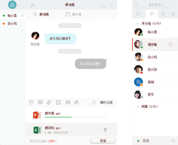

# 下载中心

## IM Demo体验
体验账号（用户可使用自己的账号登录体验，但是为了体验完整功能，可以选择一下体验账号）：账户：imtest1---imtest9 密码：123456
### 移动端体验
#### IOS下载(安装密码：yonyou)

#### Android下载(安装密码：yonyou)

### Web版体验
兼容主流浏览器，对称加密，消息安全
多套UI模板，随意使用 
 
[立刻体验](https://im.yonyou.com/web/demo/index.html "立刻体验")

## IM SDK下载
用友即时通信云SDK是永久免费的，只需要花费你5分钟的时间就可以部署到你的项目中去 
[IOS](https://iuapcdn.yonyoucloud.com/download/IMSDK-IOS.zip "IOSSDK") 
[Android](https://iuapcdn.yonyoucloud.com/download/YYImSdk.zip "AndroidSDK") 
[WEB](https://github.com/iuap-design/YYIMSDK/blob/master/dist/YYIMSDK.min.js "WEBSDK")
## 短信平台 SDK下载
[短信SDK](https://iuapcdn.yonyoucloud.com/download/usms-sdk.zip "短信SDK")
## 小友SDK下载
[IOS_IM版本](https://iuapcdn.yonyoucloud.com/download/XiaoYou_IOS_IM.zip "IOSIM版本") 
[IOS_非IM版本](https://iuapcdn.yonyoucloud.com/download/XiaoYou_IOS_NOIM.zip "IOS非IM版本") 
[Android_IM版本](https://iuapcdn.yonyoucloud.com/download/AndroidIM版SDK.zip "AndroidIM版本") 
[Android_非IM版本](https://iuapcdn.yonyoucloud.com/download/Android-非IM版SDK.zip "Android非IM版本")