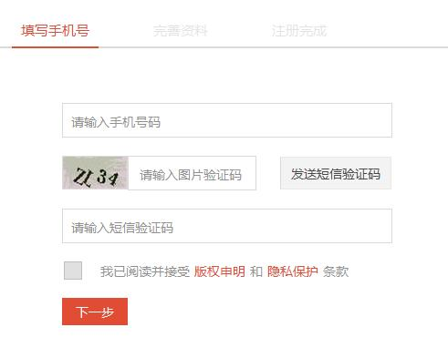
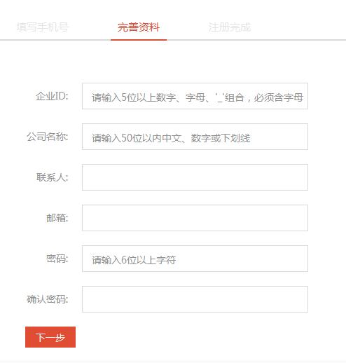
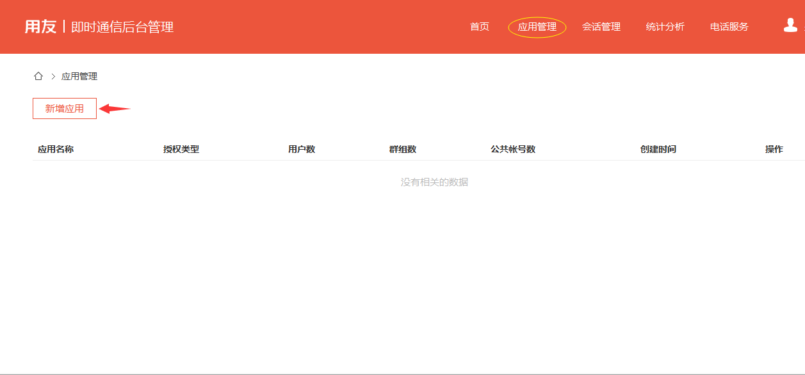
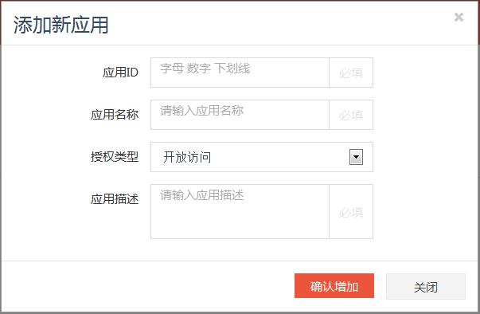
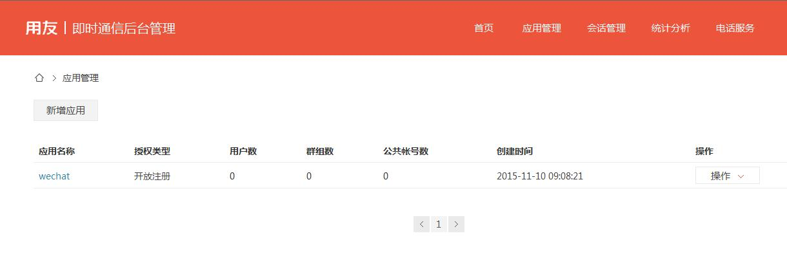
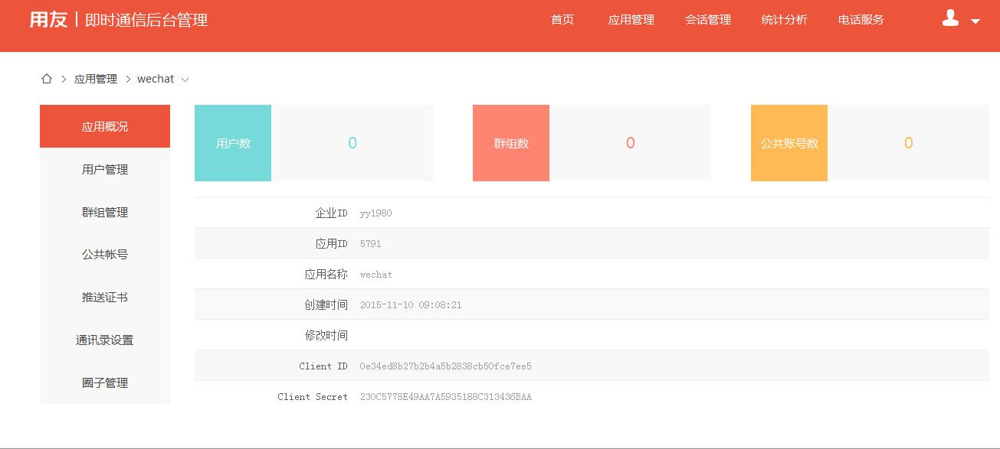
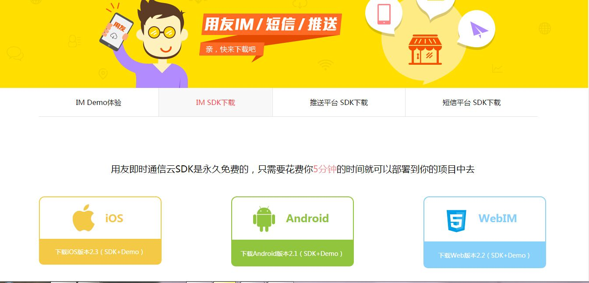

# 
IM快速入门

通过本文您将了解到：

1. 用友IM的整体介绍
2. 开发接入用友IM的总体流程
3. 如何成为用友IM的开发者？

## 1 IM简介
用友UAP是专注于企业互联网技术的企业计算平台，用友即时通信基于用友云服务架构，是UAP提供的后端服务（BaaS）的重要部分。通过免费的BaaS服务，开发者无需搭建服务端环境，即可将IM快速集成到APP当中去。

用友IM涵盖IOS，Android，web，windows，linux多端，多操作系统，提供一系列即插即用的UI模版可供开发者直接使用，同时提供客户端SDK及服务端REST API，开发者可以按照企业级社交场景的实际需要，构建自己的即时通信产品。

### 1.1 系统架构

用友提供即时通信的BaaS服务，希望在不改变第三方系统的架构的基础上与之无缝融合，用友IM的架构特点如下：

1. 无需同步用户体系，保证隐私数据
2. 无需改变第三方APP客户端架构，可直接嵌入其中
3. 认证方式由第三方APP自己提供，将获取token的服务部署到APP Serve中即可
4. 消息传输加密，绝对保证消息安全
5. 消息传输高可靠，保证消息不丢失

### 1.2 用户集成

用户体系是APP当中的核心数据，也是APP中的绝对机密。用友致力于企业级软件多年，深知数据保密的重要性，所以用友IM中不保存任何APP的用户信息，也不想知道这些信息，比如CRM的APP，此APP中的用户姓名，账号，密码，电话，email等信息是保存到CRM自己的服务器中的，在使用用友IM服务时，无需把用户体系上传到用友IM服务器中。 
用友服务希望以最友好的方式将IM嵌入到第三方APP中，反对暴力接入，第三方APP也无需为此改变自己的架构。 

目前用友IM提供开放注册和授权注册两种用户接入的方式，每个APP可按照实际需要单独设置，也可进行调整。

1. 开放注册：如果APP设置成开放注册模式，在使用用友IM服务时，无需事先导入用户体系，在客户端集成IM之后，用户在首次登陆时会被自动创建。
2. 授权注册：如果APP设置成授权注册模式，在使用用友IM服务时，需要事先导入用户体系或者使用REST API事先同步用户体系，在用户登录认证时，只有已集成的用户才视为合法用户。
当然，从隐私角度来说，在使用授权注册模式时，不必将自己的用户原账号导入到用友IM中，可在导入前做加密，只要保证此加密后的用户账号在APP内的唯一性即可。

### 1.3 安全机制

保证用户消息的数据安全，是我们的首要目标。

在客户端与用友IM进行通信时，即时通信传输协议会进行加密传输，防止数据被窃取，被篡改。 在加密策略中，我们使用公钥和私钥结合的对称加密机制，每次客户端在与服务器通信时都会产生随机的新的秘钥，从而保证数据的绝对安全。

## 2 总体流程
1. 注册用友IM用户
2. 创建应用-获取APPID和密钥
3. SDK下载
4. 开发接入
5. 应用上线

## 3 如何成为用友IM开发者

### 3.1 注册用户

在用友IM官网 https://im.yyuap.com 上方点击“注册”，请按界面流程提示进行开发者账号注册

**手机号注册:**

**完善个人材料：**

注册完成后，获得用友IM的注册用户，至此，您已经成为了用友IM的开发者，可以创建应用了。

### 3.2 创建应用

登陆用友IM控制台，一级导航栏应用管理下，点击新增引用按钮开始创建应用

创建新应用

其中，授权类型：支持开发访问、授权访问、托管模式，建议使用开发访问模式。

1. 开放访问（建议使用）:
如果应用设置成开放访问模式，在使用用友IM服务时，无需事先导入用户体系，在客户端集成IM之后，用户在首次登陆时会被自动创建。
2. 授权访问:
如果应用设置成授权访问模式，在使用用友IM服务时，需要事先导入用户体系或者使用REST API事先同步用户体系，在用户登录认证时，只有已集成的用户才视为合法用户。
3. 托管模式：
如果应用设置成授权访问模式，既要是合法用户,同时还需要校验用户密码才可以。

创建成功，返回应用列表界面

点击应用名称，进入应用详情界面，可以查看应用详情，包括企业ID，应用ID，ClientID，ClientSecret

至此，您已经注册成为用友IM的开发者，并创建了自己的应用。

### 3.3 SDK下载，开始集成

SDK中包含单独封装的demo，开源给开发者，可以实现快速集成，集成指南可参见不同终端的集成指南

1. [ios集成指南]()
2. [andriod集成指南]()
3. [web集成指南]()

