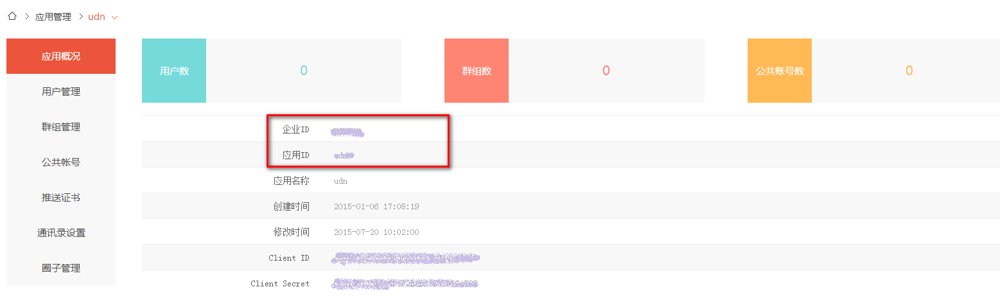

## 1 集成准备
### 1.1 注册开发者账号
在用友友信官网[ <https://euc.yonyoucloud.com/register?service=https%3A%2F%2Fim.yonyou.com%2Fcontroller%2Findex&sysid=imyonyou>](https://euc.yonyoucloud.com/register?service=https%3A%2F%2Fim.yonyou.com%2Fcontroller%2Findex&sysid=imyonyou "用友友信") ，请按界面流程提示进行开发者账号注册。
### 1.2 创建应用
使用开发者账号登录到管理后台，点击页面上方“应用管理”，进入到应用管理。
点击左侧“新增应用”，输入应用信息即可创建，如图所示：


在应用概况中你可以查看应用的信息，我们会在客户端使用到“应用ID”和“企业ID”，在服务端进行获取token服务时使用到“ClientID”和“ClientSecret”，如果忘记了可以在这里查看。



### 1.3 在APP的Server端获取用友IM token
用友IM使用token进行用户验证

在APP的Server端需要新增一个获取token的服务，供客户端调用，在服务中需要调用用友IM“获取用户token”的接口获得token并返回给客户端。

用友IM获取用户token接口格式如下：

|接口信息|说明|
|---------------------|----|
|Path:|https://im.yyuap.com/sysadmin/rest/{企业ID}/{应用ID}/token|
|HTTPMethod:|POST|
|URLParam:|无|
|RequestHeader:|{"Content-Type":"application/json"}|
|RequestBody:| {"clientId": "应用的ClientID","clientSecret": "应用的ClientSecret", "userid":"用户ID", "nickname":"昵称（可选）"}|
|ResponseBody:|{"token": "xxxxxxxx-xxxx-xxxx-xxxx-xxxxxxxx","expiration": "1420041600"}|
* 注1：企业ID、应用ID、ClientID、ClientSecret参见本文档1.2。<br>
* 注2：userid需要传入一个用户的唯一标示，规格为字母或数字，50位以内，不区分大小写。<br>
* 注3：nickname为可选参数，仅在应用为开放模式下使用，如果提供了nickname且用户已经存在的情况下会更新昵称，提供了nickname且用户不存在则使用该昵称创建用户，没有提供nickname且用户存在，使用userid作为nickname。<br>
* 注4：expiration为token的有效时间，从1970年1月1日到截止时间的毫秒数，默认是24小时，在有效期内是不需要重复获取的，有效期重复获取的Token相同。

|可能的错误代码|错误原因|
|----|----|
|401|认证服务器认证失败|
|404|企业ID或应用ID无效，应用不存在, 检查地址是否正确|
|406|ClientID与应用ID不匹配, 检查地址和参数|
|500|认证过程发生错误|

### 1.4 下载用友IM Android SDK
用友IM Android SDK下载地址:[下载中心](https://iuap.yonyoucloud.com/doc/instantmessaging.html#/md-build/exclusive_cloud_instantmessaging/articles/product/11-/download.md?key=相关下载)<br/>


## <center>2 sdk集成</center>
IM 提供官方实例demo，开源IM UI代码，在集成IM 的时候可以参考Demo如何使用sdk.
下面介绍如何迈出集成IM sdk 的第一步。
### 2.1 IM 配置
**1.添加sdk 和支持库**<br>
添加红色标注的jar和 .so文件，即可使用通用Android IM sdk。

**2.AndroidManifest配置**<br>
在应用的manifest添加如下设置
```
<!-- 允许程序打开网络套接字(Allows applications to open network sockets) -->
<uses-permission android:name="android.permission.INTERNET" />
<!-- 允许一个程序打开窗口使用 TYPE_SYSTEM_ALERT，显示在其他所有程序的顶层(Allows an application to open windows using the Type TYPE_SYSTEM_ALERT, shown on top of all other applications. ) -->
<uses-permission android:name="android.permission.SYSTEM_ALERT_WINDOW" />
<!-- 允许程序访问有关GSM网络信息(Allows applications to access information about networks) -->
<uses-permission android:name="android.permission.ACCESS_NETWORK_STATE" />
<!-- 允许访问振动设备(Allows access to the vibrator) -->
<uses-permission android:name="android.permission.VIBRATE" />
<!-- 允许使用PowerManager的 WakeLocks保持进程在休眠时从屏幕消失( Allows usingPowerManager WakeLocks to keep processor from sleeping or screen from dimming) -->
<uses-permission android:name="android.permission.WAKE_LOCK" />
<!-- 允许一个程序接收到 ACTION_BOOT_COMPLETED广播在系统完成启动(Allows an application to receive the ACTION_BOOT_COMPLETED that is broadcast after the system finishes booting. ) -->
<uses-permission android:name="android.permission.RECEIVE_BOOT_COMPLETED" />
<!-- 允许一个程序获取信息有关当前或最近运行的任务，一个缩略的任务状态，是否活动等等(Allows an application to get information about the currently correctly running tasks: a thumbnail representation of the tasks, what activities are running in it, etc.) -->
<uses-permission android:name="android.permission.GET_TASKS" />
<!-- 允许程序写入外部存储 -->
<uses-permission android:name="android.permission.WRITE_EXTERNAL_STORAGE" />
<!-- 允许程序读外部存储 -->
<uses-permission android:name="android.permission.READ_EXTERNAL_STORAGE" />
<!-- 允许挂载和反挂载文件系统可移动存储(Allows mounting and unmounting file systems for removable storage.) -->
<uses-permission android:name="android.permission.MOUNT_UNMOUNT_FILESYSTEMS" />
<!-- 允许程序录制音频(Allows an application to record audio) -->
<uses-permission android:name="android.permission.RECORD_AUDIO" />
<!-- 请求访问使用照相设备(Required to be able to access the camera device. ) -->
<uses-permission android:name="android.permission.CAMERA" />

<uses-feature android:name="android.hardware.camera" />
<uses-feature android:name="android.hardware.camera.autofocus" />
<!-- 允许程序调用killBackgroundProcesses(String).方法结束后台进程 -->
<uses-permission android:name="android.permission.KILL_BACKGROUND_PROCESSES" />
<!-- 允许一个程序访问CellID或WiFi热点来获取粗略的位置 -->
<uses-permission android:name="android.permission.ACCESS_COARSE_LOCATION" />
<!-- 允许一个程序访问精良位置(如GPS) -->
<uses-permission android:name="android.permission.ACCESS_FINE_LOCATION" />
<!-- 允许获取手机信息 -->
<uses-permission android:name="android.permission.READ_PHONE_STATE" />
<!-- 允许程序改变Wi-Fi连接状态 -->
<uses-permission android:name="android.permission.CHANGE_WIFI_STATE" />
<!-- 允许程序访问Wi-Fi网络状态信息 -->
<uses-permission android:name="android.permission.ACCESS_WIFI_STATE" />
<!-- 允许一个程序修改当前设置，如本地化 -->
<uses-permission android:name="android.permission.CHANGE_CONFIGURATION" />
<!-- audio manage -->
<uses-permission android:name="android.permission.MODIFY_AUDIO_SETTINGS" />
<!-- 隐藏屏保 -->
<uses-permission android:name="android.permission.DISABLE_KEYGUARD" />
<!-- 签名权限-->
<uses-permission android:name="android.permission.INTERACT_ACROSS_USERS_FULL" />
<application
    android:name="com.yonyou.sns.im.base.BaseApplication"
    android:allowBackup="true"
    android:icon="@drawable/icon_launcher"
    android:label="@string/app_name"
    android:theme="@style/Default.NoTitleBar" >
<receiver android:name="com.yonyou.sns.im.core.YYIMBroadcastReceiver" >
    <intent-filter>

        <!-- 开机广播 -->
        <action android:name="android.intent.action.BOOT_COMPLETED" />
        <!-- 关机广播 -->
        <action android:name="android.intent.action.ACTION_SHUTDOWN" />
        <!-- 网络连接变化的广播 -->
        <action android:name="android.net.conn.CONNECTIVITY_CHANGE" />
    </intent-filter>
</receiver>

<!-- 声明sdk所需的service -->
<service android:name="com.yonyou.sns.im.core.YYIMService" />
</application>
```
**3.添加企业标识和应用标识**<br>
企业标识(etpId)用于区分不同的企业，应用标识(appId)用于区分同一企业下的不同应用，IM 通过etpId和appId来标识公有云或私有云不同的用户，通过etpId和appId达到用户数据分离。添加企业标识和应用标识，总共有俩种实现方式：
+ 静态设置标识
在manifest 添加如下配置
```
<application
    android:name="com.yonyou.sns.im.base.BaseApplication"
    android:allowBackup="true"
    android:icon="@drawable/icon_launcher"
    android:label="@string/app_name"
    android:theme="@style/Default.NoTitleBar" >

    <meta-data android:name="com.yonyou.sns.im.appid" android:value="您的appid"/>
    <meta-data android:name="com.yonyou.sns.im.etpid" android:value="您的etpid"/>
</application>
```
+ 动态设置标识
```
YYIMChatManager.getInstance().getYmSettings().setCustomAppkey(您的appid);
YYIMChatManager.getInstance().getYmSettings().setCustomEtpkey(您的etpid);
or
/**
 * 设置自定义app.etp
 * @param id
 *    例如 udn.yonyou
 */
YYIMChatManager.getInstance().getYmSettings().setCustomAppAndEtpkey(id);
```
etpId和appId的获取，是用户通过im.yyuap.com IM 官网注册企业账号，创建app 后，在多租户后台能看到自己申请设置的etpId 和appId，如下图：


**4.混淆打包**<br>
在混淆文件中添加如下配置
```
-keep class com.yonyou.sns.im.** {*;}
-keep class com.yonyou.uap.sns.protocol.** {*;}
-keep class com.bambuser.broadcaster.** {*;}
-keep class com.opaque.project.** {*;}
-keep class org.jump.** {*;}
-keep class org.apache.harmony.javax.security.** {*;}
-keep class org.apache.qpid.management.common.sasl.** {*;}
```
### 2.2 IM 初始化
**1.初始化(必须)**<br>
```
需要在使用im之前，调用sdk初始化方法，这块建议传入applicationContext。
// 初始化yyim
YYIMChat.getInstance().init(context);
```
**2.注册token(必须)**<br>
用户需要搭建 自己的app server获取IM 服务器 token的服务，客户端调用自己的app server 获取token 的rest 请求，返回token给sdk。在初始化完毕之后调用sdk 注册token接口。
```
// 注册tokenProvider
YYIMProviderHandler.getInstance().registerTokenProvider(new CusTokenProvider());
```
CusTokenProvider.class需要用户自己实现， 这个类实现了sdk 中的ITokenProvider接口，接口如下:
```
/**
 * provider 基类
 * @author wudl
 * @date 2014年12月24日
 * @version V1.0
 */
public abstract class ITokenProvider {
   /**
	 * 请求token
	 * @param yyimCallBack 回调
	 */
	abstract public void getToken(YYIMCallBack yyimCallBack);
   /**
    * 获取过期时间
    * @return 同步返回超时时间
    */
   abstract public String getExpiration();
}
```
**3.注册自定义用户(可选)**<br>
IM SDK 允许用户从自己的服务器获取用户信息，并自定义userProvider注册进sdk，在初始化完毕之后调用sdk 注册user接口。
```
// 注册userProvider
YYIMProviderHandler.getInstance().registerUserProvider(new CusUserProvider());
```
CusUserProvider.class需要用户自己实现， 这个类实现了sdk 中的IUserProvider接口，接口如下:
```
/**
 * provider 基类
 * @author wudl
 * @date 2014年12月24日
 * @version V1.0
 */
public abstract class IUserProvider {

   /**
    * 从服务器端获取个人信息
    * @param id 用户唯一标识
    * @return
    */
   abstract public int loadUser(String id);
   
   /**
    * 本地查询个人信息
    * @param id 用户唯一标识
    * @return
    */
   abstract public YYUser queryUserNotLoad(String id);

   /**
    * 本地查询个人信息,没查到需要从服务器加载一次数据
    * @param id 用户唯一标识
    * @return
    */
   abstract public YYUser queryUser(String id);
   /**
    * 从服务器端搜索用户
    * @param key 搜索关键字
    * @return
    * @throws Exception 
    */
   abstract public List<YYSearchEntity> searchUserByKey(String key) throws Exception;
   /**
    * 从服务器端更新用户信息
    * @param user 用户实体
    * @throws Exception
    */
   abstract public void updateUser(YYUser user) throws Exception;
}
```
**4.设置消息通知栏自定义样式(可选)**<br>
sdk 允许用户自定义android 系统消息通知栏里的im 通知样式，需要用户自己配置样式，如下
```
// 设置notification消息点击时，跳转的intent为自定义的intent和样式
YYIMChatManager.getInstance().getYmSettings().setMessageNotifyListener(new CusYYMessageNotifyListener())
```
CusYYMessageNotifyListener.class实现了sdk 里的YYMessageNotifyListener接口，接口定义如下：

```
public interface YYMessageNotifyListener {
   /**
    * 自定义通知消息的消息内容
    * @param message 收到的消息实体
    * @return 返回要显示的消息字符串
    */
   public String getNotificationMessage(YYMessage message);

   /**
    * 自定义通知消息的消息标题
    * @param message 收到的消息实体
    * @return 返回要显示的消息标题
    */
   public String getNotificationTitle(YYMessage message);

   /**
    * 自定义点击通知要跳转的页面
    * @param message 收到的消息实体
    * @return 返回要跳转的页面intent
    */
   public Intent getNotificationResponse(YYMessage message);

   /**
    * 自定义通知栏消息的通知统计内容
    * @param message 收到的消息
    * @param userNum 用户数量
    * @param msgNum 消息数量
    * @return 返回要显示的通知统计内容
    */
   public String getNotificationTotal(YYMessage message, int userNum, int msgNum);

   /**
    * 获取通知栏icon
    * @return
    */
   public int getNotificationIcon();

   /**
    * 获取通知栏icon 设置等级
    * @return
    */
   public int getNotificationIconLevel();

}
```
**5.设置单双向好友关系模型(可选)**<br>
目前IM 支持双向好友和单向好友，双向好友的模式下一方发起好友邀请，另一方需要应答（拒绝或者同意），此时双方才能在好友列表看到双方(包括对方的在线状态)。
单向好友模式下，A收藏B，A能在自己的好友列表看到B(包括B的在线状态) ，但是B不能在好友列表看到A。
默认情况下是双向好友关系类型
```
YYIMChatManager.getInstance().getYmSettings().setIsOneWayRosterRelationship(isOneWayRelationship);
```
**6.设置是否自动同意好友邀请(可选)**<br>
在双向好友关系的模型下时，可以设置客户端是否自动同意所有好友邀请。
```
// 设置是否自动同意好友邀请设置
YYIMChatManager.getInstance().getYmSettings().setAutoAcceptRosterInvite(isAutoAccept);
```
### 2.3 IM 登录
```
// 登录
YYIMChatManager.getInstance().login(imUserId, new YYIMCallBack() {

    @Override
    public void onSuccess(Object object) {
        // 登录成功
    }

    @Override
    public void onProgress(int errno, String errmsg) {
    }

    @Override
    public void onError(int errno, String errmsg) {
       // 登录失败
    }
});
/**
 * 匿名登录
 *
 * @param ymCallBack
 */
public void loginAnonymously(final YYIMCallBack ymCallBack)
```
### 2.4 IM 退出
```
YYIMChatManager.getInstance().logout();
```
## 3 消息集成
### 3.1 消息发送
**1.发送文本消息**<br>
调用方法：YYIMChatManager.getInstance(). sendTextMessage();
```
/**
 * 发送文本消息
 * @param id
 *          对方的im id,单聊时为对方id，群聊时是群id
 * @param text
 *          消息内容
 * @param chatType
 *          消息类型 YYMessage.TYPE_CHAT(单聊) or YYMessage.TYPE_GROUPCHAT(群聊)
 */
public void sendTextMessage(String id, String text, String chatType, YYIMCallBack ymCallBack)

/**
 * 发送文本消息,附带需要@的人
 *
 * @param id
 *          对方的im id,单聊时为对方id，群聊时是群id
 * @param text
 *          消息内容
 * @param chatType
 *          消息类型 YYMessage.TYPE_CHAT(单聊) or YYMessage.TYPE_GROUPCHAT(群聊)
 * @param atUser
 *          需要@人的列表
 * @param ymCallBack
 */
public void sendTextMessage(String id, String text, String chatType, List<String> atUser, YYIMCallBack ymCallBack)
/**
 * 发送带拓展字段的文本消息
 * 发送文本消息
 * @param id
 *          对方的im id,单聊时为对方id，群聊时是群id
 * @param text
 *          消息内容
 * @param chatType
 *          消息类型 YYMessage.TYPE_CHAT(单聊) or YYMessage.TYPE_GROUPCHAT(群聊)
 * @param extend
 *          用户自定义的拓展字段
 * @param yyimCallBack
 *          消息回调
 */
public void sendTextMessage(String id,String text,String chatType,String extend,YYIMCallBack yyimCallBack)
```
**2.发送图片消息**<br>
调用方法：YYIMChatManager.getInstance(). sendImageMessage();
```
/**
 * 发送图片消息，默认会压缩图片
 *
 * @param id
 *          对方的im id,单聊时为对方id，群聊时是群id
 * @param imagePaths
 *          图片本地路径集合
 * @param chatType
 *          消息类型 YYMessage.TYPE_CHAT(单聊) or YYMessage.TYPE_GROUPCHAT(群聊)
 */
public void sendImageMessage(String id, String[] imagePaths, String chatType, YYIMCallBack ymCallBack)
/**
 * 发送图片消息，附带是否是原图发送
 *
 * @param id
 *          对方的im id,单聊时为对方id，群聊时是群id
 * @param imagePaths
 *          图片本地路径集合
 * @param chatType
 *          消息类型 YYMessage.TYPE_CHAT(单聊) or YYMessage.TYPE_GROUPCHAT(群聊)
 * @param isOriginal
 *          是否是原图发送
 */
public void sendImageMessage(String id, String[] imagePaths, String chatType, boolean isOriginal, YYIMCallBack ymCallBack)
```
**3.发送语音消息**<br>
调用方法：YYIMChatManager.getInstance(). sendAudioMessage();
```
/**
 *  发送语音消息
 * @param id
 *          对方的im id,单聊时为对方id，群聊时是群id
 * @param audioPath
 *          录音本地路径集合
 * @param chatType
 *          消息类型 YYMessage.TYPE_CHAT(单聊) or YYMessage.TYPE_GROUPCHAT(群聊)
 */
public void sendAudioMessage(String id, String audioPath, String chatType, YYIMCallBack ymCallBack)
```
**4.发送位置消息**<br>
调用方法：YYIMChatManager.getInstance(). sendLocationMessage();
```
/**
 * 发送位置消息
 * @param id
 *           对方的im id,单聊时为对方id，群聊时是群id
 * @param locationPath
 *           位置图片url
 * @param address
 *           位置地址
 * @param latitude
 *           位置维度
 * @param longitude
 *           位置经度
 * @param chatType
 *            消息类型 YYMessage.TYPE_CHAT(单聊) or YYMessage.TYPE_GROUPCHAT(群聊)
 * @param ymCallBack
 */
public void sendLocationMessage(String id, String locationPath, String address, Double latitude, Double longitude,
                                String chatType, YYIMCallBack ymCallBack)
```
**5.发送文件**<br>
调用方法：YYIMChatManager.getInstance(). sendFileMessage();
```
/**
 * 发送文件
 *
 * @param id
 *            对方的im id,单聊时为对方id，群聊时是群id
 * @param filePath
 *            文件路径
 * @param chatType
 *            消息类型 YYMessage.TYPE_CHAT(单聊) or YYMessage.TYPE_GROUPCHAT(群聊)
 * @param ymCallBack
 */
public void sendFileMessage(String id, String filePath, String chatType, YYIMCallBack ymCallBack)
```
**6.发送分享消息**<br>
调用方法：YYIMChatManager.getInstance(). sendShareMessage();
```
    /**
 * 发送分享消息
 *
 * @param id
 *          对方的im id,单聊时为对方id，群聊时是群id
 * @param shareTitle
 *          分享的标题
 * @param shareDesc
 *          分享的描述
 * @param shareImageUrl
 *          分享的图片URL
 * @param shareUrl
 *          分享的链接
 * @param extend
 *          分享拓展字段
 * @param ymCallBack
 */
public void sendShareMessage(String id, String chatType, String shareTitle, String shareDesc, String shareImageUrl,
                             String shareUrl, String extend, YYIMCallBack ymCallBack) 
```
**7.重新发送消息**<br>
当消息发送失败后，可以调用消息重发接口
调用方法：YYIMChatManager.getInstance(). resendMessage();
```
/**
 * 重新发送消息
 *
 * @param id
 *          消息的id,对应YYMessage.get_id()
 */
public void resendMessage(Integer id)
```
**8.转发消息**<br>
将已收到的消息或者云盘文件进行转发
调用方法：YYIMChatManager.getInstance(). forwardMessage()
YYIMChatManager.getInstance().forwardCloudFile()
```
/**
 * 转发消息
 * @param pid 消息id
 * @param toId 要转发的人
 * @param chatType 消息类型，单聊或者群聊
 */
public void forwardMessage(final String pid, final String toId, final String chatType)
/**
 * 转发云文件
 * @param toId 要转发的人的id
 * @param chatType 消息类型，单聊或者群聊
 * @param attachId 资源唯一码
 * @param file 文件，需要包含文件名和文件大小
 */
public void forwardCloudFile(final String toId, final String chatType, final String attachId, final File file)
```
### 3.2 消息接收
IM 消息接收都在sdk 中处理并以sqlite 存储，在收到消息时以广播的形式通知客户端进行消息更新。消息的广播主要有以下几种：
<br>
**1.消息新增**<br>
这条广播表示收到新的消息，并在广播中附带消息实体
广播常量：YYIMDBNotifier.MESSAGE_ADD
监听及使用：
```
registerReceiver(receiver, new IntentFilter(YYIMDBNotifier.MESSAGE_ADD));
if (YYIMDBNotifier.MESSAGE_ADD.equals(intent.getAction())) {
    if (intent.getSerializableExtra(getChatGroupId()) != null) {
        YYMessage yyMessage = (YYMessage) intent.getSerializableExtra(getChatGroupId());
        handler.obtainMessage(MSGWHAT_MESSAGE_ADD, yyMessage).sendToTarget();
    }
}
```
**2.消息更新**<br>
这条广播表示消息状态更新了
广播常量：YYIMDBNotifier.MESSAGE_UPDATE
监听及使用：
```
    registerReceiver(receiver, new IntentFilter(YYIMDBNotifier.MESSAGE_UPDATE));
    if (YYIMDBNotifier.MESSAGE_UPDATE.equals(intent.getAction())) {
    updateChat();
  }
```
**3.消息变更**<br>
这条广播表示消息有新增或者更新了，触发消息新增广播或者消息更新广播都会发送这条消息变更广播
广播常量：YYIMDBNotifier.MESSAGE_CHANGE
监听及使用：
```
 registerReceiver(receiver, new IntentFilter(YYIMDBNotifier. MESSAGE_CHANGE));
 if (YYIMDBNotifier. MESSAGE_CHANGE.equals(intent.getAction())) {
    updateChat();
  }
```
**4.历史消息变更**<br>
这条广播表示历史消息有变更，只有当消息新增或者更新时有可能触发历史消息的变更。
广播常量：YYIMDBNotifier.RECENT_CHAT_CHANGE
```
registerReceiver(receiver, new IntentFilter(YYIMDBNotifier.RECENT_CHAT_CHANGE));
 if (YYIMDBNotifier. RECENT_CHAT_CHANGE.equals(intent.getAction())) {
    updateChat();
  }
```
### 3.3 消息查询
**1.查询聊天消息**<br>
一个聊天窗口的消息对应的有可能是个人，也有可能是群组，都统一调用以下接口查询当前聊天对象的所有聊天消息
```
调用方法：YYIMChatManager.getInstance(). getMessage();
/**
 * 根据对方的id获得对话消息记录
 * @param id
 *          对方的im id,单聊时为对方id，群聊时是群id
 * @param chatType
 *           消息类型 YYMessage.TYPE_CHAT(单聊) or YYMessage.TYPE_GROUPCHAT(群聊) or YYMessage.TYPE_PUB_ACCOUNT(公众号) or YYMessage.TYPE_SYSTEM（系统）
 * @return
 */
public List<YYMessage> getMessage(String id, String chatType)
/**
 * 分页查询消息
 *
 * @param id
 *          对方的im id,单聊时为对方id，群聊时是群id
 * @param chatType
 *          消息类型 YYMessage.TYPE_CHAT(单聊) or YYMessage.TYPE_GROUPCHAT(群聊) or YYMessage.TYPE_PUB_ACCOUNT(公众号) or YYMessage.TYPE_SYSTEM（系统）
 * @param nextCursor
 *          从第几条开始查询
 * @param totalSize
 *          查询多少条
 * @return
 */
public List<YYMessage> getMessage(String id, String chatType, int nextCursor, int totalSize)
```
**2.查询历史聊天消息**<br>
查询当前登录用户的所有聊天消息，每一条历史聊天消息对应一个人或者一个群组，且不重复。
```
调用方法：YYIMChatManager.getInstance(). getRecentChat();
/**
 * 获得最近的消息记录
 *
 * @return
 */
public List<YYRecentChat> getRecentChat()
```
**3.查询图片消息**<br>
查询当前聊天窗口里的所有图片
```
调用方法：YYIMChatManager.getInstance(). getImageMessage();
/**
 * 查询图片消息
 *
 * @param id
 *          对方的im id,单聊时为对方id，群聊时是群id
 * @return List<YYMessage>
 */
public List<YYMessage> getImageMessage(String id)
```
**4.查询文件消息**<br>
查询当前用户发送过的和接收过的文件
```
调用方法：YYIMChatManager.getInstance(). getMineReceiveFile();
                 YYIMChatManager.getInstance(). getMineSendFile();
/**
 * 获取当前用户接收的文件
 *
 * @return
 */
public List<YYFile> getMineReceiveFile()
/**
 * 获取前用户发送的文件
 *
 * @return
 */
public List<YYFile> getMineSendFile()
```
**5.未读消息数查询**<br>
查询当前用户所有未读消息数
```
调用方法：YYIMChatManager.getInstance(). getUnreadMsgsCount();
/**
 * 获得未读消息
 *
 * @return
 */
public int getUnreadMsgsCount()
```
查询我和其他设备的未读消息数
```
调用方法：YYIMChatManager.getInstance(). getOwnUnreadMsgsCount();
/**
 * 我的设备未读消息数
 *
 * @return
 */
public int getOwnUnreadMsgsCount()
```
### 3.4 消息状态
**1.消息状态**<br>
A与B在聊天，A在调用YYIMChatManager.getInstance(). getMessage()查看消息后，B会收到消息更新的广播YYIMDBNotifier.MESSAGE_UPDATE,封装的消息实体的YYMessage.getState()变更,状态码具体对应如下：
```
/** 消息刚创建 */
public static final int STATE_NEW = 0;
/** 消息发送失败 */
public static final int STATE_FAILD = 1;
/** this message was sent but not yet acked, or it was received and read */
public static final int STATE_SENT_OR_READ = 2;
/** this message was acked */
public static final int STATE_ACKED = 3;
/** 代表该消息已被对方阅读 */
public static final int STATE_DELIVERED = 4;
```
用户刚收到的消息都是STATE_NEW 状态，发送成功的消息都是STATE_SENT_OR_READ状态，发送失败的消息是STATE_FAILD，对方已读的状态是STATE_DELIVERED 
在用户读完消息后，需要标记新收到消息为YYMessage.STATE_SENT_OR_READ 
```
调用方法：YYIMChatManager.getInstance(). batchUpdateMessageState();
/**
 * 按照聊天对象的id批量修改聊天消息状态
 *
 * @param chatId
 *              聊天对象的id
 * @param status
 *              消息状态
 * @return
 */
public int batchUpdateMessageState(String chatId, Integer status)
```
若在处理单条消息新增的时候没有调用YYIMChatManager.getInstance().getMessage()方法，需要手动调用YYIMChatManager.getInstance().sendReceiptReaded()接口发送已读回执。
<br>
**2.消息资源状态**<br>
发送资源消息的时候YYMessage.getRes_status()对应以下状态码：
```
/** resource is new */
public static final int RESSTATE_NEW = 0;
/** resource is uploading or downloading */
public static final int RESSTATE_PROGRESSING = 3;
/** resource upload or download faild */
public static final int RESSTATE_FAILD = 2;
/** resource upload or download success */
public static final int RESSTATE_SUCCESS = 1;
```
资源开始上传是RESSTATE_NEW状态，资源在下载或者上传中时是 RESSTATE_PROGRESSING ，资源上传下载失败是RESSTATE_FAILD，资源上传下载成功是 RESSTATE_SUCCESS 
收到新消息时，默认会下载资源（例外：文件消息类型的消息需要手动下载）。
图片消息下载的资源分成三部分，默认下载的是图片缩略图(小尺寸的图片)，图片压缩图和原图需要手动下载，
调用方法MessageResDownloadTask.syncDownLoad()
```
/**
 * 下载消息
 * @param context
 * @param entity
 *              消息实体
 * @param downMark
 *              资源下载的大小，图片资源传递压缩图，缩略图和原图标志，其他资源文件传递原图标识.
  *       MessageResDownloadTask.DOWNLOAD_COMPRESS(压缩图),MessageResDownloadTask.DOWNLOAD_ORIGINAL(原图),MessageResDownloadTask.DOWNLOAD_THRUMB（缩略图）
 * @return
 */
public boolean syncDownLoad(Context context, final YYMessage entity, final int downMark)
/**
 * 下载
 * @param context
 * @param attachId
 *              资源的attachId
 * @param fileExtend
 *              资源后缀
 * @param type
 *              资源类型
 * @param downMark
 *              资源下载的大小，图片资源传递压缩图，缩略图和原图标志，其他资源文件传递原图标识
 * @return
 */
public boolean syncDownLoad(Context context, String attachId, String fileExtend, final int type, int downMark)
```
### 3.5 消息内容类型
YYMessage.getType()标识当前消息的类型，可以更具消息类型显示不同消息的样式。
```
/** 消息类型-文本 */
public static final int CONTENT_TEXT = 2;
/** 消息类型-文件 */
public static final int CONTENT_FILE = 4;
/** 消息类型-图片 */
public static final int CONTENT_IMAGE = 8;
/** 消息类型-公共帐号的单图文消息 */
public static final int CONTENT_SINGLE_MIXED = 16;
/** 消息类型-公共帐号的多图文消息 */
public static final int CONTENT_BATCH_MIXED  = 32;
/** 消息类型-语音 */
public static final int CONTENT_AUDIO = 64;
/** 消息类型-位置 */
public static final int CONTENT_LOCATION = 128;
/** 消息类型-分享*/
public static final int CONTENT_SHARE = 256;
/** 消息类型-网络视频*/
public static final int CONTENT_VOIP = 1002;
/** 消息类型-提示消息 */
public static final int CONTENT_PROMPT = 1001;
```
## 4 好友集成
在IM中，好友关系主要分为双向好友关系和单向好友关系，在IM 初始化时可以设置集成模式，俩个模式不能共存，非此即被。双向好友表示双方用户需要确认并同意才能成为好友，单向好友表示单方面用户收藏对方为好友，但是对方并不知道且在对方好友列表没有该用户好友。im服务器会主动推送好友的在线状态
### 4.1 双向好友集成
**1.好友关系状态**<br>
双向好友关系在YYRoster实体中使用俩个字段标识好友状态，subscription属性用于标识好友关系，type属性用于标识处于中间态的好友关系状态。
```
/**
 * subscription -- both
 */
public static final int BOTH = 1;
/**
 * subscription -- none
 */
public static final int NONE = 0;
/**
 * type -- ask
 */
public static final int ASK = 1;
/**
 * type -- recv
 */
public static final int RECV = 0;
```
俩个属性联合使用表示的含义如图所示：


**2.添加好友**<br>
调用方法：YYIMRosterManager.getInstance().addRoster();
```
/**
 * 添加联系人
 * @param userId 用户id
 * @param yyimCallBack 是否成功回调
 */
public void addRoster(final String userId, final YYIMCallBack yyimCallBack)
```
**3.好友请求处理**<br>
IM sdk允许用户设置好友请求处理模式，总共有三个模式：
```
/**
 * subscribe 好友请求处理模式的枚举类型
 */
public enum SubscriptionMode {

    /**
     * 自动接受所有的 subscribe 的请求
     */
    accept_all,

    /**
     * 自动拒绝所有的 subscribe 请求
     */
    reject_all,

    /**
     * 用于手动处理subscribe 请求
     */
    manual
}
```
可以初始化的时候调用IM 配置接口设置模式，默认不设置是手动模式。
+ 设置自动接受所有好友请求 调用方法 ： YYIMChatManager.getInstance().getYmSettings().setAutoAcceptRosterInvite()
+ 设置自动拒绝所有好友请求  调用方法 ：  YYIMChatManager.getInstance().getYmSettings().setAutoRefuseRosterInvite()
```
/**
 * 设置是否自动接收好友设置
 * 
 * @param isAutoAccept
 */
public void setAutoAcceptRosterInvite(boolean isAutoAccept)
/**
 * 设置是否自动拒绝好友设置
 *
 * @param isAutoRefuse
 */
public void setAutoRefuseRosterInvite(boolean isAutoRefuse)
```

手动模式下需要调用以下方法接受或者拒绝好友请求：

+ 接收对方好友请求 调用方法：YYIMRosterManager.getInstance().acceptRosterInvite()
+ 拒绝对方好友请求 调用方法：YYIMRosterManager.getInstance().refuseRosterInvite()

```
/**
 * 接受好友邀请
 * @param userId 用户id
 * @param yyimCallBack 回调成功与否
 */
public void acceptRosterInvite(final String userId, final YYIMCallBack yyimCallBack)
/**
 * 拒绝好友邀请
 * @param userId 用户id
 * @param yyimCallBack 回调成功与否
 */
public void refuseRosterInvite(final String userId, final YYIMCallBack yyimCallBack) 
```
**4.更改好友备注**<br>
调用方法：YYIMRosterManager.getInstance().renameRoster（）
```
/**
 * 重命名联系人
 * @param userId 用户id
 * @param newName 新的用户备注名
 * @param yyimCallBack 回调
 */
public void renameRoster(final String userId, final String newName, final YYIMCallBack yyimCallBack)
```
**5.删除好友**<br>
调用方法 : YYIMRosterManager.getInstance().removeRoster()
```
/**
 * 删除联系人
 * @param userId 用户id
 * @param yyimCallBack 回调
 */
public void removeRoster(final String userId, final YYIMCallBack yyimCallBack)
```
**6.查询好友**<br>
+ 查询好友列表
调用方法 ： YYIMRosterManager.getIntance().getRosters()
```
/**
 * 获得好友列表
 * 
 * @return
 */
public List<YYRoster> getRosters()
```
+ 查询包含ask状态的好友列表
调用方法 ： YYIMRorsterManager.getInstance().getRostersContainAsk()
```
/**
 * 获取联系人，包括自己请求的但对方未应答的
 */
public List<YYRoster> getRostersContainAsk()
```
+ 查询所有的recv状态的好友
调用方法 ：  YYIMRorsterManager.getInstance().getInvites()
```
/**
 * 获取联系人邀请列表
 * 
 * @return
 */
public List<YYRoster> getInvites()
```
+ 查询最近联系人
调用方法 : YYIMRorsterManager.getInstance().getRecentRosters()
```
/**
 * 获得最近的联系人
 * 
 * @return
 */
public List<YYRoster> getRecentRosters()
```
+ 通过关键字查询好友
调用方法：YYIMRorsterManager.getInstance().getRostersByKey()
```
/**
 * 根据关键字查询联系人
 * 
 * @param key 关键字
 * @return
 */
public List<YYRoster> getRostersByKey(String key)
```
+ 查询好友
调用方法 : YYIMRorsterManager.getInstance().getRosterById()
```
/**
 * 通过联系人id查询联系人
 * 
 * @param id 用户id
 * @return
 */
public YYRoster getRosterById(String id)
```

**7.好友自定义tag**<br>
+ 添加好友tag
调用方法：YYIMRorsterManager.getInstance().setRosterTag()
```
/**
     * 设置好友tag
     * @param rosterId 好友id
     * @param tags 自定义好友tags
     * @param yyimCallBack
     */
    public void setRosterTag(final String rosterId, final List<String> tags, final YYIMCallBack yyimCallBack)
```
+ 删除好友tag
调用方法：YYIMRorsterManager.getInstance().delRotserTag()
```
/**
     * 删除联系人tag
     * @param rosterId 好友id
     * @param tags 自定义好友tags
     * @param yyimCallBack
     */
    public void delRotserTag(final String rosterId, final List<String> tags, final YYIMCallBack yyimCallBack)
```
+ 通过tag查询好友
调用方法：YYIMRorsterManager.getInstance().getRosterByTag()
```
/**
     * 通过tag 获取联系人
     *
     * @param tag 自定义tag标签
     */
    public List<YYRoster> getRosterByTag(String tag)
```
**8.好友变更通知**<br>
IM sdk 在好友发生变化的时候会向客户端发送好友变更通知，需要用户接收广播并处理。其中包括好友新增，好友修改备注，好友删除，好友在线状态变更。
广播action常量：YYIMDBNotifier.ROSTER_CHANGE
使用：
```
registerReceiver(receiver, new IntentFilter(YYIMDBNotifier.ROSTER_CHANGE));

```
**9.好友的在线状态**<br>
目前sdk 记录了四个端的各自在线状态，状态如下
```
/**
 * android在线状态
 */
public static final String ANDROID_STATE = "android_state";
/**
 * ios在线状态
 */
public static final String IOS_STATE = "ios_state";
/**
 * web在线状态
 */
public static final String WEB_STATE = "web_state";
/**
 * desk在线状态
 */
public static final String DESK_STATE = "desk_state";
```
好友的在线状态又分为以下几种：
```
/**
 * STATE--离线状态
 */
public static final int STATE_OUT_LINE = 0;
/**
 * STATE--在线状态
 */
public static final int STATE_ON_LINE = 1;
/**
 * STATE--隐身状态
 */
public static final int STATE_HIDE = 2;
/**
 * STATE--忙碌状态
 */
public static final int STATE_BUSY = 3;
/**
 * STATE--离开状态
 */
public static final int STATE_AWAY = 4;
```

### 4.2 单向好友集成
**1.添加好友**<br>
调用方法：YYIMRosterManager.getInstance().addRoster();
```
/**
 * 添加联系人
 * @param userId 用户id
 * @param yyimCallBack 是否成功回调
 */
public void addRoster(final String userId, final YYIMCallBack yyimCallBack)
```
**2.更改好友备注**<br>
调用方法：YYIMRosterManager.getInstance().renameRoster（）
```
/**
 * 重命名联系人
 * @param userId 用户id
 * @param newName 新的用户备注名
 * @param yyimCallBack 回调
 */
public void renameRoster(final String userId, final String newName, final YYIMCallBack yyimCallBack)
```
**3.删除好友**<br>
调用方法 : YYIMRosterManager.getInstance().removeRoster()
```
/**
 * 删除联系人
 * @param userId 用户id
 * @param yyimCallBack 回调
 */
public void removeRoster(final String userId, final YYIMCallBack yyimCallBack)
```
**4.查询好友**<br>
+ 查询好友列表
调用方法 ： YYIMRosterManager.getIntance().getRosters()
```
/**
 * 获得好友列表
 * 
 * @return
 */
public List<YYRoster> getRosters()
```
+ 查询最近联系人
调用方法 : YYIMRorsterManager.getInstance().getRecentRosters()
```
/**
 * 获得最近的联系人
 * 
 * @return
 */
public List<YYRoster> getRecentRosters()
```
+ 通过关键字查询好友
调用方法：YYIMRorsterManager.getInstance().getRostersByKey()
```
/**
 * 根据关键字查询联系人
 * 
 * @param key 关键字
 * @return
 */
public List<YYRoster> getRostersByKey(String key)
```
+ 查询好友
调用方法 : YYIMRorsterManager.getInstance().getRosterById()
```
/**
 * 通过联系人id查询联系人
 * 
 * @param id 用户id
 * @return
 */
public YYRoster getRosterById(String id)
```
**5.好友自定义tag**<br>
+ 添加好友tag
调用方法：YYIMRorsterManager.getInstance().setRosterTag()
```
/**
     * 设置好友tag
     * @param rosterId 好友id
     * @param tags 自定义好友tags
     * @param yyimCallBack
     */
    public void setRosterTag(final String rosterId, final List<String> tags, final YYIMCallBack yyimCallBack)
```
+ 删除好友tag
调用方法：YYIMRorsterManager.getInstance().delRotserTag()
```
/**
     * 删除联系人tag
     * @param rosterId 好友id
     * @param tags 自定义好友tags
     * @param yyimCallBack
     */
    public void delRotserTag(final String rosterId, final List<String> tags, final YYIMCallBack yyimCallBack)
```
+ 通过tag查询好友
调用方法：YYIMRorsterManager.getInstance().getRosterByTag()
```
/**
     * 通过tag 获取联系人
     *
     * @param tag 自定义tag标签
     */
    public List<YYRoster> getRosterByTag(String tag)
```
**6.好友变更通知**<br>
IM sdk 在好友发生变化的时候会向客户端发送好友变更通知，需要用户接收广播并处理。其中包括好友新增，好友修改备注，好友删除，好友在线状态变更。
广播action常量：YYIMDBNotifier.ROSTER_CHANGE
使用：
```
registerReceiver(receiver, new IntentFilter(YYIMDBNotifier.ROSTER_CHANGE));
```
**7.好友的在线状态**<br>
目前sdk 记录了四个端的各自在线状态，状态如下
```
/**
 * android在线状态
 */
public static final String ANDROID_STATE = "android_state";
/**
 * ios在线状态
 */
public static final String IOS_STATE = "ios_state";
/**
 * web在线状态
 */
public static final String WEB_STATE = "web_state";
/**
 * desk在线状态
 */
public static final String DESK_STATE = "desk_state";
```
好友的在线状态又分为以下几种：
```
/**
 * STATE--离线状态
 */
public static final int STATE_OUT_LINE = 0;
/**
 * STATE--在线状态
 */
public static final int STATE_ON_LINE = 1;
/**
 * STATE--隐身状态
 */
public static final int STATE_HIDE = 2;
/**
 * STATE--忙碌状态
 */
public static final int STATE_BUSY = 3;
/**
 * STATE--离开状态
 */
public static final int STATE_AWAY = 4;
```
## 5 群组集成
群组分为普通群组和保存到通讯录群组，通过YYChatGroup 里的type字段标识如下定义：
```
	/** type -- 收藏房间 */
	public static final int COLLECT_TYPE = 1;
	/** type -- 普通房间*/
	public static final int COMMON_TYPE = 0;
```
### 5.1 创建群组
调用方法：YYIMChatManager.getInstance(). createChatGroupAndInvite()
YYIMChatManager.getInstance(). createChatGroup()
```
/**
 * 创建群组并邀请
 *
 * @param chatGroupName 群组名称
 * @param invites 邀请的人员ids
 * @param yyimCallBack 邀请回调，成功返回房间id，失败返回失败码
 */
public void createChatGroupAndInvite(final String chatGroupName, final List<String> invites,
                                     final YYIMCallBack yyimCallBack)
/**
 * 创建群组
 *
 * @param chatGroupName 群组名称
 * @return 返回群组id
 */
public String createChatGroup(String chatGroupName)
```
### 5.2 加入群组
调用方法：YYIMChatManager.getInstance().joinChatGroup()
```
/**
 * 加入房间
 *
 * @param chatGroupId 群组id
 * @param yyimCallBack
 */
public void joinChatGroup(final String chatGroupId, final YYIMCallBack yyimCallBack)
```
### 5.3 离开群组
调用方法:YYIMChatManager.getInstance().leaveChatGroup()
```
/**
 * 离开群组
 *
 * @param chatGroupId 群组id
 * @param yyimCallBack 回调
 * @return
 */
public void leaveChatGroup(final String chatGroupId, final YYIMCallBack yyimCallBack)
```
### 5.4 修改房间名称
调用方法 ： YYIMChatManager.getInstance().renameChatGroup()
```
/**
 * 重命名群组
 * @param chatGroupId 群组id
 * @param name 新的群组名称
 * @param yyimCallBack 回调
 */
public void renameChatGroup(final String chatGroupId, final String name, final YYIMCallBack yyimCallBack)
```
### 5.5 群组保存到通讯录
调用方法 ： YYIMChatManager.getInstance().addCollectChatGroup()
```
    /**
     * 群组保存到通讯录
     *
     * @param chatgroupId 群组id
     */
    public void addCollectChatGroup(final String chatgroupId, final YYIMCallBack yyimCallBack)
```
### 5.6 群组取消保存到通讯录
调用方法 ： YYIMChatManager.getInstance().removeCollectChatGroup()
```
    /**
     * 群组取消保存到通讯录
     *
     * @param chatgroupId 群组id
     * @param yyimCallBack
     */
    public void removeCollectChatGroup(final String chatgroupId, final YYIMCallBack yyimCallBack)
```

###  5.7 邀请成员
调用方法：YYIMChatManager.getInstance().invitationUser()
YYIMChatManager.getInstance().asyInvitatUser()
```
/**
 * 邀请加入群组
 *
 * @param chatGroupId 群组id
 * @param userIds 用户ids
 * @param inviteMsgStr 邀请附带的信息
 * @return 成功返回true,失败返回false
 */
public boolean invitationUser(String chatGroupId, List<String> userIds, String inviteMsgStr)
/**
 * 异步邀请加入群组
 *
 * @param chatGroupId 群组id
 * @param userIds 用户ids
 * @param inviteMsgStr 邀请附带的信息
 */
public void asyInvitatUser(final String chatGroupId, final List<String> userIds, final String inviteMsgStr,
                           final YYIMCallBack yyimCallBack)
```
### 5.8 踢除成员
只有创建群的人能在群里踢人
调用方法：YYIMChatManager.getInstance().kickMember()
```
/**
 * 踢出成员
 *
 * @param chatgourpId 群组id
 * @param memberId 成员id
 */
public void kickMember(final String chatgourpId, final String memberId, final YYIMCallBack yyimCallBack)
```
### 5.9 群组查询
**1.查询群组列表**<br>
查询当前用户所有的群组
调用方法：YYIMChatManager.getInstance().getChatGroups()
```
/**
 * 获得房间列表
 *
 * @return
 */
public List<YYChatGroup> getChatGroups()
```
**2.查询保存到通讯录的所有群组**<br>
调用方法：YYIMChatManager.getInstance().getCollectChatGroups()
```
/**
 * 获取保存到通讯录的房间列表
 *
 * @return
 */
public List<YYChatGroup> getCollectChatGroups()
```
**3.查询群组**<br>
调用方法：YYIMChatManager.getInstance().getChatGroupById()
```
/**
 * 根据id获得房间
 *
 * @param chatGroupId 群组id
 */
public YYChatGroup getChatGroupById(String chatGroupId)
```
**4.查询群成员列表**<br>
调用方法：YYIMChatManager.getInstance().getChatGroupMemberByid()
```
/**
 * 根据id获得房间成员
 *
 * @param chatGropId 群组id
 */
public List<YYChatGroupMember> getChatGroupMemberByid(String chatGropId)
```
**5.根据关键字查询群组**<br>
根据关键字查询本地自己已有的房间
调用方法：YYIMChatManager.getInstance().getchatGroupsByKey（）
```
/**
 * 通过key获取chatGroup，包括群组名字和id的模糊查询
 *
 * @param key 关键字
 * @return
 */
public List<YYChatGroup> getchatGroupsByKey(String key)
```
根据关键字查询服务器所有房间
调用方法：YYIMChatManager.getInstance().searchChatGroupByKey（）
```
/**
 * 通过key查询群组列表
 *
 * @param key 关键字
 * @param yyimCallBack
 */
public void searchChatGroupByKey(final String key, final YYIMCallBack yyimCallBack)
```
是否已加入群组是由YYChatGroup 的 state 属性标记，如下：
```
/** state--已加入*/
public static final int STATE_JOIN = 1;
/** state--未加入*/
public static final int STATE_UNJOIN = 0;
```
**6.分页查询群组列表成员**<br>
调用方法：YYIMChatManager.getInstance().getChatGroupMembesById（）
```
/**
     * 短链接获取群组成员列表
     * @param chatGroupId 群id
     * @param ts 如果参数ts不为0，则获取加入时间大于ts的群成员
     * @param yyimCallBack
     */
    public void getChatGroupMembesById(String chatGroupId,long ts,YYIMCallBack<YYChatGroupMembers> yyimCallBack)
```
**7.获取媒体文件**<br>
调用方法：YYIMChatManager.getInstance().getChatMediasById（）
```
/**
     * 获取媒体文件
     * @param chatGroupId 聊天对象id
     * @param chatGroupType 聊天类型，目前只支持单聊和群聊类型的查询
     * @param mediaType 查询媒体文件类型
     * @param start 开始位置
     * @param size 查询条数
     * @param yyimCallBack
     */
    public void getChatMediasById(String chatGroupId,String chatGroupType,MediaType mediaType, int start,int size,YYIMCallBack<YYChatGroupMedias> yyimCallBack)
  
```
**8.搜索媒体文件**<br>
调用方法：YYIMChatManager.getInstance().searchChatMedias（）
```
/**
     * 搜索媒体文件
     * @param chatGroupId 聊天对象id
     * @param chatGroupType 聊天类型，目前只支持单聊和群聊类型的查询
     * @param mediaType 查询媒体文件类型
     * @param key 搜索关键字
     * @param start 开始位置
     * @param size 查询条数
     * @param yyimCallBack
     */
    public void searchChatMedias(String chatGroupId,String chatGroupType,MediaType mediaType,String key,int start,int size,YYIMCallBack<YYChatGroupMedias> yyimCallBack)
```
**9.根据tag 查询群组**<br>
调用方法：YYIMChatManager.getInstance().getChatGroupByTag（）
```
/**
     * 通过tag 查询群组
     * @param tag 
     * @return
     */
        public List<YYChatGroup> getChatGroupByTag(String tag)
```
## 6 用户集成
### 6.1 自定义用户信息
sdk提供用户自定义的接口，供不同的app 集成自己app server 上的用户数据。
需要在初始化的时候调用方法 ： 
```
// 注册userProvider
YYIMProviderHandler.getInstance().registerUserProvider(new CusUserProvider());
```
CusUserProvider 需要实现了sdk中的接口IUserProvider,定义如下：
```
	/**
	 * 从服务器端获取个人信息
	 * @param id 用户唯一标识
	 * @return
	 */
	abstract public int loadUser(String id);
	
	/**
	 * 本地查询个人信息
	 * @param id 用户唯一标识
	 * @return
	 */
	abstract public YYUser queryUserNotLoad(String id);

	/**
	 * 本地查询个人信息,没查到需要从服务器加载一次数据
	 * @param id 用户唯一标识
	 * @return
	 */
	abstract public YYUser queryUser(String id);
	/**
	 * 从服务器端搜索用户
	 * @param key 搜索关键字
	 * @return
	 * @throws Exception 
	 */
	abstract public List<YYSearchEntity> searchUserByKey(String key) throws Exception;
	/**
	 * 从服务器端更新用户信息
	 * @param user 用户实体
	 * @throws Exception
	 */
	abstract public void updateUser(YYUser user) throws Exception;
```
### 6.2 用户查询
**1.根据用户ID查询用户对象**<br>
调用方法：YYIMChatManager.getInstance().queryUser()
```
	/**
     * 本地取User
     *
     * @param userId 用户id
     * @return
     */
    public YYUser queryUser(String userId) 
```
**2.根据关键字查询用户信息**<br>
调用方法：YYIMChatManager.getInstance().searchUserByKey()
```
	/**
     * 根据关键字搜索用户
     * @param key 关键字
     */
    public void searchUserByKey(final String key, final YYIMCallBack yyimCallBack)
```
**3.根据用户ID向服务器请求用户信息**<br>
调用方法：YYIMChatManager.getInstance().loadUser()
```
	/**
     * 服务器取User
     *
     * @param userId 用户id
     * @param yyimCallBack
     */
    public void loadUser(final String userId, final YYIMCallBack yyimCallBack)
```
### 6.3 修改用户信息
调用方法：YYIMChatManager.getInstance().updateUser()
```
	/**
     * 更新User
     * @param user 更新用户
     * @param yyimCallBack
     */
    public void updateUser(final YYUser user, final YYIMCallBack yyimCallBack)
```
### 6.4 删除用户信息
调用方法：YYIMChatManager.getInstance().delAllUnExistUserMessage（）
```
/**
     * 删除所有不存在用户的消息
     */
    public void delAllUnExistUserMessage()
```
```
/**
     * 删除不存在用户的消息
     *
     * @param userId
     */
    public void delUnExistUserMessage(final String userId)
```
### 6.5 设置用户tag
调用方法：YYIMChatManager.getInstance().setUserTag（）
```
 /**
     * 设置用户tag
     * @param userId 用户id
     * @param tags 自定义tags
     * @param yyimCallBack
     */
    public void setUserTag(String userId,List<String> tags,YYIMCallBack yyimCallBack)
```
### 6.6 删除用户tag
调用方法：YYIMChatManager.getInstance().delUserTag）（）
```
/**
     * 删除用户tag
     * @param userId 用户id
     * @param tags 自定义tags
     * @param yyimCallBack
     */
    public void delUserTag(String userId,List<String> tags,YYIMCallBack yyimCallBack)
```
## 7 公共账号集成
### 7.1 公共账号类型
公共账号分为广播号和订阅号，广播号能发送给应用下所有的用户，订阅号只发送消息给以订阅公共账号的用户。
对应sdk YYPubAccount 实体 里的type属性，如下：
```
/** 广播类型的公共账号*/
public static final int TYPE_BROADCAST = 2;
/** 关注类型的公共账号*/
public static final int TYPE_SUBSCRIBE = 1;
```
### 7.2 搜索公共号
调用方法：YYIMChatManager.getInstance().searchPubAccountByKey()
```
/**
 * 从服务器端根据关键字搜索公众帐号
 *
 * @param key 关键字
 * @param yyimCallBack 回调
 * @return
 */
public void searchPubAccountByKey(final String key, final YYIMCallBack yyimCallBack)
```
是否已关注公共号对应于YYPubAccount 实体的state属性，如下：
```
/** STATE--已关注*/
public static final int STATE_FOLLOWED = 1;
/** STATE--未关注*/
public static final int STATE_UNFOLLOW = 0;
```
### 7.3 关注公共号
调用方法：YYIMChatManager.getInstance().followPubAccount()
```
/**
 * 关注公共号
 *
 * @param accountId 公共号id
 */
public void followPubAccount(final String accountId, final YYIMCallBack yyimCallBack) 
```
### 7.4 取消关注公共号
调用方法：YYIMChatManager.getInstance().removePubAccount()
```
/**
 * 取消关注公共号
 *
 * @param id 公共号id
 * @param yyimCallBack
 */
public void removePubAccount(String id, YYIMCallBack yyimCallBack)
```
### 7.5 查询公众号
调用方法：YYIMChatManager.getInstance().queryPubAccount()
```
/**
     * 查询公众号
     * @param accountId 公众号id
     * @return
     */
    public YYPubAccount queryPubAccount(String accountId)
```
```
/**
     * 请求公众号列表
     */
    public void loadPubAccouts() 
```
```
/**
     * 通过tag 查询公众号
     * @param tag
     */
    public List<YYPubAccount> getPubAccountsByTag(String tag)
```
### 7.6 获取公众号菜单
调用方法：YYIMChatManager.getInstance().getPubAccountMenu()
```
/**
     * 服务器获取公众号菜单
     * @param pubAccountId 公众号id
     * @param yyimCallBack
     */
    public void getPubAccountMenu(String pubAccountId, YYIMCallBack<YYPubAccountMenu> yyimCallBack)
```
```
/**
     * 本地查询公众号菜单
     * @param pubAccountId
     */
    public YYPubAccountMenu queryPubAccountMenu(String pubAccountId)
```
### 7.7公众号菜单推送事件
调用方法：YYIMChatManager.getInstance().triggerPubAccountMenuEvent()
```
/**
     * 触发菜单事件
     * @param pubAccountId 公众号id
     * @param eventType 事件类型
     * @param eventKey 事件key
     * @param eventValue 自定义事件数据
     * @param yyimCallBack
     */
    public void triggerPubAccountMenuEvent(final String pubAccountId, final String eventType, final String eventKey, final String eventValue, final YYIMCallBack yyimCallBack)
```
## 8 组织结构集成
### 8.1 加载组织结构
**1.加载组织根节点**<br>
调用方法：YYIMChatManager.getInstance().getRoot()
```
/**
 * 获取组织结构的根节点
 *
 * @param yyimCallBack 在回调成功接口返回List<YYOrgStruct>
 * @return
 */
public void getRoot(YYIMCallBack yyimCallBack)
```
**2.加载子节点**<br>
调用方法：YYIMChatManager.getInstance().getOrgStruct（）
```
/**
 * 通过父节点获取组织结构
 * @param pid 组织根节点
 * @param yyimCallBack 在回调成功接口返回List<YYOrgStruct>
 */
public void getOrgStruct(final String pid, final YYIMCallBack yyimCallBack)
```
### 8.2 查询组织结构
**1.查询子集节点**<br>
调用方法：YYIMChatManager.getInstance().queryStruct()
```
/**
 * 通过pid查询组织结构
 *
 * @param pid 根节点
 * @return
 */
public List<YYOrgStruct> queryStruct(String pid)
```
**2.根据key查询组织**<br>
调用方法：YYIMChatManager.getInstance().queryStructByKey()
```
/**
 * 通过key查询组织结构，匹配组织的id或者名字
 *
 * @param key 关键字
 * @return
 */
public List<YYOrgStruct> queryStructByKey(String key)
```
## 9 视频会议
<b>所有的视频会议接口都定义在sdk 中YYIMVoipManage 管理类中，调用方式YYIMVoipManage.getInstance().xxx;</b>
视频会议的接口初始化需要语音和视频的权限，在Android 6以上机型需自行在前端适配权限，Android 6以下的需要在minafest中申明权限。
### 9.1 视频会议
** 1.开始会议**<br>
```
	/**
     * 创建视频会议
     *
     * @param topic 会议主题
     * @param invites 邀请的成员
     * @param type 视频会议类型, 单聊视频聊天 or 群聊视频聊天 or 会议 or 直播
     * @param mode 视频会议模式,视频模式 or 音频模式
     * @param yyimCallBack
     */
    public void createNetMeeting(String topic, Set<String> invites, YYVoipMember.Type type,  YYVoipMember.Mode mode, YYIMCallBack<List<YYVoipMember>> yyimCallBack)
```
** 2.加入会议**<br>
```
/**
     * 加入会议
     *
     * @param channelId 会议id
     */
    public void joinNetMeeting(final String channelId, final YYIMCallBack<List<YYVoipMember>> yyimCallBack)
```
** 3.修改会议主题**<br>
```
/**
     * 修改会议主题
     *
     * @param topic 主题名称
     * @param yyimCallBack
     */
    public void modifyNetMeetingTopic(final String topic, final YYIMCallBack<String> yyimCallBack)
```
** 4.会议邀请成员**<br>
```
/**
     * 邀请成员
     *
     * @param members 成员列表
     */
    public void inviteUsers(final List<String> members, final YYIMCallBack yyimCallBack)
```
** 5.接受会议邀请**<br>
```
 /**
     * 接受邀请
     * @param channelId 会议id
     * @param yyimCallBack
     */
    public void acceptInvite(final String channelId, final YYIMCallBack<YYVoipMember> yyimCallBack)
```
** 6.拒绝会议邀请**<br>
```
/**
     * 拒绝邀请
     * @param channelId 会议id
     * @param yyimCallBack
     */
    public void refuseInivte(final String channelId, final YYIMCallBack yyimCallBack)
```
** 7.会议禁言**<br>
```
/**
     * 禁言某人
     *
     * @param memberId 用户id
     */
    public void muzzled(String memberId, boolean isMuzzled, YYIMCallBack yyimCallBack)
```
** 8.会议全员禁言**<br>
```
/**
     * 全员禁言
     * @param isMuzzeld 是否开启全员禁言
     * @param yyimCallBack
     */
    public void muzzledAll(final boolean isMuzzeld, final YYIMCallBack yyimCallBack)
```
** 9.会议主持人权限移交**<br>
```
/**
     * 主持人转换
     *
     * @param memberId 用户id
     */
    public void roleConversion(final String memberId, final YYIMCallBack yyimCallBack)
```
** 10.会议视频开关**<br>
```
/**
     * 开启视频
     *
     * @param enable
     */
    public void enableLocalVideo(final boolean enable, final YYIMCallBack yyimCallBack)
```
** 11.会议语音的开关**<br>
```
/**
     * 开启音频
     *
     * @param enable
     */
    public void enableLocalAudio(final boolean enable, final YYIMCallBack yyimCallBack)
```
** 12.会议挂起**<br>
```
/**
     * 挂起视频会议，会议里的成员无法看到自己的视频和听到自己的语音
     */
    public void pauseNetMeeting() 
```
** 13.会议恢复**<br>
```
 /**
     * 恢复挂起的视频会议
     *
     * @param cacheVideoEnable 挂起前自己的视频状态
     * @param cacheAudioEnable 挂起前自己的语音状态
     */
    public void resumeNetMeeting(final boolean cacheVideoEnable, final boolean cacheAudioEnable)
```
** 14.扬声器开关**<br>
```
**
     * 是否开启扬声器
     *
     * @param enable
     */
    public void enableSpeaker(final boolean enable)
```
** 15.会议踢除成员**<br>
```
/**
     * 踢除成员
     * @param memebrs 踢除的成员列表
     * @param yyimCallBack
     */
    public void kickMembers(final Set<String> memebrs, final YYIMCallBack yyimCallBack)
```
** 16.摄像头切换**<br>
```
/**
     * 前后摄像头切换
     */
    public void switchCamera()
```
** 17.初始化本地视频流**<br>
```
/**
     * 初始化本地视频流
     *
     * @return
     */
    public int setupLocalVideo(SurfaceView surface)
```
** 18.初始化远端视频流**<br>
```
/**
     * 初始化远端视频流
     *
     * @param rtcId
     * @return
     */
    public int setupRemoteVideo(SurfaceView surface, int rtcId)
```
** 17.会议上锁**<br>
```
/**
     * 锁定房间，上锁的房间就不允许他人再加入了
     * @param isLock 是否上锁
     * @param yyimCallBack
     */
    public void lockNetMeeting(final boolean isLock, final YYIMCallBack yyimCallBack)
```
** 18.离开会议**<br>
```
/**
     * 离开会议，只有非会议主持人才能调离开会议
     */
    public void leaveNetMeeting(final YYIMCallBack yyimCallBack)
```
** 19.结束会议**<br>
```
 /**
     * 结束网络会议，只有会议主持人可以结束会议
     *
     * @param yyimCallBack
     */
    public void endNetMeeting(final YYIMCallBack yyimCallBack)
```
** 20.会议监听**<br>
```
	/**
     * 注册监听
     *
     * @param listener
     */
    public void registerListener(YYVoipListener listener)
```
```
	/**
     * 取消注册的监听
     *
     * @param listener
     */
    public void unRegisterListener(YYVoipListener listener)
```
其中YYVoipListener 监听定义如下
```
 /**
     * 邀请成员加入会议
     *
     * @param operator 操作人
     * @param operhand 被受影响的人
     * @param members  会议的所有成员
     */
    void invite(String operator, Set<String> operhand, List<YYVoipMember> members);
    /**
     * 成员举手
     *
     * @param memberId 成员
     */
    void onUserHand(String memberId);

    /**
     * 成员禁言
     *
     * @param member
     */
    void onUserMuzzle(String member, boolean mute);

    /**
     * 主持人转移
     *
     * @param operator
     * @param operhand
     */
    void onRoleConversion(String operator, String operhand);

    /**
     * 踢除成员
     *
     * @param oppetor 操作的人
     * @param opphand 被操作的人
     */
    void onUserKick(String oppetor, Set<String> opphand);

    /**
     * 成员拒绝邀请
     */
    void onUserRefuse(String memebrId);

    /**
     * 成员超时自动挂断监听
     *
     * @param memberId
     */
    void onUserTimeOut(String memberId);

    /**
     * 成员加入房间
     *
     * @param members
     */
    void onUserJoin(List<YYVoipMember> members);

    /**
     * 成员接受邀请
     * @param members
     */
    void onUserAgree(List<YYVoipMember> members);

    /**
     * 用户下线
     *
     * @param member 成员id
     */
    void onUserExit(String member);

    /**
     * 用户对音频的控制
     *
     * @param member 成员id
     * @param muted
     */
    void onUserMuteAudio(String member, boolean muted);

    /**
     * 用户对视频的控制
     *
     * @param member 成员id
     * @param muted
     */
    void onUserMuteVideo(String member, boolean muted);

    /**
     * 用户占线中
     *
     * @param member
     */
    void onUserBusy(String member, YYVoipMember.Type type);

    /**
     * 用户没有通讯权限
     */
    void onUserNoCommPermissions(Set<String> netaccountMismatchMember);

    /**
     * 视频会议主题修改
     *
     * @param topic
     */
    void onNetMeetingTopicChange(String topic);

    /**
     * 房间是否锁定
     *
     * @param isLock
     */
    void onNetMeetingLock(boolean isLock);

    /**
     * 结束会议
     */
    void onNetMeetingEnd(String netMeetingId);

    /**
     * 全员禁言
     */
    void onNetMeetingMuzzle(boolean mute);

    /**
     * 视频错误回调
     *
     * @param err
     */
    void onError(int err);
```
### 9.2 预约会议
** 1.预约会议**<br>
```
	/**
     * 创建视频预约
     * @param yyVoipRecoredDetail 预约信息
     * @param yyimCallBack
     */
    public void createNetMeetingReservation(final YYVoipRecoredDetail yyVoipRecoredDetail, final YYIMCallBack<YYVoipResult> yyimCallBack)
```
** 2.开始预约**<br>
```
	/**
     * 开始预约会议
     * @param channelId 会议id
     * @param yyimCallBack
     */
    public void startReversionNetMeeting(final String channelId, final YYIMCallBack<List<YYVoipMember>> yyimCallBack)
```
** 3.取消预约会议**<br>
```
/**
     * 取消预约会议
     *
     * @param channelId 会议id
     * @param yyimCallBack
     */
    public void cancelNetMeetingReservation(final String channelId, final YYIMCallBack yyimCallBack)
```
** 4.预约会议踢人**<br>
```
/**
     * 预约会议踢人
     *
     * @param channelId 会议id
     * @param users 用户列表
     * @param yyimCallBack
     */
    public void kickNetMeetingReservation(final String channelId, final String[] users, final YYIMCallBack yyimCallBack)
```
** 5.预约会议邀请**<br>
```
/**
     * 邀请预约视频会议成员
     *
     * @param channelId
     * @param users
     * @param yyimCallBack
     */
    public void inviteNetMeetingReservation(final String channelId, final String[] users, final YYIMCallBack<YYVoipResult> yyimCallBack)
```
** 6.修改预约会议**<br>
```
/**
     * 修改视频预约会议
     *
     * @param yyVoipRecoredDetail
     * @param yyimCallBack
     */
    public void modifyNetMeetingReservation(final YYVoipRecoredDetail yyVoipRecoredDetail, final YYIMCallBack yyimCallBack)
```
** 7.获取会议记录**<br>
```
/**
     * 获取视频会议记录
     *
     * @param start 分页的起始
     * @param size 条数
     * @param yyimCallBack
     */
    public void getNetMeetingRecored(final int start, final int size, final YYIMCallBack<YYVoipRecoreds> yyimCallBack)
```
** 8.删除会议记录**<br>
```
/**
     * 删除会议记录
     *
     * @param channelId 会议id
     */
    public void deleteNetMeetingRecored(final String channelId, final YYIMCallBack yyimCallBack) 
```
** 9.获取会议记录详情**<br>
```
/**
     * 获取会议记录详情
     *
     * @param channelId 会议id
     * @param yyimCallBack
     */
    public void getNetMeetingRecoredDetail(final String channelId, final YYIMCallBack<YYVoipRecoredDetail> yyimCallBack)
```
### 9.3 其他
** 1.设置视频质量**<br>
视频质量有以下几种选择
```
/** 视频的码率 120P */
    private static final int VIDEO_PROFILE_120P = Constants.VIDEO_PROFILE_120P_2;
    /** 视频的码率 180P */
    private static final int VIDEO_PROFILE_180P = Constants.VIDEO_PROFILE_180P_2;
    /** 视频的码率 240P */
    private static final int VIDEO_PROFILE_240P = Constants.VIDEO_PROFILE_240P_2;
    /** 视频的码率 360P */
    private static final int VIDEO_PROFILE_360P = Constants.VIDEO_PROFILE_360P_5;
    /** 视频的码率 720P */
    private static final int VIDEO_PROFILE_720P = Constants.VIDEO_PROFILE_720P_4;
```
设置方式：
```
/**
     * 设置视频码率
     *
     * @param profile
     */
    public void setVideoProfile(int profile)
```
** 2.视频会议类型**<br>
在YYVoipMember 中定义了会议类型枚举，如下：
```
public enum Type{
        /** 单聊视频聊天*/
        singleChat,
        /** 群聊视频聊天*/
        groupChat,
        /** 会议*/
        conference,
        /** 直播*/
        live
    }
```
** 3.视频会议模式**<br>
在YYVoipMember 中定义了视频会议模式枚举，如下：
```
public enum Mode{
        /** 视频模式*/
        video,
        /** 音频模式*/
        audio
    }
```
** 4.会议成员的状态**<br>
在YYVoipMember 中定义了会议成员的状态枚举，如下：
```
public enum State {
        /** 初始化状态*/
        init,
        /** 邀请中状态*/
        inviting,
        /** 已加入会议状态*/
        joined,
        /** 超时未处理状态*/
        timeout,
        /** 忙碌状态*/
        busy,
        /** 拒绝加入会议状态*/
        refuse,
        /** 退出会议状态*/
        exit
    }
```

## 10 其他
### 10.1 消息设置
消息设置是针对于整个应用的
+ 新消息提示 ： 关闭后新消息不会有铃声，震动，app运行在后台也不会有通知栏提醒。
调用方法：YYIMChatManager.getInstance().getYmSettings().setNewmsgRemind()
+ 铃声 ：关闭后新消息不会有铃声
调用方法：YYIMChatManager.getInstance().getYmSettings().setNewmsgRingmode()
+ 震动 ： 关闭后新消息不会震动
调用方法：YYIMChatManager.getInstance().getYmSettings().setNewmsgVibration()
+ 新消息预览 ： 关闭后在通知栏不会显示具体消息信息
调用方法：YYIMChatManager.getInstance().getYmSettings().setNewmsgPreview()

### 10.2 群组设置
群组设置是针对特定群组消息，影响对象是某个特定的群组聊天对象
+ 置顶聊天
调用方法 ：YYIMChatManager.getInstance().setChatGroupMsgTop()
```
/**
 * 更改聊天置顶设置
 *
 * @param chatId 群组id
 * @param isChatTop 是否置顶
 * @return
 */
public void setChatGroupMsgTop(String chatId, boolean isChatTop)
```
+ 消息免打扰
调用方法 ：YYIMChatManager.getInstance().setChatGroupMsgDistub()
```
/**
 * 更改聊天免打扰
 *
 * @param chatId 群组id
 * @param isChatDistub 是否免打扰
 * @return
 */
public void setChatGroupMsgDistub(String chatId, boolean isChatDistub) 
```
+ 显示成员姓名
调用方法 ：YYIMChatManager.getInstance().setChatGroupMsgShowName（）
```
/**
 * 更改聊天置顶设置
 *
 * @param chatId 群组id
 * @param isShowMemberName 是否显示群成员名称
 * @return
 */
public void setChatGroupMsgShowName(String chatId, boolean isShowMemberName)
```

### 10.3 个人设置
个人设置是针对个人消息，公共号消息，系统消息的设置，影响对象是某个特定的单一聊天对象
+ 置顶聊天
调用方法 ：YYIMChatManager.getInstance().setChatMsgTop()
```
/**
 * 更改聊天置顶设置
 *
 * @param chatId 聊天对象的id
 * @param isChatTop 是否置顶
 * @return
 */
public void setChatMsgTop(String chatId, boolean isChatTop)
```
+ 消息免打扰
调用方法 ：YYIMChatManager.getInstance().setChatGroupMsgDistub()
```
/**
 * 更改聊天免打扰设置
 *
 * @param chatId 聊天对象的id
 * @param isChatDistub 是否免打扰
 * @return
 */
public void setChatMsgDistub(String chatId, boolean isChatDistub)
```

### 10.4 sdk所有的通知广播
**1.数据变更广播**<br>
常量在YYIMDBNotifier中：
```
/** chat insert notify*/
public static final String MESSAGE_ADD ;
/** chat update notify*/
public static final String MESSAGE_UPDATE;
/** chat notify*/
public static final String MESSAGE_CHANGE;
/** roster notify*/
public static final String ROSTER_CHANGE;
/** user notify*/
public static final String USER_CHANGE;
/** chatGroup notify*/
public static final String CHAT_GROUP_CHANGE;
/** member notify*/
public static final String MEMBER_CHANGE;
/** member notify*/
public static final String MEMBER_ADD;
/** member notify*/
public static final String MEMBER_DEL;
/** file notify*/
public static final String FILE_CHANGE;
/** rosterInvite notify*/
public static final String ROSTER_INVITE_CHANGE;
/** chatExtra setting notify*/
public static final String CHAT_EXTRA_CHANGE;
/** chatGroupExtra setting notify */
public static final String CHAT_GROUP_EXTRA_CHANGE;
/** pubAccount setting notify */
public static final String PUB_ACCOUNT_CHANGE;
/** cloudFile notify*/
public static final String CLOUD_FILE_CHANGE;
/** rencetChat notify*/
public static final String RECENT_CHAT_CHANGE;
```
**2.网络连接广播**<br>
常量在CommonConstants中：
```
/** 没有物理网络通知 */
public static final String NET_WORK_UNAVAILABLE;
/** 物理网络可用通知 */
public static final String NET_WORK_AVAILABLE;
/** 将要连接 */
public static final String JUMP_WILL_CONNECT;
/** 已连接 */
public static final String JUMP_CONNECTED ;
/** 已认证 */
public static final String JUMP_AUTHED;
/** 断开连接 */
public static final String JUMP_DISCONNECT;
/** 网络冲突，断开连接 */
public static final String CONNECTION_CONFLICT;
```
验证当前是否与IM服务器连接上，调用方法：YYIMChatManager.getInstance().isConnected()
验证当前物理网络是否可用，调用方法：YYIMChatManager.getInstance().isNetworkAvailable();

### 10.5 sdk中所有回调的错误码对照
```
	/** 未知异常*/
	int EXCEPTION_UNKNOWN = 0;
	/** 发送消息异常*/
	int EXCEPTION_SENDING_MESSAGE = 1001;
	/** 音频太短错误*/
	int ERROR_AUDIO_TO_SHORT = 1002;
	/** 请求user异常*/
	int EXCEPTION_LOAD_USER = 1005;
	/** 更新user异常*/
	int EXCEPTION_UPDATE_USER = 1006;
	/** 移除联系人异常*/
	int EXCEPTION_REMOVE_ROSTER = 1007;
	/** 输入为空*/
	int EXCEPTION_EMPTY_INPUT = 1008;
	/** 搜索联系人异常*/
	int EXCEPTION_SEARCH_ROSTER = 1009;
	/** 未搜到数据*/
	int EXCEPTION_SEARCH_EMPTY = 1010;
	/** 服务器未响应异常*/
	int EXCEPTION_NORESPONSE = 2000;
	/** 资源上传失败*/
	int ERROR_UPLOAD_FILE = 2001;
	/** 资源下载失败*/
	int ERROR_DOWNLOAD_FILE = 2002;
	/** 创建网络会议错误*/
	int ERROR_CREATE_NET_MEETING = 3001;
	/** 加入网络会议错误*/
	int ERROR_JOIN_NET_MEETING = 3002;
	/** 离开网络会议错误*/
	int ERROR_LEAVE_NET_MEETING = 3003;
	/** 邀请成员加入网络会议错误*/
	int ERROR_INVITE_NET_MEETING  = 3004;
	/** 网络会议接受邀请错误*/
	int ERROR_ACCEPT_INVITE = 3005;
	/** 网络会议决绝邀请错误*/
	int ERROR_REFUSE_INVITE = 3006;
	/** 禁言错误*/
	int ERROR_MUTE = 3007;
	/** 禁言所有人错误*/
	int ERROR_MUTE_ALL = 3008;
	/** 群主转让错误*/
	int ERROR_ROLE_CONVERSION = 3009;
	/** 创建二维码错误*/
	int ERROR_CREATE_QRCODE = 3010;
	/** 识别二维码失败*/
	int ERROR_SCAN_QRCODE = 3011;
	/** 不是本应用的二维码*/
	int ERROR_NOT_IN_APP_QRCODE = 3012;
	/** 群主踢人错误*/
	int ERROR_KICK_MEMBER = 3013;
	/** 关闭语音错误*/
	int ERROR_CLOSE_MICROPHONE = 3014;
	/** 关闭视频错误*/
	int ERROR_CLOSE_VIDEO = 3015;
	/** 离开网络会议错误*/
	int ERROR_END_NET_MEETING = 3016;
	/** 锁定网络会议错误*/
	int ERROR_LOCK_NET_MEETING = 3017;
	/** 查询网络会议记录失败*/
	int ERROR_GET_NET_MEETING = 3018;
	/** 删除网络会议记录失败*/
	int ERROR_DEL_NET_MEETING = 3019;
	/** 修改网络会议主题失败*/
	int ERROR_MODIFY_NET_MEETING_TOPIC = 3020;
	/** 没有通信权限*/
	int ERROR_NET_MEETING_NOAUTH = 3021;
	/** 单聊模式对方没有通讯权限*/
	int ERROR_SINGLE_NET_MEETING_NOAUTH = 3022;
	/** 单聊模式对方没有通讯权限*/
	int ERROR_NET_MEETING_LOCKED = 3023;
	/** 查询网络会议记录详情失败*/
	int ERROR_GET_NET_MEETING_RECORD_DETAIL = 3024;
	/** 查询网络会议记录详情失败*/
	int ERROR_CANCEL_NET_MEETING_RESERVATION = 3025;
	/** 删除视频会议用户*/
	int ERROR_KICK_NET_MEETING_USERS_RESERVATION = 3026;
	/** 邀请视频会议用户*/
	int ERROR_INVITE_NET_MEETING_USERS_RESERVATION = 3027;
	/** 创建视频会议预约*/
	int ERROR_CREATE_NET_MEETING_RESERVATION = 3028;
	/** 修改视频会议预约*/
	int ERROR_MODIFY_NET_MEETING_RESERVATION = 3029;
	/** 开始预约会议*/
	int ERROR_STATRT_RESERVITION_NET_MEETING = 3030;
	/** 已有会议正在进行中*/
	int ERROR_NET_MEETING_REPEAT = 3031;
	/** 未认证错误*/
	int ERROR_AUTHORIZATION = 4001;
	/** 登录错误*/
	int ERROR_LOGIN_EXCEPTION = 4002;
	/** 获取token错误*/
	int ERROR_GET_TOKEN_EXCEPTION = 4003;
	/** 连接失败*/
	int ERROR_CONNECT_ERROR = 4004;
	/** 创建房间异常*/
	int EXCEPTION_CREATING_CHATGROUP = 5001;
	/** 离开房间异常*/
	int EXCEPTION_LEAVE_CHATGROUP = 5002;
	/** 房间重命名异常*/
	int EXCEPTION_RENAME_CHATGROUP = 5003;
	/** 搜索房间列表异常*/
	int EXCEPTION_SEARCH_CHAT_GROUP = 5004;
	/** 房间邀请上限*/
	int EXCEPTION_INVITE_LIMIT = 5005;
	/** 邀请人失败*/
	int EXCEPTION_INVITE_USER = 5006;
	/** 踢人失败*/
	int EXCEPTION_KICK_MEMBER = 5007;
	/** 收藏房间失败*/
	int EXCEPTION_COLLECT_CHATGROUP = 5008;
	/** 移除收藏房间失败*/
	int EXCEPTION_REMOVE_COLLECT_CHATGROUP = 5009;
	/** 加入房间失败*/
	int EXCEPTION_JOIN_CHATGROUP_LIMIT = 5010;
	/** 解散房间失败*/
	int ERROR_CHAT_GROUP_DISMISS = 5011;
	/** 落地电话，会议请求失败*/
	int EXCEPTION_REQUEST_CONFERENCE=6001;
	/** 落地电话，会议电话为空*/
	int EXCEPTION_REQUEST_EMPTY_PHONE=6002;
	/** 取消关注公众号失败*/
	int EXCEPTION_REMOVE_PUBACCOUNT= 7001;
	/** 获取云文件失败*/
	int EXCEPTION_GET_CLOUD_FILE_FAILED= 8001;
	/** 云文件已存在*/
	int EXCEPTION_GET_CLOUD_FILE_ALREADY_EXIT = 8002;
	/** 云文件搜索失败*/
	int EXCEPTION_GET_CLOUD_FILE_SEARCH_ERROR = 8003;
	/** 云文件删除失败*/
	int EXCEPTION_GET_CLOUD_FILE_DELETE_ERROR= 8004;
	/** 云文件重命名失败*/
	int EXCEPTION_RENAME_CLOUD_DISK_FILE = 8005;
	/** 云盘没有权限*/
	int EXCEPTION_CLOUD_DISK_AUTHORITY = 8006;
	/** 创建文件夹失败*/
	int EXCEPTION_CLOUD_DISK_CREATE_FILE = 8007;
	/** 云盘资源上传失败*/
	int EXCEPTION_CLOUD_DISK_UPLOAD = 8008;
	/** 修改密码---用户名无合法,或者版本号不合法*/
	int EXCEPTION_MODIFY_PASSWORD_USER = 9001;
	/** 修改密码---token无效/过期，或用户名与Token不对应*/
	int EXCEPTION_MODIFY_PASSWORD_TOKEN = 9002;
	/** 修改密码---内部服务器错误*/
	int EXCEPTION_MODIFY_PASSWORD_SERVER = 9003;
```
### 10.6 嘟嘟电话接口
使用前需要注册嘟嘟账号和keyTemp
注册接口：YYIMChatManager.getInstance().setAccountIdentify()
		YYIMChatManager.getInstance().setAppkeyTemp()
```
/**
	 * 设置嘟嘟账号id
	 * @param accountIdentify
	 */
	public void setAccountIdentify(String accountIdentify)
/**
	 *  设置appKeyTemp
	 * @param appkeyTemp
	 */
	public void setAppkeyTemp(String appkeyTemp)
```
开始会议调用方法：YYIMChatManager.getInstance().makeConference()
```
/**
     * 开始嘟嘟会议，需要设置嘟嘟账号和appKeyTemp
     *
     * @param userId 用户id
     * @param phones 多方通话参与者,多个号码之间用“,”隔开
     * @return
     */
    public void startConference(final String userId, final String phones, final YYIMCallBack yyimCallBack)
```
```
/**
     * 开始会议,调用IM 封装的嘟嘟电话接口
     *
     * @param userId 用户id
     * @param phones 多方通话参与者,多个号码之间用“,”隔开
     * @return
     */
    public void makeConference(final String userId, final String phones, final YYIMCallBack yyimCallBack)
```


