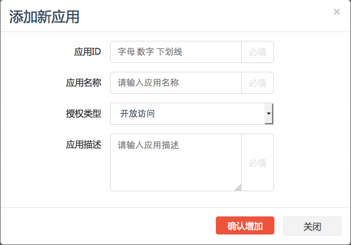
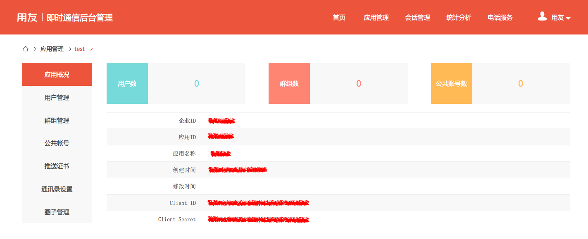
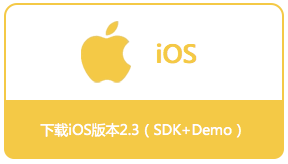
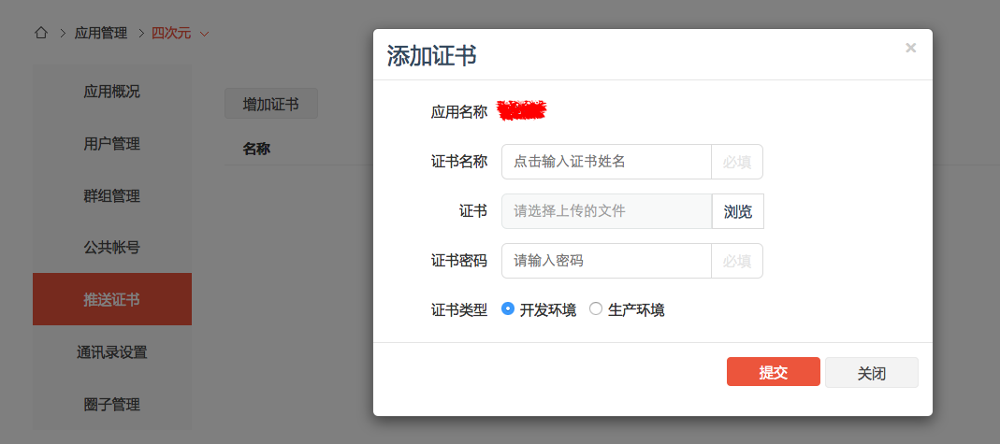

# <center>用友eUC iOS SDK集成指南</center>
欢迎使用**用友eUC**，在本文档中我们将为您详细介绍，如何在iOS APP中集成用友eUC。

## 1 集成准备
### 1.1 注册开发者账号
在用友eUC官网 <https://im.yyuap.com/> 上方点击“注册”，请按界面流程提示进行开发者账号注册。
### 1.2 创建应用
使用开发者账号登录到管理后台，点击页面上方“应用管理”，进入到应用管理。
点击左侧“新增应用”，输入应用信息即可创建，如图所示：



在应用概况中你可以查看应用的信息，我们会在客户端使用到“应用ID”和“企业ID”，在服务端进行获取token服务时使用到“ClientID”和“ClientSecret”，如果忘记了可以在这里查看。



### 1.3 在APP的Server端获取用友eUC token
用友eUC使用token进行用户验证

在APP的Server端需要新增一个获取token的服务，供客户端调用，在服务中需要调用用友eUC“获取用户token”的接口获得token并返回给客户端。

用友eUC获取用户token接口格式如下：

|接口信息|说明|
|---------------------|----|
|Path:|https://im.yyuap.com/sysadmin/rest/{企业ID}/{应用ID}/token|
|HTTPMethod:|POST|
|URLParam:|无|
|RequestHeader:|{"Content-Type":"application/json"}|
|RequestBody:| {"clientId": "应用的ClientID","clientSecret": "应用的ClientSecret", "userid":"用户ID", "nickname":"昵称（可选）"}|
|ResponseBody:|{"token": "xxxxxxxx-xxxx-xxxx-xxxx-xxxxxxxx","expiration": "1420041600"}|
* 注1：企业ID、应用ID、ClientID、ClientSecret参见本文档1.2。<br>
* 注2：userid需要传入一个用户的唯一标示，规格为字母或数字，50位以内，不区分大小写。<br>
* 注3：nickname为可选参数，仅在应用为开放模式下使用，如果提供了nickname且用户已经存在的情况下会更新昵称，提供了nickname且用户不存在则使用该昵称创建用户，没有提供nickname且用户存在，使用userid作为nickname。<br>
* 注4：expiration为token的有效时间，从1970年1月1日到截止时间的毫秒数，默认是24小时，在有效期内是不需要重复获取的，有效期重复获取的Token相同。

|可能的错误代码|错误原因|
|----|----|
|401|认证服务器认证失败|
|404|企业ID或应用ID无效，应用不存在, 检查地址是否正确|
|406|ClientID与应用ID不匹配, 检查地址和参数|
|500|认证过程发生错误|

### 1.4 下载用友eUC iOS SDK
用友eUC iOS SDK下载地址:<https://im.yyuap.com/download.html>



SDK目录结构如下图所示:


包含更新日志及开源的代码示例工程

### 1.5 iOS推送证书上传
如果需要iOS推送功能，在用友eUC后台上传推送证书，如图所示：



需要为p12证书设置一个证书名称，输入正确的密码，以及设置它是生产证书还是开发证书

## 2 SDK集成
### 2.1 集成SDK到APP
将libYonyouIMSdk.a及头文件引入到工程中，开发者可视情况引入真机专用库文件,模拟器专用库文件或者通用库文件
### 2.2 依赖的类库
用友eUC iOS SDK依赖的系统类库如下：

AudioToolbox.framework<br>
MobileCoreServices.framework<br>
AssetsLibrary.framework<br>
AVFoundation.framework<br>
CoreMotion.framework<br>
libresolv.dylib<br>
libsqlite3.dylib<br>
Security.framework<br>
libstdc++.6.9.0.dylib<br>
libz.dylib<br>
SystemConfiguration.framework<br>
CoreTelephony.framework<br>
CoreLocation.framework<br>
QuartzCore.framework<br>
CoreGraphics.framework

示例工程默认高德地图用于发送位置，开发者可以视自身情况使用其他地图类库

MAMapKit.framework<br>
AMapSearchKit.framework<br>
### 2.3 初始化SDK
在application:didFinishLaunchingWithOptions方法中进行SDK初始化及相关配置：

``` objective-c
// 注册app
[[YYIMChat sharedInstance] registerApp:@"应用ID" etpKey:@"企业ID"];
```
### 2.4 实现YYIMChatDelegate协议
AppDelegate实现YYIMChatDelegate协议

``` objective-c
// 添加代理
[[YYIMChat sharedInstance].chatManager addDelegate:self];
```
实现YYIMChatDelegate方法

``` objective-c
// 连接IM服务器失败
- (void)didConnectFailure:(YYIMError *)error {
}
// IM服务器认证失败
- (void)didAuthenticateFailure:(YYIMError *)error {
}
// 用户在其他客户端登陆，被踢出
- (void)didLoginConflictOccurred {
}
```
### 2.5 推送设置
注册远程推送

``` objective-c
// 注册远程推送
[self registerRemoteNotification];

- (void)registerRemoteNotification {
    UIApplication *application = [UIApplication sharedApplication];

    // 注册推送通知
    if (YYIM_iOS8) {
        [application registerForRemoteNotifications];
        UIUserNotificationType notificationTypes = UIUserNotificationTypeBadge | UIUserNotificationTypeSound | UIUserNotificationTypeAlert;
        UIUserNotificationSettings *settings = [UIUserNotificationSettings settingsForTypes:notificationTypes categories:nil];
        [application registerUserNotificationSettings:settings];
    } else {
        UIRemoteNotificationType notificationTypes = UIRemoteNotificationTypeBadge | UIRemoteNotificationTypeSound | UIRemoteNotificationTypeAlert;
        [[UIApplication sharedApplication] registerForRemoteNotificationTypes:notificationTypes];
    }
}
```
注册推送证书，设置上传的证书名称，参见1.5

``` objective-c
// 注册推送证书
#if defined(DEBUG) && DEBUG
    [[YYIMChat sharedInstance] registerApnsCerName:@"开发证书名称"];
#else
    [[YYIMChat sharedInstance] registerApnsCerName:@"生产证书名称"];
#endif
```
开启本地推送

``` objective-c
// 配置info.plist
// 添加Required background modes键，类型Array，新增value:App provides Voice over IP services
// 本地推送
[[YYIMChat sharedInstance].chatManager setEnableLocalNotification:YES];
```
### 2.6 应用生命周期
在Application的生命周期，调用sdk的对应方法

``` objective-c
[[YYIMChat sharedInstance] application:application didFinishLaunchingWithOptions:launchOptions];

[[YYIMChat sharedInstance] applicationWillResignActive:application];

[[YYIMChat sharedInstance] applicationDidEnterBackground:application];

[[YYIMChat sharedInstance] applicationWillEnterForeground:application];

[[YYIMChat sharedInstance] applicationDidBecomeActive:application];

[[YYIMChat sharedInstance] applicationWillTerminate:application];

[[YYIMChat sharedInstance] application:application didRegisterForRemoteNotificationsWithDeviceToken:deviceToken];

[[YYIMChat sharedInstance] application:application didFailToRegisterForRemoteNotificationsWithError:error];

[[YYIMChat sharedInstance] application:application didReceiveRemoteNotification:userInfo];

[[YYIMChat sharedInstance] application:application didReceiveLocalNotification:notification];
```
### 2.7 实现YYIMTokenDelegate协议
``` objective-c
// 注册token代理
[[YYIMChat sharedInstance].chatManager registerTokenDelegate:self];
```
实现YYIMTokenDelegate的getAppTokenWithComplete:方法，参见1.3，调用APPServer的取token接口获取token

``` objective-c
- (void)getAppTokenWithComplete:(void (^)(BOOL, id))complete {
    // 请求APPServer的取token接口
    // 如果请求成功
    YYToken *token = [YYToken tokenWithExpiration:@"请求到的token" expiration:@"token的过期时间"];
    complete(YES, token);
    // 如果请求失败
    complete(NO, error);
}
```
### 2.8 其他设置
设置日志级别

``` objective-c
// 设置日志级别
[[YYIMChat sharedInstance] setLogLevel:YYIM_LOG_LEVEL_VERBOSE];
```
如果使用了高德地图API，需要设置高德APIKey

``` objective-c
// 设置高德地图key，参见高德地图官网
[MAMapServices sharedServices].apiKey = @"高德地图Key";
```
## 3 登录与退出
### 3.1 登录
``` objective-c
YYIMLoginCompleteBlock block = ^(BOOL result, NSDictionary *userInfo, YYIMError *loginError) {
    if (result) {
        // 登录成功
    } else {
        // 登录失败
    }
};
// 登录
[[YYIMChat sharedInstance].chatManager login:@"用户ID" completion:block];
```
### 3.2 匿名登录
``` objective-c
// 匿名登录
[[YYIMChat sharedInstance].chatManager loginAnonymousWithCompletion:block];
```
### 3.3 退出
``` objective-c
// 退出
[[YYIMChat sharedInstance].chatManager logoff];
```
## 4 消息
### 4.1 获取每一个聊天用户/群组的最新消息及未读消息数
``` objective-c
/**
 *  获取每一个聊天用户/群组的最新消息及未读消息数
 *
 *  @return NSArray<YYRecentMessage>
 */
[[YYIMChat sharedInstance].chatManager getRecentMessage];
```
### 4.2 获取最近的联系人
``` objective-c
/**
 *  获取最近的联系人
 *
 *  @return NSArray<YYRoster/YYUser>
 */
[[YYIMChat sharedInstance].chatManager getRecentRoster];
```
### 4.3 获取未读的消息总数
``` objective-c
/**
 *  获取未读的消息总数
 *
 *  @return NSInteger
 */
[[YYIMChat sharedInstance].chatManager getUnreadMsgCount];
```
### 4.4 获取同某个用户/群组聊天的消息记录
``` objective-c
/**
 *  获取同某个用户/群组聊天的消息记录
 *
 *  @param chatId 用户/群组ID
 *
 *  @return NSArray<YYMessage>
 */
[[YYIMChat sharedInstance].chatManager getMessageWithId:(NSString *)chatId];
```
### 4.5 分页获取同某个用户/群组聊天的消息记录
``` objective-c
/**
 *  分页获取同某个用户/群组聊天的消息记录，获取某条消息之前的pageSize条消息记录，消息pid为空，获取最近的pageSize条消息记录
 *
 *  @param chatId   用户/群组ID
 *  @param pid      消息pid
 *  @param pageSize 分页大小
 *
 *  @return NSArray<YYMessage>
 */
[[YYIMChat sharedInstance].chatManager getMessageWithId:(NSString *)chatId beforePid:(NSString *)pid pageSize:(NSInteger)pageSize];
```
### 4.6 获取同某个用户/群组在某条消息及其之后的所有消息
``` objective-c
/**
 *  获取同某个用户/群组在某条消息及其之后的所有消息
 *
 *  @param chatId 用户/群组ID
 *  @param pid    消息pid
 *
 *  @return NSArray<YYMessage>
 */
[[YYIMChat sharedInstance].chatManager getMessageWithId:(NSString *)chatId afterPid:(NSString *)pid];
```
### 4.7 根据用户/群组ID删除与其所有的消息记录
``` objective-c
/**
 *  根据用户/群组ID删除与其所有的消息记录
 *
 *  @param chatId 用户/群组ID
 */
[[YYIMChat sharedInstance].chatManager deleteMessageWithId:(NSString *)chatId];
```
### 4.8 根据消息pid删除单条消息记录
``` objective-c
/**
 *  根据消息pid删除单条消息记录
 *
 *  @param packetId 消息pid
 */
[[YYIMChat sharedInstance].chatManager deleteMessageWithPid:(NSString *)packetId];
```
### 4.9 删除所有的消息记录
``` objective-c
/**
 *  删除所有的消息记录
 */
[[YYIMChat sharedInstance].chatManager deleteAllMessage];
```
### 4.10 更新语音消息已播放状态
``` objective-c
/**
 *  更新语音消息已播放状态
 *
 *  @param packetId 消息pid
 */
[[YYIMChat sharedInstance].chatManager updateAudioReaded:(NSString *)packetId];
```
### 4.11 根据消息pid更新单条消息已读状态
``` objective-c
/**
 *  根据消息pid更新单条消息已读状态
 *
 *  @param packetId 消息pid
 */
[[YYIMChat sharedInstance].chatManager updateMessageReadedWithPid:(NSString *)packetId];
```
### 4.12 根据用户/群组ID更新消息已读状态
``` objective-c
/**
 *  根据用户/群组ID更新消息已读状态
 *
 *  @param chatId 用户/群组ID
 */
[[YYIMChat sharedInstance].chatManager updateMessageReadedWithId:(NSString *)chatId];
```
### 4.13 发送文本消息
``` objective-c
/**
 *  发送文本消息
 *
 *  @param chatId   用户/群组ID
 *  @param text     消息内容
 *  @param chatType 单聊:YM_MESSAGE_TYPE_CHAT，群聊:YM_MESSAGE_TYPE_GROUPCHAT
 */
[[YYIMChat sharedInstance].chatManager sendTextMessage:(NSString *)chatId text:(NSString *)text chatType:(NSString *)chatType];

/**
 *  发送文本消息
 *
 *  @param chatId      用户/群组ID
 *  @param text        消息内容
 *  @param chatType    单聊:YM_MESSAGE_TYPE_CHAT，群聊:YM_MESSAGE_TYPE_GROUPCHAT
 *  @param atUserArray 群聊中@的用户IDArray，单聊无效
 */
[[YYIMChat sharedInstance].chatManager sendTextMessage:(NSString *)chatId text:(NSString *)text chatType:(NSString *)chatType atUserArray:(NSArray *)atUserArray];
```
### 4.15 发送图片消息
``` objective-c
/**
 *  发送图片消息
 *
 *  @param chatId     用户/群组ID
 *  @param assetArray 图片AssetArray
 *  @param chatType   单聊:YM_MESSAGE_TYPE_CHAT，群聊:YM_MESSAGE_TYPE_GROUPCHAT
 */
[[YYIMChat sharedInstance].chatManager sendImageMessage:(NSString *)chatId assets:(NSArray *)assetArray chatType:(NSString *)chatType];

/**
 *  发送图片消息
 *
 *  @param chatId     用户/群组ID
 *  @param assetArray 图片AssetArray
 *  @param chatType   单聊:YM_MESSAGE_TYPE_CHAT，群聊:YM_MESSAGE_TYPE_GROUPCHAT
 *  @param isOriginal 是否发送原图
 */
[[YYIMChat sharedInstance].chatManager sendImageMessage:(NSString *)chatId assets:(NSArray *)assetArray chatType:(NSString *)chatType isOriginal:(BOOL)isOriginal];
```
### 4.16 发送语音消息
``` objective-c
/**
 *  发送语音消息
 *
 *  @param chatId    用户/群组ID
 *  @param audioPath 语音路径
 *  @param chatType  单聊:YM_MESSAGE_TYPE_CHAT，群聊:YM_MESSAGE_TYPE_GROUPCHAT
 */
[[YYIMChat sharedInstance].chatManager sendAudioMessage:(NSString *)chatId wavPath:(NSString *)audioPath chatType:(NSString *)chatType];
```
### 4.17 发送分享消息
``` objective-c
/**
 *  发送分享消息
 *
 *  @param chatId         用户/群组ID
 *  @param urlString      分享链接URL
 *  @param title          标题
 *  @param description    描述
 *  @param imageUrlString 图标URL
 *  @param extendValue    扩展信息
 *  @param chatType       单聊:YM_MESSAGE_TYPE_CHAT，群聊:YM_MESSAGE_TYPE_GROUPCHAT
 */
[[YYIMChat sharedInstance].chatManager sendShareMessage:(NSString *)chatId url:(NSString *)urlString title:(NSString *)title description:(NSString *)description imageUrl:(NSString *)imageUrlString extendValue:(NSString *)extendValue chatType:(NSString *)chatType];
```
### 4.18 发送位置消息
``` objective-c
/**
 *  发送位置消息
 *
 *  @param chatId    用户/群组ID
 *  @param imagePath 位置截图路径
 *  @param address   地址
 *  @param longitude 经度
 *  @param latitude  纬度
 *  @param chatType  单聊:YM_MESSAGE_TYPE_CHAT，群聊:YM_MESSAGE_TYPE_GROUPCHAT
 */
[[YYIMChat sharedInstance].chatManager sendLocationManager:(NSString *)chatId imagePath:(NSString *)imagePath address:(NSString *) address longitude: (float) longitude latitude:(float) latitude chatType:(NSString *)chatType];
```
### 4.19 转发消息
``` objective-c
/**
 *  转发消息
 *
 *  @param chatId   用户/群组ID
 *  @param packetId 源消息pid
 *  @param chatType 单聊:YM_MESSAGE_TYPE_CHAT，群聊:YM_MESSAGE_TYPE_GROUPCHAT
 */
[[YYIMChat sharedInstance].chatManager forwardMessage:(NSString *)chatId pid:(NSString *)packetId chatType:(NSString *)chatType];
```
### 4.20 重发失败的消息
``` objective-c
/**
 *  重发失败的消息
 *
 *  @param pid 消息pid
 */
[[YYIMChat sharedInstance].chatManager resendMessage:(NSString *)pid];
```
### 4.21 下载消息资源
``` objective-c
/**
 *  下载消息资源（图片/语音/文件）
 *
 *  @param pid 消息pid
 */
[[YYIMChat sharedInstance].chatManager downloadMessageRes:(NSString *)pid];
```
### 4.22 下载消息图片
``` objective-c
/**
 *  下载消息图片
 *
 *  @param pid              消息pid
 *  @param imageType        kYYIMImageTypeNormal:默认图，kYYIMImageTypeOriginal:原图，kYYIMImageTypeThumb:缩略图
 *  @param downloadProgress 进度回调block
 *  @param downloadComplete 完成回调block
 */
[[YYIMChat sharedInstance].chatManager downloadImageMessageRes:(NSString *)pid imageType:(YYIMImageType)imageType progress:(YYIMAttachDownloadProgressBlock)downloadProgress complete:(YYIMAttachDownloadCompleteBlock)downloadComplete];
```
### 4.23 YYIMChatDelegate中的消息相关通知
``` objective-c
/**
 *  消息即将发送
 *
 *  @param message 消息
 */
- (void)willSendMessage:(YYMessage *)message;

/**
 *  消息已经发送
 *
 *  @param message 消息
 */
- (void)didSendMessage:(YYMessage *)message;

/**
 *  消息发送失败
 *
 *  @param message 消息
 *  @param error   错误
 */
- (void)didSendMessageFaild:(YYMessage *)message error:(YYIMError *)error;

/**
 *  收到消息
 *
 *  @param message 消息
 */
- (void)didReceiveMessage:(YYMessage *)message;

/**
 *  消息状态变更
 *
 *  @param message 消息
 */
- (void)didMessageStateChange:(YYMessage *)message;

/**
 *  消息状态变化
 *
 *  @param chatId 用户/群组ID
 */
- (void)didMessageStateChangeWithChatId:(NSString *)chatId;

/**
 *  消息资源（语音/图片/文件）状态变化
 *
 *  @param message 消息
 *  @param error   错误
 */
- (void)didMessageResStatusChanged:(YYMessage *)message error:(YYIMError *)error;

/**
 *  消息删除
 *
 *  @param info 删除信息
 */
- (void)didMessageDelete:(NSDictionary *)info;
```
## 5 好友
### 5.1 好友模式
好友关系分为两种模式：

1. 双向确认的好友关系：A添加B为好友，B会收到好友邀请的通知，B同意后，AB双方互为好友关系；

2. 单向收藏的好友关系：A添加B为好友即为A对B的收藏关系；

好友的关系模式只能选择一种，默认的好友模式为双向确认的模式。

设置好友模式：

``` objective-c
/**
 *  设置好友模式
 *
 *  @param isCollect 是否单向收藏模式
 */
[[YYIMConfig sharedInstance] setRosterCollect:(BOOL)isCollect];
```
### 5.2 获得所有好友对象
``` objective-c
/**
 *  获得所有好友对象
 *
 *  @return NSArray<YYRoster>
 */
[[YYIMChat sharedInstance].chatManager getAllRoster];
```
### 5.3 根据好友ID获得好友对象
``` objective-c
/**
 *  根据好友ID获得好友对象
 *
 *  @param rosterId 好友ID
 *
 *  @return YYRoster
 */
[[YYIMChat sharedInstance].chatManager getRosterWithId:(NSString *)rosterId];
```
### 5.4 添加好友
``` objective-c
/**
 *  添加好友
 *
 *  @param userId 用户ID
 */
[[YYIMChat sharedInstance].chatManager addRoster:(NSString *)userId];
```
### 5.5 获得所有好友邀请（双向模式）
``` objective-c
/**
 *  获得所有好友邀请
 *
 *  @return NSArray<YYRoster>
 */
[[YYIMChat sharedInstance].chatManager getAllRosterInvite];
```
### 5.6 获得未处理的好友邀请数量（双向模式）
``` objective-c
/**
 *  获得未处理的好友邀请数量
 *
 *  @return NSInteger
 */
[[YYIMChat sharedInstance].chatManager getNewRosterInviteCount];
```
### 5.7 同意好友邀请（双向模式）
``` objective-c
/**
 *  同意好友邀请
 *
 *  @param userId 用户ID
 */
[[YYIMChat sharedInstance].chatManager acceptRosterInvite:(NSString *)userId];
```
### 5.8 拒绝好友邀请（双向模式）
``` objective-c
/**
 *  拒绝好友邀请
 *
 *  @param userId 用户ID
 */
[[YYIMChat sharedInstance].chatManager refuseRosterInvite:(NSString *)userId];
```
### 5.9 删除好友
``` objective-c
/**
 *  删除好友
 *
 *  @param rosterId 好友ID
 */
[[YYIMChat sharedInstance].chatManager deleteRoster:(NSString *)rosterId];
```
### 5.10 重命名好友
``` objective-c
/**
 *  重命名好友
 *
 *  @param rosterId 好友ID
 *  @param name     备注名
 */
[[YYIMChat sharedInstance].chatManager renameRoster:(NSString *)rosterId name:(NSString *)name];
```
### 5.11 YYIMChatDelegate中的好友相关通知
``` objective-c
/**
 *  好友信息变化
 */
- (void)didRosterChange;

/**
 *  好友信息变化
 *
 *  @param roster 好友
 */
- (void)didRosterUpdate:(YYRoster *)roster;

/**
 *  好友删除
 *
 *  @param rosterId 好友ID
 */
- (void)didRosterDelete:(NSString *)rosterId;

/**
 *  好友在线状态变化
 *
 *  @param rosterId 好友ID
 */
- (void)didRosterStateChange:(NSString *)rosterId;

/**
 *  收到好友邀请
 *
 *  @param roster 好友
 */
- (void)didRosterInviteReceived:(YYRoster *)roster;

/**
 *  好友邀请变化
 */
- (void)didRosterInviteChange;
```
## 6 群组
### 6.1 创建群组
``` objective-c
/**
 *  创建群组
 *
 *  @param groupName   群组名称
 *  @param userIdArray 群组成员userIDs
 *
 *  @return seriId
 */
[[YYIMChat sharedInstance].chatManager createChatGroupWithName:(NSString *)groupName user:(NSArray *)userIdArray];
```
### 6.2 邀请用户加入群组
``` objective-c
/**
 *  邀请用户加入群组
 *
 *  @param groupId     群组ID
 *  @param userIdArray 邀请加入的userIDs
 */
[[YYIMChat sharedInstance].chatManager inviteRosterIntoChatGroup:(NSString *)groupId user:(NSArray *)userIdArray];
```
### 6.3 加入群组
``` objective-c
/**
 *  加入群组
 *
 *  @param groupId 群组ID
 */
[[YYIMChat sharedInstance].chatManager joinChatGroup:(NSString *)groupId];
```
### 6.4 退出群组
``` objective-c
/**
 *  退出群组
 *
 *  @param groupId 群组ID
 */
[[YYIMChat sharedInstance].chatManager leaveChatGroup:(NSString *)groupId];
```
### 6.5 将群组成员踢出群组
``` objective-c
/**
 *  将群组成员踢出群组
 *
 *  @param groupId  群组ID
 *  @param memberId 要踢出的成员ID
 */
[[YYIMChat sharedInstance].chatManager kickGroupMemberFromGroup:(NSString *)groupId member:(NSString *)memberId];
```
### 6.6 重命名群组
``` objective-c
/**
 *  重命名群组
 *
 *  @param groupId   群组ID
 *  @param groupName 群组新名称
 */
[[YYIMChat sharedInstance].chatManager renameChatGroup:(NSString *)groupId name:(NSString *)groupName];
```
### 6.7 群组保存到通讯录
``` objective-c
/**
 *  群组保存到通讯录
 *
 *  @param groupId 群组ID
 */
[[YYIMChat sharedInstance].chatManager collectChatGroup:(NSString *)groupId];
```
### 6.8 群组取消保存到通讯录
``` objective-c
/**
 *  群组取消保存在通讯录
 *
 *  @param groupId 群组ID
 */
[[YYIMChat sharedInstance].chatManager unCollectChatGroup:(NSString *)groupId];
```
### 6.9 获取保存到通讯录的所有群组
``` objective-c
/**
 *  获得保存到通讯录的群组列表
 *
 *  @return NSArray<YYChatGroup>
 */
[[YYIMChat sharedInstance].chatManager getCollectChatGroups];
```
### 6.10 根据群组ID获得群组对象
``` objective-c
/**
 *  根据群组ID获取群组对象
 *
 *  @param groupId 群组ID
 *
 *  @return YYChatGroup
 */
[[YYIMChat sharedInstance].chatManager getChatGroupWithGroupId:(NSString *)groupId];
```
### 6.11 获得已加入的所有群组
``` objective-c
/**
 *  获得已加入的所有群组
 *
 *  @return NSArray<YYChatGroup>
 */
[[YYIMChat sharedInstance].chatManager getAllChatGroups];
```
### 6.12 根据群组ID获得所有群组成员
``` objective-c
/**
 *  根据群组ID获得所有群组成员
 *
 *  @param groupId 群组ID
 *
 *  @return NSArray<YYChatGroupMember>
 */
[[YYIMChat sharedInstance].chatManager getGroupMembersWithGroupId:(NSString *)groupId];
```
### 6.13 根据群组ID获得当前用户是否该群组所有者
``` objective-c
/**
 *  根据群组ID获得当前用户是否该群组所有者
 *
 *  @param groupId 群组ID
 *
 *  @return 是否群组所有者
 */
[[YYIMChat sharedInstance].chatManager isGroupOwner:(NSString *)groupId];
```
### 6.14 根据关键字模糊搜索群组
``` objective-c
/**
 *  根据关键字模糊搜索群组
 *
 *  @param keyword 关键字
 */
[[YYIMChat sharedInstance].chatManager searchChatGroupWithKeyword:(NSString *)keyword];
```
### 6.15 YYIMChatDelegate中的消息相关通知
``` objective-c
/**
 *  群组创建成功
 *
 *  @param seriId 创建群返回的seriId
 *  @param group  群组
 */
- (void)didChatGroupCreateWithSeriId:(NSString *)seriId group:(YYChatGroup *)group;

/**
 *  群组创建失败
 *
 *  @param seriId 创建群返回的seriId
 */
- (void)didNotChatGroupCreateWithSeriId:(NSString *)seriId;

/**
 *  群组信息变更
 *
 *  @param group 群组
 */
- (void)didChatGroupInfoUpdate:(YYChatGroup *)group;

/**
 *  群组成员信息变更
 *
 *  @param groupId 群组ID
 */
- (void)didChatGroupMemberUpdate:(NSString *)groupId;

/**
 *  群组成员数量变化
 *
 *  @param groupId 群组ID
 */
- (void)didChatGroupMemberCountChange:(NSString *)groupId;

/**
 *  退出群组
 *
 *  @param groupId 群组ID
 */
- (void)didLeaveChatGroup:(NSString *)groupId;

/**
 *  群组搜索结果
 *
 *  @param groupArray NSArray<YYChatGroup>
 */
- (void)didReceiveChatGroupSearchResult:(NSArray *)groupArray;

/**
 *  群组搜索失败
 *
 *  @param error 错误
 */
- (void)didNotReceiveChatGroupSearchResult:(YYIMError *)error;

/**
 *  保存群组到通讯录成功
 *
 *  @param groupId 群组ID
 */
- (void)didCollectChatGroup:(NSString *)groupId;

/**
 *  保存群组到通讯录失败
 *
 *  @param groupId 群组ID
 *  @param error
 */
- (void)didNotCollectChatGroup:(NSString *)groupId error:(YYIMError *)error;

/**
 *  取消保存群组到通讯录成功
 *
 *  @param groupId 群组ID
 */
- (void)didUnCollectChatGroup:(NSString *)groupId;

/**
 *  取消保存群组到通讯录失败
 *
 *  @param groupId 群组ID
 *  @param error
 */
- (void)didNotUnCollectChatGroup:(NSString *)groupId error:(YYIMError *)error;
```
## 7 用户
### 7.1 根据用户ID获取用户对象
``` objective-c
/**
 *  根据用户ID获取用户对象
 *
 *  @param userId 用户ID
 *
 *  @return YYUser
 */
[[YYIMChat sharedInstance].chatManager getUserWithId:(NSString *)userId];
```
### 7.2 更新用户信息
``` objective-c
/**
 *  更新用户信息
 *
 *  @param user 用户信息YYUser
 */
[[YYIMChat sharedInstance].chatManager updateUser:(YYUser *)user];
```
### 7.3 根据用户ID向Server请求用户信息
``` objective-c
/**
 *  根据用户ID向Server请求用户信息
 *
 *  @param userId 用户ID
 */
[[YYIMChat sharedInstance].chatManager loadUser:(NSString *)userId];
```
### 7.4 根据关键字查询用户信息
``` objective-c
/**
 *  根据关键字查询用户信息
 *
 *  @param keyword 关键字
 */
[[YYIMChat sharedInstance].chatManager searchUserWithKeyword:(NSString *)keyword];
```
### 7.5 YYIMChatDelegate中的用户相关通知
``` objective-c
/**
 *  用户信息更新
 *
 *  @param user 用户
 */
- (void)didUserInfoUpdate:(YYUser *)user;

/**
 *  用户搜索结果
 *
 *  @param userArray NSArray<YYUser>
 */
- (void)didReceiveUserSearchResult:(NSArray *)userArray;

/**
 *  用户搜索失败
 *
 *  @param error 错误
 */
- (void)didNotReceiveUserSearchResult:(YYIMError *)error;
```
### 7.6 自定义用户的实现
用友eUC支持用户在不同步用户信息数据的情况下进行集成

实现YYIMUserProtocol自定义用户提供者：

``` objective-c
@protocol YYIMUserProtocol <YYIMBaseProtocol>

@optional

- (void)activeYYIMDelegate:(id<YYIMChatDelegate>)delegate;

- (void)loadRosterUsers;

@required

/**
 *  根据关键字查询用户信息
 *
 *  @param keyword 关键字
 */
- (void)searchUserWithKeyword:(NSString *)keyword;

/**
 *  根据用户ID向Server请求用户信息
 *
 *  @param userId 用户ID
 */
- (void)loadUser:(NSString *)userId;

/**
 *  根据用户ID获取用户对象
 *
 *  @param userId 用户ID
 *
 *  @return YYUser
 */
- (YYUser *)getUserWithId:(NSString *)userId;

/**
 *  更新用户信息
 *
 *  @param user 用户信息YYUser
 */
- (void)updateUser:(YYUser *)user;

@end
```
用户数据提供者实现示例：

``` objective-c
@interface DEMOUserProvider ()

@property (weak, nonatomic) id<YYIMChatDelegate> delegate;

@end

@implementation DEMOUserProvider

- (void)activeYYIMDelegate:(id<YYIMChatDelegate>)delegate {
    self.delegate = delegate;
}

- (YYUser *)getUserWithId:(NSString *)userId {
    // get user from cache/db
    YYUser *user = [[YYUser alloc] init];
    [user setUserId:userId];
    [user setUserName:@""];
    [user setUserPhoto:@""];
    ...
    return user;
}

- (void)loadUser:(NSString *)userId {
    // load server from app server
    // on success
    YYUser *user = [[YYUser alloc] init];
    [user setUserId:userId];
    [user setUserName:@""];
    [user setUserPhoto:@""];
    [self.delegate didUserInfoUpdate:user];
}

- (void)updateUser:(YYUser *)user {
    // update user data to app server
    // update user in cache/db
    [self.delegate didUserInfoUpdate:user];
}

- (void)searchUserWithKeyword:(NSString *)keyword {
    // search user data from app server
    // on success
    [self.delegate didReceiveUserSearchResult:(NSArray *)userArray];
    // on faild
    [self.delegate didNotReceiveUserSearchResult:(YYIMError *)error];
}

@end
```
注册用户数据提供者到SDK

``` objective-c
[[YYIMChat sharedInstance].chatManager registerUserProvider:[[DEMOUserProvider alloc] init]];
```
## 8 公共号
### 8.1 获得已关注的所有公共号
``` objective-c
/**
 *  获得已关注的所有公共号
 *
 *  @return NSArray<YYPubAccount>
 */
[[YYIMChat sharedInstance].chatManager getAllPubAccount];
```
### 8.2 根据公共号ID获得公共号对象
``` objective-c
/**
 *  根据公共号ID获得公共号对象
 *
 *  @param accountId 公共号ID
 *
 *  @return YYPubAccount
 */
[[YYIMChat sharedInstance].chatManager getPubAccountWithAccountId:(NSString *)accountId];
```
### 8.3 根据关键字搜索公共号
``` objective-c
/**
 *  根据关键字搜索公共号
 *
 *  @param keyword 关键字
 */
[[YYIMChat sharedInstance].chatManager searchPubAccountWithKeyword:(NSString *)keyword];
```
### 8.4 关注公共号
``` objective-c
/**
 *  关注公共号
 *
 *  @param accountId 公共号ID
 */
[[YYIMChat sharedInstance].chatManager followPubAccount:(NSString *)accountId];
```
### 8.5 取消关注公共号
``` objective-c
/**
 *  取消关注公共号
 *
 *  @param accountId 公共号ID
 */
[[YYIMChat sharedInstance].chatManager unFollowPubAccount:(NSString *)accountId];
```
### 8.6 YYIMChatDelegate中的公共号相关通知
``` objective-c
/**
 *  公共号数据变化
 */
- (void)didPubAccountChange;

/**
 *  搜索公共号结果
 *
 *  @param pubAccountArray NSArray<YYPubAccount>
 */
- (void)didReceivePubAccountSearchResult:(NSArray *)pubAccountArray;

/**
 *  搜索公共号失败
 *
 *  @param error 错误
 */
- (void)didNotReceivePubAccountSearchResult:(YYIMError *)error;
```
## 9 组织架构
### 9.1 获得根组织对象
``` objective-c
/**
 *  获得根组织对象
 *
 *  @return YYOrg
 */
[[YYIMChat sharedInstance].chatManager getRootOrg];
```
### 9.2 根据组织ID获得组织对象
``` objective-c
/**
 *  根据组织ID获得组织对象
 *
 *  @param parentId 组织ID
 *
 *  @return YYOrg
 */
[[YYIMChat sharedInstance].chatManager getOrgWithParentId:(NSString *)parentId];
```
### 9.3 根据上级组织ID
``` objective-c
/**
 *  根据组织ID向服务器请求组织信息
 *
 *  @param parentId 组织ID
 */
[[YYIMChat sharedInstance].chatManager loadOrgWithParentId:(NSString *)parentId];
```
### 9.4 YYIMChatDelegate中的组织相关通知
``` objective-c
/**
 *  组织信息
 *
 *  @param parentId 组织ID
 *  @param org      组织
 */
- (void)didReceiveOrgWithParentId:(NSString *)parentId org:(YYOrg *)org;

/**
 *  获取组织信息失败
 *
 *  @param parentId 组织ID
 *  @param error    错误
 */
- (void)didNotReceiveOrgWithParentId:(NSString *)parentId error:(YYIMError *)error;
```

## 10 会议
### 10.1 判断当前是否进行会议中
``` objective-c
/**
 *  获取当前是否有会议在进行
 *  调用了创建会议，加入会议和同意邀请成功后就会被认为是成功加入了会议
 *
 *  @return
 */
- (BOOL)isNetMeetingProcessing;
```
### 10.2 判断当前是否有没有处理的会议邀请
``` objective-c
/**
 *  获取还没有处理的网络会议邀请
 *  如果客户端收到了会议请求，但是还没有响应（同意或者拒绝）。
 *
 *  @return 邀请的id（没有返回nil）
 */
- (NSString *)getUntreatedNetMeetingInviting;
```
### 10.3 标记会议邀请已处理
``` objective-c
/**
 *  标记已经处理了网络会议邀请
 */
- (void)treatNetMeetingInvite;
```
### 10.4 设置网络会议的优化配置
``` objective-c
/**
 *  设置网络会议的优化配置，可以设置：
    自由模式，大家都可以发送和接收音视频
    主持模式，自己可以发送音视频，不能接收
    观众模式，自己不可以发送音视频，可以接受
 *
 *  @param profile 优化配置
 */
- (void)setNetMeetingProfile:(YYIMNetMeetingProfile)profile;
```
### 10.5 根据会议id进入会议的频道中
``` objective-c
/**
 *  根据会议id进入会议的频道中（必须使用在创建会议、加入会议、同意邀请成功之后）
 *
 *  @param channelId 频道id
 *
 *  @return
 */
- (void)enterNetMeeting:(NSString *)channelId;
```
### 10.6 设置会议为视频模式
``` objective-c
/**
 *  视频可用。将语音模式切换到视频模式.通话过程中或者进入频道之前都可以成功调用。
 *
 *  @return 返回0表示成功，负数表示失败。
 */
- (int)enableNetMeetingVideo;
```
### 10.7 设置会议为音频模式
``` objective-c
/**
 *  视频不可用。将视频模式切换到语音模式.通话过程中或者进入频道之前都可以成功调用。
 *
 *  @return 返回0表示成功，负数表示失败。
 */
- (int)disableNetMeetingVideo;
```
### 10.9 打开本地预览
``` objective-c
/**
 *  打开本地预览，这个时候不会发送视频流到服务器。
 *
 *  @return 返回0表示成功，负数表示失败。
 */
- (int)startNetMeetingPreview;
```
### 10.9 关闭本地预览
``` objective-c
/**
 *  关闭本地预览
 *
 *  @return 返回0表示成功，负数表示失败。
 */
- (int)stopNetMeetingPreview;
```
### 10.10 设置麦克状态
``` objective-c
/**
 *  设置是否关闭麦克本地静音，禁止上传音频流到服务器
 *
 *  @param mute YES: 静音。 NO: 不静音.
 *
 *  @return 返回0表示成功，负数表示失败。
 */
- (int)muteNetMeetingLocalAudioStream:(BOOL)mute;
```
### 10.11 设置视频流发送
``` objective-c
/**
 *  设置是否禁止发送本地视频流到服务器。
 *
 *  @param mute YES: 禁止发送。 NO: 不禁止发送.
 *
 *  @return 返回0表示成功，负数表示失败。
 */
- (int)muteNetMeetingLocalVideoStream:(BOOL)mute;
```
### 10.12 暂停播放所有远程音频流
``` objective-c
/**
 *  设置暂停播放所有远程音频流
 *
 *  @param mute 是否禁止
 *
 *  @return 返回0表示成功，负数表示失败。
 */
- (int)muteAllNetMeetingRemoteAudioStreams:(BOOL)mute;
```
### 10.13 暂停播放所有远程视频流
``` objective-c
/**
 *  设置暂停播放所有远程视频流
 *
 *  @param mute 是否禁止
 *
 *  @return 返回0表示成功，负数表示失败
 */
- (int)muteAllNetMeetingRemoteVideoStreams:(BOOL)mute;
```
### 10.14 设置扬声器
``` objective-c
/**
 *  设置是否使用扬声器
 *
 *  @param mute YES: 使用。 NO: 不使用
 *
 *  @return 返回0表示成功，负数表示失败。
 */
- (int)setNetMeetingEnableSpeakerphone:(BOOL)enableSpeaker;
```
### 10.15 查询扬声器使用状态
``` objective-c
/**
 *  查询当前是否正在使用扬声器
 *
 *  @return 返回0表示成功，负数表示失败。
 */
- (BOOL)isNetMeetingSpeakerphoneEnabled;
```
### 10.16 绘制本地视频流
``` objective-c
/**
 *  设置本地（自己）视频流的绘制。可以在进入频道前设置。
 *
 *  @param view 需要绘制视频流的视图
 *  @param uid  用户id
 *
 *  @return 返回0表示成功，负数表示失败。
 */
- (int)setupNetMeetingLocalVideo:(UIView *)view userId:(NSString *)userId;
```
### 10.17 绘制远程视频流
``` objective-c
/**
 *  设置远程（除自己以为的用户）视频流的绘制。
 *
 *  @param view 需要绘制视频流的视图
 *  @param uid  用户id
 *
 *  @return 返回0表示成功，负数表示失败。
 */
- (int)setupNetMeetingRemoteVideo:(UIView *)view userId:(NSString *)userId;
```
### 10.18 切换前后摄像头
``` objective-c
/**
 *  切换前后摄像头
 *
 *  @return 返回0表示成功，负数表示失败。
 */
- (int)switchNetMeetingCamera;
```
### 10.19 开启网络质量监测
``` objective-c
/**
 *  开启网络质量监测。即使没有进行通话也会占用流量。所以建议当应用在前台并且通话中启用。离开通话或者进入后台关闭网络质量监测。
 *
 *  @return 返回0表示成功，负数表示失败。
 */
- (int)enableNetMeetingNetworkTest;
```
### 10.20 关闭网络质量监测
``` objective-c
/**
 *  关闭网络质量监测。
 *
 *  @return 返回0表示成功，负数表示失败。
 */
- (int)disableNetMeetingNetworkTest;
```
### 10.21 获得指定的会议对象
``` objective-c
/**
 *  获得指定的会议对象
 *
 *  @param channelId 会议id
 *
 *  @return 会议对象
 */
- (YYNetMeeting *)getNetMeetingWithChannelId:(NSString *)channelId;
```
### 10.22 获得会议主持人
``` objective-c
/**
 *  获得会议主持人
 *
 *  @param channelId 会议id
 *
 *  @return
 */
- (YYNetMeetingMember *)getNetMeetingModerator:(NSString *)channelId;
```
### 10.23 获得会议的所有成员
``` objective-c
/**
 *  获得会议的所有成员
 *
 *  @param channelId 会议id
 *
 *  @return 成员集合
 */
- (NSArray *)getNetMeetingMembersWithChannelId:(NSString *)channelId;
```
### 10.24 获得会议的指定数量的成员
``` objective-c
/**
 *  获得会议的指定数量的成员
 *
 *  @param channelId 会议id
 *  @param limit     数量限制
 *
 *  @return 成员集合
 */
- (NSArray *)getNetMeetingMembersWithChannelId:(NSString *)channelId limit:(NSInteger)limit;
```
### 10.25 获取会议的指定成员
``` objective-c
/**
 *  获取会议的指定成员
 *
 *  @param channelId 会议id
 *  @param memberId  成员id
 *
 *  @return 成员
 */
- (YYNetMeetingMember *)getNetMeetingMemberWithChannelId:(NSString *)channelId memberId:(NSString *)memberId;
```
### 10.26 获得会议通知
``` objective-c
/**
 *  获得会议通知
 *
 *  @param offset 偏移量
 *  @param limit  数量
 *
 *  @return
 */
- (NSArray *)getNetMeetingNoticeWithOffset:(NSInteger)offset limit:(NSInteger)limit;
```
### 10.27 开始预约会议
``` objective-c
/**
 *  开始预约会议
 *
 *  @param channelId 会议id
 *
 *  @return 创建的唯一标示
 */
- (NSString *)startReservationNetMeeting:(NSString *)channelId;
```
### 10.28 创建一个会议
``` objective-c
/**
 *  创建一个会议
 *
 *  @param netMeetingType 会议类型（会议或者直播）
 *  @param netMeetingMode 会议模式（视频或者语音）
 *  @param invitees       被邀请人
 *  @param topic          主题
 *
 *  @return 创建的唯一标示
 */
- (NSString *)createNetMeetingWithNetMeetingType:(YYIMNetMeetingType)netMeetingType netMeetingMode:(YYIMNetMeetingMode)netMeetingMode invitees:(NSArray *)invitees topic:(NSString *)topic;
```
### 10.29 发送会议邀请
``` objective-c
/**
 *  发送会议邀请
 *
 *  @param channelId 会议id
 *  @param invitees  被邀请人集合
 */
- (void)inviteNetMeetingMember:(NSString *)channelId invitees:(NSArray *)invitees;
```
### 10.30 主动加入会议
``` objective-c
/**
 *  主动加入会议
 *
 *  @param channelId 会议id
 */
- (void)joinNetMeeting:(NSString *)channelId;
```
### 10.31 同意加入会议
``` objective-c
/**
 *  同意加入会议
 *
 *  @param channelId 会议id
 */
- (void)agreeEnterNetMeeting:(NSString *)channelId;
```
### 10.32 拒绝加入会议
``` objective-c
/**
 *  拒绝加入会议
 *
 *  @param channelId 会议id
 */
- (void)refuseEnterNetMeeting:(NSString *)channelId;
```
### 10.33 通知会议其他人，本人打开摄像头
``` objective-c
/**
 *  通知会议其他人，本人打开摄像头
 *
 *  @param channelId 会议id
 */
- (void)openNetMeetingVideo:(NSString *)channelId;
```
### 10.34 通知会议其他人，本人关闭摄像头
``` objective-c
/**
 *  通知会议其他人，本人关闭摄像头
 *
 *  @param channelId 会议id
 */
- (void)closeNetMeetingVideo:(NSString *)channelId;
```
### 10.35 通知会议其他人，本人打开麦克
``` objective-c
/**
 *  通知会议其他人，本人打开麦克
 *
 *  @param channelId 会议id
 */
- (void)openNetMeetingAudio:(NSString *)channelId;
```
### 10.36 通知会议其他人，本人关闭麦克
``` objective-c
/**
 *  通知会议其他人，本人关闭麦克
 *
 *  @param channelId 会议id
 */
- (void)closeNetMeetingAudio:(NSString *)channelId;
```
### 10.37 会议上锁
``` objective-c
/**
 *  会议上锁。上锁后禁止邀请，禁止加入
 *
 *  @param channelId 会议id
 */
- (void)lockNetMeeting:(NSString *)channelId;
```
### 10.38 会议解锁
``` objective-c
/**
 *  会议解锁
 *
 *  @param channelId 会议id
 */
- (void)unlockNetMeeting:(NSString *)channelId;
```
### 10.39 修改会议主题
``` objective-c
/**
 *  修改会议主题
 *
 *  @param channelId 会议id
 */
- (void)editNetMeetingTopic:(NSString *)channelId topic:(NSString *)topic;
```
### 10.40 参与者离开会议
``` objective-c
/**
 *  离开会议。只有参与者可以离开，而主持人不能调用此方法。
 *
 *  @param channelId 会议id
 */
- (void)exitNetMeeting:(NSString *)channelId;
```
### 10.41 更换主持人
``` objective-c
/**
 *  更换主持人
 *
 *  @param channelId 会议id
 *  @param userId    新的主持人
 */
- (void)roleConversionOfNetMeeting:(NSString *)channelId withUserId:(NSString *)userId;
```
### 10.42 主持人结束会议
``` objective-c
/**
 *  主持人结束了会议
 *
 *  @param channelId 会议id
 */
- (void)endNetMeeting:(NSString *)channelId;
```
### 10.43 会议踢出成员
``` objective-c
/**
 *  会议踢出成员
 *
 *  @param channelId   会议id
 *  @param memberArray 成员集合
 */
- (void)kickMemberFromNetMeeting:(NSString *)channelId memberArray:(NSArray *)memberArray;
```
### 10.44 指定成员禁言
``` objective-c
/**
 *  指定成员禁言
 *
 *  @param channelId   会议id
 *  @param memberArray 成员集合
 */
- (void)disableMemberSpeakFromNetMeeting:(NSString *)channelId userId:(NSString *)userId;
```
### 10.45 指定成员允许发言
``` objective-c
/**
 *  指定成员允许发言
 *
 *  @param channelId   会议id
 *  @param memberArray 成员集合
 */
- (void)enableMemberSpeakFromNetMeeting:(NSString *)channelId userId:(NSString *)userId;
```
### 10.46 禁言所有人
``` objective-c
/**
 *  禁言所有人
 *
 *  @param channelId 会议id
 */
- (void)disableAllSpeakFromNetMeeting:(NSString *)channelId;
```
### 10.47 允许所有人发言
``` objective-c
/**
 *  允许所有人发言
 *
 *  @param channelId 会议id
 */
- (void)enableAllSpeakFromNetMeeting:(NSString *)channelId;
```
### 10.48 获得会议详情
``` objective-c
/**
 *  获得会议详情
 *
 *  @param channelId 会议id
 *  @param complete
 */
- (void)getNetmeetingDetail:(NSString *)channelId complete:(void (^)(BOOL, YYNetMeetingDetail *, NSArray *, YYIMError *))complete;
```
### 10.49 获取我的会议记录
``` objective-c
/**
 *  获取我的会议记录
 *
 *  @param complete
 */
- (void)getMyNetMeetingWithOffset:(NSUInteger)offset limit:(NSUInteger)limit complete:(void (^)(BOOL result, NSArray *netMeetings, YYIMError *error)) complete;
```
### 10.50 预约会议
``` objective-c
/**
 *  预约会议
 *
 *  @param netMeetingDetail 预约会议信息
 *  @param members          邀请人
 *  @param complete
 */
- (void)reservationNetMeetingWithNetMeetingDetail:(YYNetMeetingDetail *)netMeetingDetail members:(NSArray *)members complete:(void (^)(BOOL, YYIMError *, NSArray *))complete;
```
### 10.51 删除会议记录
``` objective-c
/**
 *  删除会议记录
 *
 *  @param channelId 会议ID
 *  @param complete
 */
- (void)removeNetMeetingWithChannelId:(NSString *)channelId complete:(void (^)(BOOL result, YYIMError *error)) complete;
```
### 10.52 取消预约会议
``` objective-c
/**
 *  取消预约会议
 *
 *  @param channelId 会议id
 *  @param complete
 */
- (void)cancelReservationNetMeeting:(NSString *)channelId complete:(void (^)(BOOL, YYIMError *))complete;
```
### 10.53 编辑预约会议
``` objective-c
/**
 *  编辑预约会议
 *
 *  @param netMeetingDetail 会议详情
 *  @param complete
 */
- (void)EditReservationNetMeeting:(YYNetMeetingDetail *)netMeetingDetail complete:(void (^)(BOOL, YYIMError *))complete;
```
### 10.54 预约会议邀请
``` objective-c
/**
 *  预约会议邀请
 *
 *  @param channelId 会议id
 *  @param members 成员集合
 *  @param complete
 */
- (void)inviteReservationNetMeeting:(NSString *)channelId member:(NSArray *)members complete:(void (^)(BOOL, YYIMError *, NSArray *))complete;
```
### 10.55 预约会议邀请
``` objective-c
/**
 *  预约会议踢人
 *
 *  @param channelId 会议id
 *  @param members   成员集合
 *  @param complete  
 */
- (void)kickReservationNetMeeting:(NSString *)channelId member:(NSArray *)members complete:(void (^)(BOOL, YYIMError *))complete;
```
### 10.56 YYIMNetMeetingDelegate中的消息相关通知
``` objective-c
/**
 *  视频会议服务初始化失败
 */
- (void)didNetMeetingInitFaild;

/**
 *  当前用户加入会议频道成功的回调
 *
 *  @param channel 会议id
 *  @param elapsed 加入频道延迟（毫秒）
 */
- (void)didJoinNetMeetingSuccessed:(NSString *)channelId elapsed:(NSInteger)elapsed;

/**
 *  sdk中出现错误。并且不能够恢复到正常状态，需要用户自己处理错误。
 *
 *  @param 错误
 */
- (void)didNetMeetingOccurError:(YYIMError *)error;

/**
 *  网络连接丢失的回调
 *
 */
- (void)didNetMeetingConnectionLost;

/**
 *  其他用户重连加入频道的回调
 *
 *  @param channel 会议id
 *  @param userId  用户id
 *  @param elapsed 加入频道延迟（毫秒）
 */
- (void)didRejoinNetMeeting:(NSString*)channelId withUserId:(NSString *)userId elapsed:(NSInteger) elapsed;

/**
 *  报告当前的统计数据，一秒钟执行一次
 *
 *  @param duration     累计通话时间
 *  @param sendBytes    累计发送流量字节数量
 *  @param receiveBytes 累计接收流量字节数量
 */
- (void)didNetMeetingReportStats:(NSUInteger)duration sendBytes:(NSUInteger)sendBytes receiveBytes:(NSUInteger)receiveBytes;


/**
 *  报告本地的网络质量的回调
 *
 *  @param 网络质量
 */
- (void)didNetMeetingNetworkQuality:(YYIMNetMeetingQuality)quality;

/**
 *  开始预约会议失败
 *
 *  @param seriId 请求id
 */
- (void)didNotStartReservationNetMeetingWithSeriId:(NSString *)seriId error:(YYIMError *)error;

/**
 *  创建一个会议失败
 *
 *  @param seriId 请求id
 */
- (void)didNotNetMeetingCreateWithSeriId:(NSString *)seriId netMeetingType:(YYIMNetMeetingType)netMeetingType netMeetingMode:(YYIMNetMeetingMode)netMeetingMode error:(YYIMError *)error;

/**
 *  加入会议失败
 */
- (void)didNotJoinNetMeeting:(NSString *)channelId error:(YYIMError *)error;

/**
 *  踢人失败
 */
- (void)didNotKickMemberFromNetMeeting;

/**
 *  编辑主题失败
 *
 *  @param channeId 会议id
 *  @param error    错误
 */
- (void)didNotNetMeetingEditTopic:(NSString *)channeId error:(YYIMError *)error;

/**
 *  收到会议邀请
 *
 *  @param channelId 会议id
 *  @param userArray  成员数组
 */
- (void)didNetMeetingInvited:(NSString *)channelId userArray:(NSArray *)userArray;

/**
 *  开始预约会议失败
 *
 *  @param seriId 请求id
 */
- (void)didStartReservationNetMeetingWithSeriId:(NSString *)seriId channelId:(NSString *)channelId;

/**
 *  创建会议成功
 *
 *  @param seriId 请求id
 *  @param channelId 频道id
 */
- (void)didNetMeetingCreate:(NSString *)seriId channelId:(NSString *)channelId;

/**
 *  同意加入会议
 *
 *  @param channelId 会议id
 */
- (void)didNetMeetingAgree:(NSString *)channelId netMeetingType:(YYIMNetMeetingType)netMeetingType;

/**
 *  主动加入会议（加入会议的要求被服务器同意，需要调用enterNetMeeting:执行真正的进入）
 *
 *  @param channelId 会议id
 */
- (void)didNetMeetingJoin:(NSString *)channelId;

/**
 *  被要求在会议内禁言
 */
- (void)didNetMeetingDisableSpeak:(NSString *)userId;

/**
 *  被要求在会议内允许发言
 */
- (void)didNetMeetingEnableSpeak:(NSString *)userId;

/**
 *  全体被要求在会议内禁言
 */
- (void)didNetMeetingAllDisableSpeak;

/**
 *  全体被要求在会议内允许
 */
- (void)didNetMeetingAllEnableSpeak;

/**
 *  通知会议成员改变语音状态
 *
 *  @param enable  是否开启
 *  @param userIds 成员id集合
 */
- (void)didNetMeetingMembersEnableAudio:(BOOL)enable userId:(NSString *)userId;

/**
 *  通知会议成员改变视频状态
 *
 *  @param enable  是否开启
 *  @param userIds 成员id集合
 */
- (void)didNetMeetingMembersEnableVideo:(BOOL)enable userId:(NSString *)userId;

/**
 *  会议被结束
 */
- (void)didNetMeetingEndChannel:(NSString *)channelId;

/**
 *  会议被锁定
 */
- (void)didLockNetMeeting;

/**
 *  会议被解锁
 */
- (void)didUnLockNetMeeting;

/**
 *  会议主题更改
 *
 *  @param topic    新主题
 *  @param channeId 会议id
 */
- (void)didNetMeetingEditTopic:(NSString *)topic channelId:(NSString *)channeId;

/**
 *  会议中有人主持人发生变更
 *
 *  @param oldUserId 旧主持人id
 *  @param newUserId 新主持人id
 */
- (void)didNetMeetingModeratorChange:(NSString *)oldUserId to:(NSString *)newUserId;

/**
 *  会议中有成员加入
 *
 *  @param userId 成员id
 */
- (void)didNetMeetingMemberEnter:(NSString *)userId;

/**
 *  会议中有成员被踢
 *
 *  @param userArray 成员数组
 */
- (void)didNetMeetingMemberkicked:(NSArray *)userArray;

/**
 *  会议中有成员退出
 *
 *  @param userId 成员id
 */
- (void)didNetMeetingMemberExit:(NSString *)userId;

/**
 *   成员因为忙而不能接听
 *
 *  @param userId 成员id
 */
- (void)didNetMeetingMemberBusy:(NSString *)userId;

/**
 *  成员拒绝参加会议
 *
 *  @param userId 成员id
 */
- (void)didNetMeetingMemberRefuse:(NSString *)userId;

/**
 *  成员邀请超时的回调
 *
 *  @param channelId 会议id
 *  @param userId    用户id
 */
- (void)didNetMeetingInviteTimeout:(NSString *)channelId userId:(NSString *)userId;

/**
 *  收到新的会议通知
 */
- (void)didNetMeetingNoticeReceive;

/**
 *  邀请了没有通信权限的用户
 *
 *  @param channelId 会议id
 *  @param userArray 用户数组
 */
- (void)didNetMeetingInviteMisMatchMember:(NSString *)channelId userArray:(NSArray *)userArray;
```

## 11 其他
### 11.1 消息设置

消息设置，可设置用户/群组/公共号的消息免打扰、置顶等

``` objective-c
/**
 *  根据用户ID获得用户消息设置
 *
 *  @param userId 用户ID
 *
 *  @return YYUserExt 用户消息设置
 */
[[YYIMChat sharedInstance].chatManager getUserExtWithId:(NSString *)userId];

/**
 *  根据群组ID获得群组消息设置
 *
 *  @param groupId 群组ID
 *
 *  @return YYChatGroupExt 群组消息设置
 */
[[YYIMChat sharedInstance].chatManager getChatGroupExtWithId:(NSString *)groupId];

/**
 *  根据公共号ID获得公共号消息设置
 *
 *  @param accountId 公共号ID
 *
 *  @return YYPubAccountExt 公共号消息设置
 */
[[YYIMChat sharedInstance].chatManager getPubAccountExtWithId:(NSString *)accountId];

/**
 *  更新用户消息设置
 *
 *  @param userExt 用户消息设置
 */
[[YYIMChat sharedInstance].chatManager updateUserExt:(YYUserExt *)userExt];

/**
 *  更新群组消息设置
 *
 *  @param chatGroupExt 群组消息设置
 */
[[YYIMChat sharedInstance].chatManager updateChatGroupExt:(YYChatGroupExt *)chatGroupExt];

/**
 *  更新公共号消息设置
 *
 *  @param pubAccountExt 公共号消息设置
 */
[[YYIMChat sharedInstance].chatManager updatePubAccountExt:(YYPubAccountExt *)pubAccountExt];
```
### 11.2 用户设置
用户设置对象

``` objective-c
@interface YYSettings : NSObject

// 新消息提示
@property BOOL newMsgRemind;
// 声音
@property BOOL playSound;
// 振动
@property BOOL playVibrate;
// 显示消息详情
@property BOOL showDetail;

/**
 *  默认设置
 *  新消息提示：  TRUE
 *  声音：       TRUE
 *  震动：       TRUE
 *  显示消息详情：TRUE
 *
 *  @return 默认设置
 */
+ (instancetype)defaultSettings;

@end
```
相关接口

``` objective-c
/**
 *  开启/关闭本地通知
 *
 *  @param enable 开启/关闭
 */
[[YYIMChat sharedInstance].chatManager setEnableLocalNotification:(BOOL)enable];

/**
 *  用户设置
 *
 *  @return YYSettings 用户设置
 */
[[YYIMChat sharedInstance].chatManager getSettings];

/**
 *  更新用户设置
 *
 *  @param settings 用户设置
 */
[[YYIMChat sharedInstance].chatManager updateSettings:(YYSettings *)settings];
```
### 11.3 嘟嘟电话会议接口
``` objective-c
/**
 *  注册嘟嘟账号和临时密钥
 *
 *  @param accountIdentify 嘟嘟accountIdentify
 *  @param appkeyTemp      嘟嘟临时密钥
 */
[[YYIMChat sharedInstance].chatManager registerDuduWithAccountIdentify:(NSString *)accountIdentify appkeyTemp:(NSString *)appkeyTemp];

/**
 *  开始嘟嘟电话会议
 *
 *  @param userId       会议发起人ID
 *  @param participants 会议参与人ID
 */
[[YYIMChat sharedInstance].chatManager createDuduConferenceWithCaller:(NSString *)userId participants:(NSArray *)participants];

/**
 *  开始嘟嘟电话会议
 *
 *  @param phoneNumber  会议发起人电话号码
 *  @param phoneNumbers 会议参与人电话号码
 */
[[YYIMChat sharedInstance].chatManager createDuduConferenceWithCallerPhone:(NSString *)phoneNumber participantPhones:(NSArray *)phoneNumbers];
```
YYIMChatDelegate中的电话会议相关通知

``` objective-c
/**
 *  电话会议发起成功
 *
 *  @param sessionId 电话会议SessionID
 */
- (void)didConferenceStartWithSessionId:(NSString *)sessionId;

/**
 *  电话会议发起失败
 *
 *  @param error 错误
 */
- (void)didNotConferenceStartWithError:(YYIMError *)error;
```