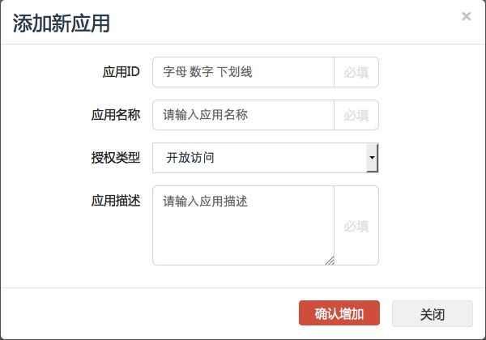
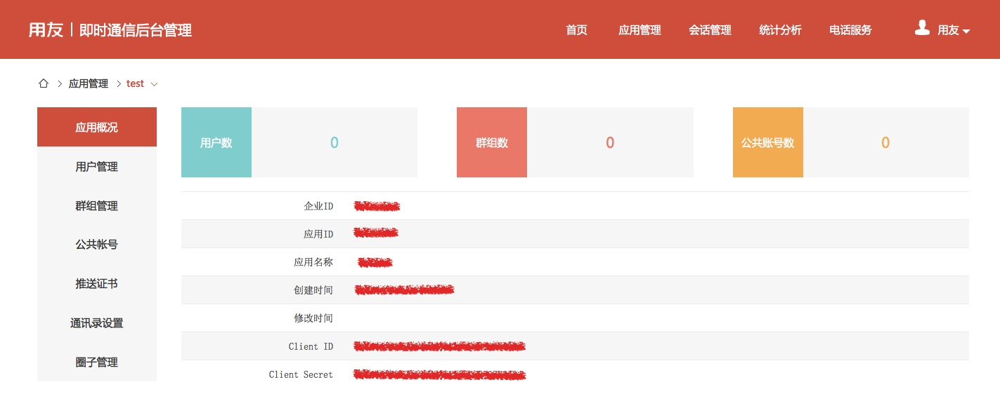
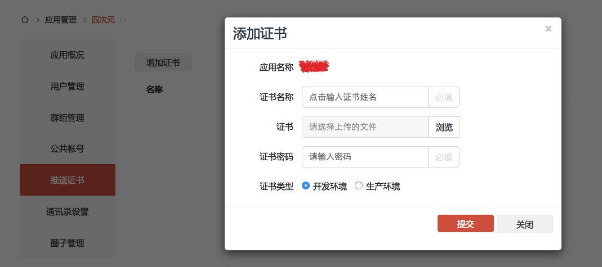

# IM 文档

## 一.集成准备

### 1.1 注册开发者账号

*在用友IM官网 <https://im.yyuap.com/> 上方点击“注册”，请按界面流程提示进行开发者账号注册。*

### 1.2 创建应用

*使用开发者账号登录到管理后台，点击页面上方“应用管理”，进入到应用管理。 点击左侧“新增应用”，输入应用信息即可创建，如图所示：*



*在应用概况中你可以查看应用的信息，我们会在客户端使用到“应用ID”和“企业ID”，在服务端进行获取token服务时使****用到“ClientID”和“ClientSecret”，如果忘记了可以在这里查看。*



### 1.3 在APP的Server端获取用友IMtoken

*调用该接口获取指定租户指定应用下的指定用户的UserToken，UserToken是客户端登录IM服务器认证以及调用服务端接口中的需要验证用户token的接口的口令*

*特别提示：当应用模式为开放注册模式时，调用此接口如果参数userid对应的用户不存在，服务端会创建该用户。*

| 接口信息 | 说明 | 
| --- | --- | 
| URL | https://im.yyuap.com/sysadmin/rest/{etpId}/{appId}/token|  
| method | POST | 
| Header | {"Content-Type":"application/json"} | 

*参数以JSON格式提交，如下：*

 {

 "clientId":"762a8f681f5e5b32760d0b5f8276bb52",

 "clientSecret":"7E39BD8fgh2991D060AB420A6A3123C2",

 "userid":"zongtf",

 "nickname":"宗腾飞",

 "photo":"ancasdsderere"

 }
 
| 参数名称 | 类型 | 意义 |  是否必须 |
| - | --- |---| --- | 
| eptId | String | 企业ID | 是 |  
| appId | String | 应用ID | 是 |
| clientId | String | 创建应用时产生 | 是 | 
| clientSecret | String | 创建应用时产生 | 是 | 
| userid | String | 要获取token的用户的用户名 | 是 | 
| nickname | String | 用户的昵称 | 否，当传入此参数且不为空时，服务端会将该用户的昵称更新为参数中的值 | 
| photo | String | 用户的头像 | 否，当传入此参数且不为空时，服务端会将该用户的头像更新为参数中的 | 

- *成功:statuscode为200，responsebody返回token和过期时间戳，JSON格式：*

 {

  "token": "9c1e769b-4228-41df-bd9d-f28b7e8b4bed",

  "expiration": "1441120983396"

### 1.4 下载用友IMiOS SDK

用友IMiOS SDK下载地址:[下载中心](https://iuap.yonyoucloud.com/doc/instantmessaging.html#/md-build/exclusive_cloud_instantmessaging/articles/product/11-/download.md?key=相关下载)<br/>

### 1.5 iOS推送证书上传

*如果需要iOS推送功能，在用友IM后台上传推送证书，如图所示：*



*需要为p12证书设置一个证书名称，输入正确的密码，以及设置它是生产证书还是开发证书*

## 二.SDK集成

### 2.1 集成SDK到APP

*将libYonyouIMSdk.a及头文件引入到工程中，开发者可视情况引入真机专用库文件,模拟器专用库文件或者通用库文件*

### 2.2 依赖裤

```

AudioToolbox.framework

MobileCoreServices.framework

AssetsLibrary.framework

AVFoundation.framework

CoreMotion.framework

Security.framework

SystemConfiguration.framework

CoreTelephony.framework

CoreLocation.framework

QuartzCore.framework

CoreGraphics.framework

libresolv.tbd

libsqlite3.tbd

libstdc++.6.9.0.tbd

libz.tbd

示例工程默认高德地图用于发送位置，开发者可以视自身情况使用其他地图类库

MAMapKit.framework

AMapSearchKit.framework

```

### 2.3 初始化SDK

*在application:didFinishLaunchingWithOptions方法中进行SDK初始化及相关配置：*

```

//注册app

[[YYIMChat sharedInstance] registerApp:@"应用ID" etpKey:@"企业ID"];

// 服务器配置

[[YYIMConfig sharedInstance] setIMServer:];

[[YYIMConfig sharedInstance] setIMServerPort:];

[[YYIMConfig sharedInstance] setIMServerSSLPort:];

[[YYIMConfig sharedInstance] setIMServerEnableSSL:];

[[YYIMConfig sharedInstance] setIMRestServer:];

[[YYIMConfig sharedInstance] setIMRestServerHTTPS:];

[[YYIMConfig sharedInstance] setRosterCollect:];

[[YYIMConfig sharedInstance] setResourceUploadServer:];

[[YYIMConfig sharedInstance] setResourceDownloadServer:];

```

### 2.4 实现YYIMChatDelegate协议

*AppDelegate实现YYIMChatDelegate协议*

```

// 添加代理

[[YYIMChat sharedInstance].chatManager addDelegate:self];

```

实现YYIMChatDelegate方法

```

// 链接IM服务器

- (void)didConnect {

}

// IM服务器认证

- (void)didAuthenticate {

}

// 连接IM服务器失败

- (void)didConnectFailure:(YYIMError *)error {

}

// IM服务器认证失败

- (void)didAuthenticateFailure:(YYIMError *)error {

}

// 用户在其他客户端登陆，被踢出

- (void)didLoginConflictOccurred {

}

```

### 2.5 推送

*注册远程推送*

```

[self registerRemoteNotification];

- (void)registerRemoteNotification {

 UIApplication *application = [UIApplication sharedApplication];

 // 注册推送通知

 if (YYIM_iOS8) {

 [application registerForRemoteNotifications];

 UIUserNotificationType notificationTypes = UIUserNotificationTypeBadge | UIUserNotificationTypeSound | UIUserNotificationTypeAlert;

 UIUserNotificationSettings *settings = [UIUserNotificationSettings settingsForTypes:notificationTypes categories:nil];

 [application registerUserNotificationSettings:settings];

 } else {

 UIRemoteNotificationType notificationTypes = UIRemoteNotificationTypeBadge | UIRemoteNotificationTypeSound | UIRemoteNotificationTypeAlert;

 [[UIApplication sharedApplication] registerForRemoteNotificationTypes:notificationTypes];

 }

}

```

*注册推送证书，设置上传的证书名称，参见1.5*

```

// 注册推送证书

#if defined(DEBUG) && DEBUG

 [[YYIMChat sharedInstance] registerApnsCerName:@"开发证书名称"];

#else

 [[YYIMChat sharedInstance] registerApnsCerName:@"生产证书名称"];

#endif

```

*开启本地推送*

```

// 本地推送

[[YYIMChat sharedInstance].chatManager setEnableLocalNotification:YES];

```

### 2.6 应用生命周期

*在Application的生命周期，调用sdk的对应方法*

```

[[YYIMChat sharedInstance] application:application didFinishLaunchingWithOptions:launchOptions];

[[YYIMChat sharedInstance] applicationWillResignActive:application];

[[YYIMChat sharedInstance] applicationDidEnterBackground:application];

[[YYIMChat sharedInstance] applicationWillEnterForeground:application];

[[YYIMChat sharedInstance] applicationDidBecomeActive:application];

[[YYIMChat sharedInstance] applicationWillTerminate:application];

[[YYIMChat sharedInstance] application:application didRegisterForRemoteNotificationsWithDeviceToken:deviceToken];

[[YYIMChat sharedInstance] application:application didFailToRegisterForRemoteNotificationsWithError:error];

[[YYIMChat sharedInstance] application:application didReceiveRemoteNotification:userInfo];

[[YYIMChat sharedInstance] application:application didReceiveLocalNotification:notification];

```

### 2.7 实现YYIMTokenDelegate协议

```

// 注册token代理

[[YYIMChat sharedInstance].chatManager registerTokenDelegate:self];

```

*实现YYIMTokenDelegate的getAppTokenWithComplete:方法，参见1.3，调用APPServer的取token接口获取token*

```

- (void)getAppTokenWithComplete:(void (^)(BOOL, id))complete {

 // 请求APPServer的取token接口

 // 如果请求成功

 YYToken *token = [YYToken tokenWithExpiration:@"请求到的token" expiration:@"token的过期时间"];

 complete(YES, token);

 // 如果请求失败

 complete(NO, error);

}

```

### 2.8 其他设置

```

// 设置日志级别

[[YYIMChat sharedInstance] setLogLevel:YYIM_LOG_LEVEL_VERBOSE];

```

*如果使用了高德地图API，需要设置高德APIKey*

```

// 设置高德地图key，参见高德地图官网

[MAMapServices sharedServices].apiKey = @"高德地图Key";

```

##三.登录与退出

### 3.1登录

```

YYIMLoginCompleteBlock block = ^(BOOL result, NSDictionary *userInfo, YYIMError *loginError) {

 if (result) {

 // 登录成功

 } else {

 // 登录失败

 }

};

// 登录

[[YYIMChat sharedInstance].chatManager login:@"用户ID" completion:block];

```

*默认下次启动自动链接服务*

```

/**

 * 设置是否自动登录

 *

 * @param isAutoLogin 是否自动登录

 * @param clearUserInfo 清空当前用户登录信息

 */

[[YYIMConfig sharedInstance] setAutoLogin:(BOOL)isAutoLogin flag:(BOOL)clearUserInfo

```

### 3.2 匿名登录

```

[[YYIMChat sharedInstance].chatManager loginAnonymousWithCompletion:block];

```

### 3.3 退出

```

[[YYIMChat sharedInstance].chatManager logoff];

```

## 四.消息

### 4.1 获取每一个聊天用户/群组的最新消息及未读消息数

```

/**

 * 获取摘要消息列表

 *

 * @return NSArray<YYRecentMessage>

 */

[[YYIMChat sharedInstance].chatManager getRecentMessage]

/**

 * 获取摘要消息列表 回调方式 子线程查询，主线程返回

 *

 * @param block

 */

[[YYIMChat sharedInstance].chatManager getRecentMessageWithBlock:(void (^)(NSArray *messages))resultBlock];

```

### 4.2 获取最近的联系人

```

/**

 * 获取最近的联系人

 *

 * @return NSArray<YYRoster/YYUser>

 */

[[YYIMChat sharedInstance].chatManager getRecentRoster];

```

### 4.3 获取未读的消息总数

```

/**

 * 获取未读的消息总数

 *

 * @return NSInteger

 */

[[YYIMChat sharedInstance].chatManager getUnreadMsgCount];

```

### 4.4 获取同某个用户/群组聊天的消息记录

```

/**

 * 获取同某个用户/群组聊天的消息记录

 *

 * @param chatId 用户/群组ID

 *

 * @return NSArray<YYMessage>

 */

[[YYIMChat sharedInstance].chatManager getMessageWithId:(NSString *)chatId];

```

### 4.5 分页获取同某个用户/群组聊天的消息记录

```

/**

 * 分页获取同某个用户/群组聊天的消息记录，获取某条消息之前的pageSize条消息记录，消息pid为空，获取最近的pageSize条消息记录

 *

 * @param chatId 用户/群组ID

 * @param pid 消息pid

 * @param pageSize 分页大小

 *

 * @return NSArray<YYMessage>

 */

[[YYIMChat sharedInstance].chatManager getMessageWithId:(NSString *)chatId beforePid:(NSString *)pid pageSize:(NSInteger)pageSize];

```

### 4.6 获取同某个用户/群组在某条消息及其之后的所有消息

```

/**

 * 获取同某个用户/群组在某条消息及其之后的所有消息

 *

 * @param chatId 用户/群组ID

 * @param pid 消息pid

 *

 * @return NSArray<YYMessage>

 */

[[YYIMChat sharedInstance].chatManager getMessageWithId:(NSString *)chatId afterPid:(NSString *)pid];

```

### 4.7 根据用户/群组ID删除与其所有的消息记录

```

/**

 * 根据用户/群组ID删除与其所有的消息记录

 *

 * @param chatId 用户/群组ID

 */

[[YYIMChat sharedInstance].chatManager deleteMessageWithId:(NSString *)chatId];

```

### 4.8 根据消息pid删除单条消息记录

```

/**

 * 根据消息pid删除单条消息记录

 *

 * @param packetId 消息pid

 */

[[YYIMChat sharedInstance].chatManager deleteMessageWithPid:(NSString *)packetId];

```

### 4.9 删除所有的消息记录

```

/**

 * 删除所有的消息记录

 */

[[YYIMChat sharedInstance].chatManager deleteAllMessage];

```

### 4.10 更新语音消息已播放状态

```

/**

 * 更新语音消息已播放状态

 *

 * @param packetId 消息pid

 */

[[YYIMChat sharedInstance].chatManager updateAudioReaded:(NSString *)packetId];

```

### 4.11 根据消息pid更新单条消息已读状态

```

/**

 * 根据消息pid更新单条消息已读状态

 *

 * @param packetId 消息pid

 */

[[YYIMChat sharedInstance].chatManager updateMessageReadedWithPid:(NSString *)packetId];

```

### 4.12 根据用户/群组ID更新消息已读状态

```

/**

 * 根据用户/群组ID更新消息已读状态

 *

 * @param chatId 用户/群组ID

 */

[[YYIMChat sharedInstance].chatManager updateMessageReadedWithId:(NSString *)chatId];

```

### 4.13 发送文本消息

```

/**

 * 发送文本消息

 *

 * @param chatId 用户/群组ID

 * @param text 消息内容

 * @param chatType 单聊:YM_MESSAGE_TYPE_CHAT，群聊:YM_MESSAGE_TYPE_GROUPCHAT

 */

[[YYIMChat sharedInstance].chatManager sendTextMessage:(NSString *)chatId text:(NSString *)text chatType:(NSString *)chatType];

/**

 * 发送文本消息

 *

 * @param chatId 用户/群组ID

 * @param text 消息内容

 * @param chatType 单聊:YM_MESSAGE_TYPE_CHAT，群聊:YM_MESSAGE_TYPE_GROUPCHAT

 * @param atUserArray 群聊中@的用户IDArray，单聊无效

 */

[[YYIMChat sharedInstance].chatManager sendTextMessage:(NSString *)chatId text:(NSString *)text chatType:(NSString *)chatType atUserArray:(NSArray *)atUserArray];

/**

 * 发送文本消息

 *

 * @param chatId 用户/群组ID

 * @param text 消息内容

 * @param chatType 单聊:YM_MESSAGE_TYPE_CHAT，群聊:YM_MESSAGE_TYPE_GROUPCHAT

 * @param atUserArray 群聊中@的用户IDArray，单聊无效

 * @param extendValue 扩展信息

 */

[[YYIMChat sharedInstance].chatManager sendTextMessage:(NSString *)chatId text:(NSString *)text chatType:(NSString *)chatType atUserArray:(NSArray *)atUserArray extendValue:(NSString *)extendValue;

/**

 发送文本消息 分词过滤 根据全局开关判断

 @param chatId 用户/群组ID

 @param text 消息内容

 @param chatType 单聊:YM_MESSAGE_TYPE_CHAT，群聊:YM_MESSAGE_TYPE_GROUPCHAT

 @param atUserArray 群聊中@的用户IDArray，单聊无效

 */

[[YYIMChat sharedInstance].chatManager sendTextIntelligentMessage:(NSString *)chatId text:(NSString *)text chatType:(NSString *)chatType atUserArray:(NSArray *)atUserArray;

```

### 4.14 发送视频消息

```

/**

 * 发送短视频消息

 *

 * @param chatId 用户/群组ID

 * @param filePath 短视频的路径

 * @param thumbNail 缩略图的路径

 * @param chatType 单聊:YM_MESSAGE_TYPE_CHAT，群聊:YM_MESSAGE_TYPE_GROUPCHAT

 */

[[YYIMChat sharedInstance].chatManager sendMicroVideoMessage:(NSString *)chatId filePath:(NSString *)filePath thumbPath:(NSString *)thumbPath chatType:(NSString *)chatType;

```

### 4.15 发送图片消息

```

/**

 * 发送图片消息

 *

 * @param chatId 用户/群组ID

 * @param assetArray 图片AssetArray

 * @param chatType 单聊:YM_MESSAGE_TYPE_CHAT，群聊:YM_MESSAGE_TYPE_GROUPCHAT

 */

[[YYIMChat sharedInstance].chatManager sendImageMessage:(NSString *)chatId assets:(NSArray *)assetArray chatType:(NSString *)chatType];

/**

 * 发送图片消息

 *

 * @param chatId 用户/群组ID

 * @param assetArray 图片AssetArray

 * @param chatType 单聊:YM_MESSAGE_TYPE_CHAT，群聊:YM_MESSAGE_TYPE_GROUPCHAT

 * @param isOriginal 是否发送原图

 */

[[YYIMChat sharedInstance].chatManager sendImageMessage:(NSString *)chatId assets:(NSArray *)assetArray chatType:(NSString *)chatType isOriginal:(BOOL)isOriginal];

/**

 *

 * 单张图片发送，可带留言

 *

 */

[[YYIMChat sharedInstance].chatManager sendSingeleImageMessage:(NSString *)chatId imagePath:(NSString *)imagePath chatType:(NSString *)chatType liuyan:(NSString *)liuyan

```

### 4.16 发送语音消息

```

/**

 * 发送语音消息

 *

 * @param chatId 用户/群组ID

 * @param audioPath 语音路径

 * @param audioPath 转化后的语音路径

 * @param chatType 单聊:YM_MESSAGE_TYPE_CHAT，群聊:YM_MESSAGE_TYPE_GROUPCHAT

 */

[[YYIMChat sharedInstance].chatManager sendAudioMessage:(NSString *)chatId wavPath:(NSString *)audioPath mp3Path:(NSString *)mp3Path chatType:(NSString *)chatType;

/**

 * 发送语音消息

 *

 * @param chatId 用户/群组ID

 * @param audioPath 语音路径

 * @param audioPath 转化后的语音路径

 * @param chatType 单聊:YM_MESSAGE_TYPE_CHAT，群聊:YM_MESSAGE_TYPE_GROUPCHAT

 * @param time 语音时长

 */

[[YYIMChat sharedInstance].chatManager sendAudioMessage:(NSString *)chatId wavPath:(NSString *)audioPath mp3Path:(NSString *)mp3Path chatType:(NSString *)chatType time:(NSTimeInterval)time;

```

<font color=#A52A2A>废弃方法</font>

```

/**

 * 发送语音消息 

 *

 * @param chatId 用户/群组ID

 * @param audioPath 语音路径

 * @param chatType 单聊:YM_MESSAGE_TYPE_CHAT，群聊:YM_MESSAGE_TYPE_GROUPCHAT

 */

[[YYIMChat sharedInstance].chatManager sendAudioMessage:(NSString *)chatId wavPath:(NSString *)audioPath chatType:(NSString *)chatType];

```

### 4.17 发送分享消息

```

/**

 * 发送分享消息

 *

 * @param chatId 用户/群组ID

 * @param urlString 分享链接URL

 * @param title 标题

 * @param description 描述

 * @param imageUrlString 图标URL

 * @param extendValue 扩展信息

 * @param chatType 单聊:YM_MESSAGE_TYPE_CHAT，群聊:YM_MESSAGE_TYPE_GROUPCHAT

 */

[[YYIMChat sharedInstance].chatManager sendShareMessage:(NSString *)chatId url:(NSString *)urlString title:(NSString *)title description:(NSString *)description imageUrl:(NSString *)imageUrlString extendValue:(NSString *)extendValue chatType:(NSString *)chatType];

```

### 4.18 发送位置消息

```

/**

 * 发送位置消息

 *

 * @param chatId 用户/群组ID

 * @param imagePath 位置截图路径

 * @param address 地址

 * @param longitude 经度

 * @param latitude 纬度

 * @param chatType 单聊:YM_MESSAGE_TYPE_CHAT，群聊:YM_MESSAGE_TYPE_GROUPCHAT

 */

[[YYIMChat sharedInstance].chatManager sendLocationManager:(NSString *)chatId imagePath:(NSString *)imagePath address:(NSString *) address longitude: (float) longitude latitude:(float) latitude chatType:(NSString *)chatType];

/**

 * 发送位置消息

 *****

 * @param chatId 用户/群组ID

 * @param imagePath 位置截图路径

 * @param address 地址

 * @param address 下级地址

 * @param longitude 经度

 * @param latitude 纬度

 * @param chatType 单聊:YM_MESSAGE_TYPE_CHAT，群聊:YM_MESSAGE_TYPE_GROUPCHAT

 */

[[YYIMChat sharedInstance].chatManager sendLocationManager:(NSString *)chatId address:(NSString *)address subAddress:(NSString *)subAddress longitude:(float)longitude latitude:(float)latitude chatType:(NSString *)chatType;

```

### 4.19 转发消息

```

/**

 * 转发消息

 *

 * @param chatId 用户/群组ID

 * @param packetId 源消息pid

 * @param chatType 单聊:YM_MESSAGE_TYPE_CHAT，群聊:YM_MESSAGE_TYPE_GROUPCHAT

 */

[[YYIMChat sharedInstance].chatManager forwardMessage:(NSString *)chatId pid:(NSString *)packetId chatType:(NSString *)chatType];

/**

 * 转发文件消息

 *

 * @param chatId 用户/群组ID

 * @param packetId 源消息pid

 * @param chatType 单聊:YM_MESSAGE_TYPE_CHAT，群聊:YM_MESSAGE_TYPE_GROUPCHAT

 */

[[YYIMChat sharedInstance].chatManager forwardFileMessage:(NSString *)chatId pid:(NSString *)packetId chatType:(NSString *)chatType;

/**

 逐条转发

 @param chatId 用户/群组ID

 @param pids 源消息pid集合

 @param chatType 单聊:YM_MESSAGE_TYPE_CHAT，群聊:YM_MESSAGE_TYPE_GROUPCHAT

 @param extendMessage 留言

 */

[[YYIMChat sharedInstance].chatManager forwardMultiMessage:(NSString *)chatId pids:(NSArray *)pids chatType:(NSString *)chatType extendMessage:(NSString *)extendMessage;

/**

 * 转发消息

 *

 * @param chatId 用户/群组ID

 * @param packetId 源消息pid

 * @param chatType 单聊:YM_MESSAGE_TYPE_CHAT，群聊:YM_MESSAGE_TYPE_GROUPCHAT

 * @param extendMessage 留言

 */

[[YYIMChat sharedInstance].chatManager forwardMessage:(NSString *)chatId pid:(NSString *)packetId chatType:(NSString *)chatType extendMessage:(NSString *)extendMessage;

/**

 转发消息

 @param chatId 用户/群组ID

 @param forwardMessage 源消息

 @param chatType 单聊:YM_MESSAGE_TYPE_CHAT，群聊:YM_MESSAGE_TYPE_GROUPCHAT

 @param extendMessage 留言

 */

[[YYIMChat sharedInstance].chatManager forwardMessage:(NSString *)chatId forwardMessage:(YYMessage *)forwardMessage chatType:(NSString *)chatType extendMessage:(NSString *)extendMessage;

```

### 4.20 重发失败的消息

```

/**

 * 重发失败的消息

 *

 * @param pid 消息pid

 */

[[YYIMChat sharedInstance].chatManager resendMessage:(NSString *)pid];

```

### 4.21 下载消息资源

```

/**

 * 下载消息资源（图片/语音/文件）

 *

 * @param pid 消息pid

 */

[[YYIMChat sharedInstance].chatManager downloadMessageRes:(NSString *)pid];

/**

 下载合并消息资源

 @param packetId 消息pid

 @param parentId 父消息pid

 */

[[YYIMChat sharedInstance].chatManager downloadCombineMessageRes:(NSString *)packetId parentId:(NSString *)parentId;

```

### 4.22 下载消息图片

```

/**

 * 下载消息图片

 *

 * @param pid 消息pid

 * @param imageType kYYIMImageTypeNormal:默认图，kYYIMImageTypeOriginal:原图，kYYIMImageTypeThumb:缩略图

 * @param downloadProgress 进度回调block

 * @param downloadComplete 完成回调block

 */

[[YYIMChat sharedInstance].chatManager downloadImageMessageRes:(NSString *)pid imageType:(YYIMImageType)imageType progress:(YYIMAttachDownloadProgressBlock)downloadProgress complete:(YYIMAttachDownloadCompleteBlock)downloadComplete];

/**

 下载合并消息图片

 @param pid 消息pid

 @param parentId 父消息pid

 @param imageType kYYIMImageTypeNormal:默认图，kYYIMImageTypeOriginal:原图，kYYIMImageTypeThumb:缩略图

 @param contentType 消息类型 图片或者是合并消息

 @param downloadProgress 进度回调block

 @param downloadComplete 完成回调block

 */

[[YYIMChat sharedInstance].chatManager downloadImageMessageRes:(NSString *)pid chatId:(NSString *)chatId parentId:(NSString *)parentId imageType:(YYIMImageType)imageType contentType:(NSInteger)contentType progress:(YYIMAttachDownloadProgressBlock)downloadProgress complete:(YYIMAttachDownloadCompleteBlock)downloadComplete;

```

### 4.23 发送文件

```

/**

 发送文件消息

 @param chatId

 @param filePath

 @param chatType

 */

[[YYIMChat sharedInstance].chatManager sendFileMessage:(NSString *)chatId filePath:(NSString *)filePath chatType:(NSString *)chatType;

/**

 发送带留言的文件消息

 @param chatId

 @param filePath

 @param chatType

 @param extendMessage

 */

[[YYIMChat sharedInstance].chatManager sendFileMessage:(NSString *)chatId filePath:(NSString *)filePath chatType:(NSString *)chatType extendMessage:(NSString *)extendMessage;

```

### 4.24 发送自定义消息

```

/**

 * 发送自定义消息

 *

 * @param chatId 用户/群组ID

 * @param customType 自定义消息类型

 * @param customDictionary 自定义消息内容

 * @param extendValue 扩展信息

 * @param chatType 单聊:YM_MESSAGE_TYPE_CHAT，群聊:YM_MESSAGE_TYPE_GROUPCHAT

 */

[[YYIMChat sharedInstance].chatManager sendCustomMessage:(NSString *)chatId customType:(NSInteger)customType customDictionary:(NSDictionary *)customDictionary extendValue:(NSString *)extendValue chatType:(NSString *)chatType;

```

### 4.25 获取历史消息

```

/**

 * 获得历史消息

 *

 * @param chatId 用户/群组/公众号ID

 * @param chatType 类型

 * @param message 当前最老的一条消息

 * @param pageSize 请求数量

 * @param complete 完成回调的block

 */

[[YYIMChat sharedInstance].chatManager getMessageHistory:(NSString *)chatId chatType:(NSString *)chatType beforeMessage:(YYMessage *)message pageSize:(NSInteger)pageSize complete:(void (^)(BOOL, NSArray *, YYIMError *))complete;

```

### 4.26单聊消息撤回

```

/**

* 撤回单聊

* @param pid 消息ID

*/

[[YYIMChat activeDelegate] revokeChatMessageWithId:(NSString *)pid]

/**

* 撤回群聊

* @param pid 消息ID

*/

[[YYIMChat activeDelegate] revokeGroupChatMessageWithId:(NSString *)pid]

/**

* 消息撤回成功

* @param pid 消息ID

*/

- (void)didRevokeMessageWithPid:(NSString *)pid;

/**

* 消息撤回失败

* @param pid 消息ID

* @param error

*/

- (void)didNotRevokeMessageWithPid:(NSString *)pid error:(YYIMError *)error;

/**

* 消息撤回通知

* @param message 消息

*/

- (void)didMessageRevoked:(YYMessage *)message;

```

### 4.27 下载消息视频文件

```

/**

 * 下载视频的视频文件

 *

 * @param pid 消息pid

 * @param downloadProgress 进度回调block

 * @param downloadComplete 完成回调block

 */

[[YYIMChat sharedInstance].chatManager downloadMicroVideoMessageRes:(NSString *)pid chatId:(NSString*)chatId progress:(YYIMAttachDownloadProgressBlock)downloadProgress complete:(YYIMAttachDownloadCompleteBlock)downloadComplete;

/**

 下载视频的视频文件

 @param pid 消息pid

 @param parentId 父消息pid

 @param contentType 消息类型 视频消息 合并消息

 @param downloadProgress 进度回调block

 @param downloadComplete 完成回调block

 */

[[YYIMChat sharedInstance].chatManager downloadMicroVideoMessageRes:(NSString *)pid chatId:(NSString*)chatId parentId:(NSString *)parentId contentType:(NSInteger)contentType progress:(YYIMAttachDownloadProgressBlock)downloadProgress complete:(YYIMAttachDownloadCompleteBlock)downloadComplete;

```

### 4.28 YYIMChatDelegate中的消息相关通知

```

/**

 * 消息即将发送

 *

 * @param message 消息

 */

- (void)willSendMessage:(YYMessage *)message;

/**

 * 消息已经发送

 *

 * @param message 消息

 */

- (void)didSendMessage:(YYMessage *)message;

/**

 * 消息发送失败

 *

 * @param message 消息

 * @param error 错误

 */

- (void)didSendMessageFaild:(YYMessage *)message error:(YYIMError *)error;

/**

 * 收到消息

 *

 * @param message 消息

 */

- (void)didReceiveMessage:(YYMessage *)message;

/**

 * 消息状态变更

 *

 * @param message 消息

 */

- (void)didMessageStateChange:(YYMessage *)message;

/**

 * 消息状态变化

 *

 * @param chatId 用户/群组ID

 */

- (void)didMessageStateChangeWithChatId:(NSString *)chatId;

/**

 * 消息资源（语音/图片/文件）状态变化

 *

 * @param message 消息

 * @param error 错误

 */

- (void)didMessageResStatusChanged:(YYMessage *)message error:(YYIMError *)error;

/**

 * 消息删除

 *

 * @param info 删除信息

 */

- (void)didMessageDelete:(NSDictionary *)info;

```

##五、好友

### 5.1 好友模式

好友关系分为两种模式：

双向确认的好友关系：A添加B为好友，B会收到好友邀请的通知，B同意后，AB双方互为好友关系；

单向收藏的好友关系：A添加B为好友即为A对B的收藏关系；

好友的关系模式只能选择一种，默认的好友模式为双向确认的模式。

设置好友模式：

```

/**

 * 设置好友模式

 *

 * @param isCollect 是否单向收藏模式

 */

[[YYIMConfig sharedInstance] setRosterCollect:(BOOL)isCollect];

```

### 5.2 获得所有好友对象

```

/**

 * 获得所有好友对象

 *

 * @return NSArray<YYRoster>

 */

[[YYIMChat sharedInstance].chatManager getAllRoster];

```

### 5.3 根据好友ID获得好友对象

```

/**

 * 根据好友ID获得好友对象

 *

 * @param rosterId 好友ID

 *

 * @return YYRoster

 */

[[YYIMChat sharedInstance].chatManager getRosterWithId:(NSString *)rosterId];

```

### 5.4 添加好友

```

/**

 * 添加好友

 *

 * @param userId 用户ID

 */

[[YYIMChat sharedInstance].chatManager addRoster:(NSString *)userId];

/**

 添加好友

 @param userId 用户ID

 @param rosterRemark 加好友的备注

 */

[[YYIMChat sharedInstance].chatManager addRoster:(NSString *)userId rosterRemark:(NSString *)rosterRemark;

```

### 5.5 获得所有好友邀请（双向模式）

```

/**

 * 获得所有好友邀请

 *

 * @return NSArray<YYRoster>

 */

[[YYIMChat sharedInstance].chatManager getAllRosterInvite];

```

### 5.6 获得未处理的好友邀请数量（双向模式）

```

/**

 * 获得未处理的好友邀请数量

 *

 * @return NSInteger

 */

[[YYIMChat sharedInstance].chatManager getNewRosterInviteCount];

```

### 5.7 同意好友邀请（双向模式）

```

/**

 * 同意好友邀请

 *

 * @param userId 用户ID

 */

[[YYIMChat sharedInstance].chatManager acceptRosterInvite:(NSString *)userId];

```

### 5.8 拒绝好友邀请（双向模式）

```

/**

 * 拒绝好友邀请

 *

 * @param userId 用户ID

 */

[[YYIMChat sharedInstance].chatManager refuseRosterInvite:(NSString *)userId];

```

### 5.9 删除好友

```

/**

 * 删除好友

 *

 * @param rosterId 好友ID

 */

[[YYIMChat sharedInstance].chatManager deleteRoster:(NSString *)rosterId];

```

### 5.10 重命名好友

```

/**

 * 重命名好友

 *

 * @param rosterId 好友ID

 * @param name 备注名

 */

[[YYIMChat sharedInstance].chatManager renameRoster:(NSString *)rosterId name:(NSString *)name];

```

### 5.11 YYIMChatDelegate中的好友相关通知

```

/**

 * 好友信息变化

 */

- (void)didRosterChange;

/**

 * 好友信息变化

 *

 * @param roster 好友

 */

- (void)didRosterUpdate:(YYRoster *)roster;

/**

 * 好友删除

 *

 * @param rosterId 好友ID

 */

- (void)didRosterDelete:(NSString *)rosterId;

/**

 * 好友在线状态变化

 *

 * @param rosterId 好友ID

 */

- (void)didRosterStateChange:(NSString *)rosterId;

/**

 * 收到好友邀请

 *

 * @param roster 好友

 */

- (void)didRosterInviteReceived:(YYRoster *)roster;

/**

 * 好友邀请变化

 */

- (void)didRosterInviteChange;

 /**

 * 加载好友信息失败

 *

 * @param error

 */

- (void)didNotLoadRostersWithError:(YYIMError *)error;

```

### 5.12 好友Tag

```

/**

 * 设置好友的tag

 *

 * @param rosterTags tag集合

 * @param rosterId 好友Id

 * @param complete 执行的回调

 */

[[YYIMChat sharedInstance].chatManager addRosterTags:(NSArray *)rosterTags rosterId:(NSString *)rosterId complete:(void (^)(BOOL result, YYIMError *error))complete;

/**

 * 删除好友的tag

 *

 * @param rosterTags tag集合

 * @param rosterId 好友Id

 * @param complete 执行的回调

 */

[[YYIMChat sharedInstance].chatManager deleteRosterTags:(NSArray *)rosterTags rosterId:(NSString *)rosterId complete:(void (^)(BOOL result, YYIMError *error))complete;

/**

 * 通过tag获取好友集合

 *

 * @param tag tag

 *

 * @return 好友集合

 */

[[YYIMChat sharedInstance].chatManager getRostersWithTag:(NSString *)tag

```

##六、群组

### 6.1 创建群组

```

/**

 * 创建群组

 *

 * @param groupName 群组名称

 * @param userIdArray 群组成员userIDs

 *

 * @return seriId

 */

[[YYIMChat sharedInstance].chatManager createChatGroupWithName:(NSString *)groupName user:(NSArray *)userIdArray];

/**

 * 创建群组，可以定义群组id

 *

 * @param groupId 群组Id

 * @param groupName 群组名称

 * @param userIdArray 群组成员userIDs

 *

 * @return seriId

 */

[[YYIMChat sharedInstance].chatManager createChatGroupWithId:(NSString *)groupId groupName:(NSString *)groupName user:(NSArray *)userIdArray;

```

### 6.2 邀请用户加入群组

```

/**

 * 邀请用户加入群组

 *

 * @param groupId 群组ID

 * @param userIdArray 邀请加入的userIDs

 */

[[YYIMChat sharedInstance].chatManager inviteRosterIntoChatGroup:(NSString *)groupId user:(NSArray *)userIdArray];

```

### 6.3 加入群组

```

/**

 * 加入群组

 *

 * @param groupId 群组ID

 */

[[YYIMChat sharedInstance].chatManager joinChatGroup:(NSString *)groupId];

```

### 6.4 退出群组

```

/**

 * 退出群组

 *

 * @param groupId 群组ID

 */

[[YYIMChat sharedInstance].chatManager leaveChatGroup:(NSString *)groupId];

```

### 6.5 将群组成员踢出群组

```

/**

 * 将群组成员踢出群组

 *

 * @param groupId 群组ID

 * @param memberId 要踢出的成员ID

 */

[[YYIMChat sharedInstance].chatManager kickGroupMemberFromGroup:(NSString *)groupId member:(NSString *)memberId];

```

### 6.6 重命名群组

```

/**

 * 重命名群组

 *

 * @param groupId 群组ID

 * @param groupName 群组新名称

 */

[[YYIMChat sharedInstance].chatManager renameChatGroup:(NSString *)groupId name:(NSString *)groupName];

```

### 6.7 群组保存到通讯录

```

/**

 * 群组保存到通讯录

 *

 * @param groupId 群组ID

 */

[[YYIMChat sharedInstance].chatManager collectChatGroup:(NSString *)groupId];

```

### 6.8 群组取消保存到通讯录

```

/**

 * 群组取消保存在通讯录

 *

 * @param groupId 群组ID

 */

[[YYIMChat sharedInstance].chatManager unCollectChatGroup:(NSString *)groupId];

```

### 6.9 获取保存到通讯录的所有群组

```

/**

 * 获得保存到通讯录的群组列表

 *

 * @return NSArray<YYChatGroup>

 */

[[YYIMChat sharedInstance].chatManager getCollectChatGroups];

```

### 6.10 根据群组ID获得群组对象

```

/**

 * 根据群组ID获取群组对象

 *

 * @param groupId 群组ID

 *

 * @return YYChatGroup

 */

[[YYIMChat sharedInstance].chatManager getChatGroupWithGroupId:(NSString *)groupId];

```

### 6.11 获得已加入的所有群组

```

/**

 * 获得已加入的所有群组

 *

 * @return NSArray<YYChatGroup>

 */

[[YYIMChat sharedInstance].chatManager getAllChatGroups];

```

### 6.12 根据群组ID获得所有群组成员

```

/**

 * 根据群组ID获得所有群组成员

 *

 * @param groupId 群组ID

 *

 * @return NSArray<YYChatGroupMember>

 */

[[YYIMChat sharedInstance].chatManager getGroupMembersWithGroupId:(NSString *)groupId];

```

### 6.13 根据群组ID获得当前用户是否该群组所有者

```

/**

 * 根据群组ID获得当前用户是否该群组所有者

 *

 * @param groupId 群组ID

 *

 * @return 是否群组所有者

 */

[[YYIMChat sharedInstance].chatManager isGroupOwner:(NSString *)groupId];

```

### 6.14 根据关键字模糊搜索群组(<font color=#A52A2A>不支持</font>)

```

/**

 * 根据关键字模糊搜索群组

 *

 * @param keyword 关键字

 */

[[YYIMChat sharedInstance].chatManager searchChatGroupWithKeyword:(NSString *)keyword];

```

### 6.15群组权限转让

```

/**

* 更改管理员

* @param groupId 群组ID

* @param memberId 新的管理员

*/

[[YYIMChat sharedInstance].chatManager changeChatGroupAdminForGroup:(NSString *)groupId to:(NSString *)memberId]

##### 通知

/**

* 群组信息变更

* @param group 群组

- (void)didChatGroupInfoUpdate:(YYChatGroup *)group;

* 群组更改管理员失败

* @param groupId 群组id

* @param error 错误

*/

- (void)didNotChangeAdminFromGroup:(NSString *)groupId error:(YYIMError *)error;

```

### 6.16群组二维码功能

```

/**

* 生成群组二维码文本

* @param groupId 群组ID

* @param complete result 是否成功 qrCodeInfo数据信息 error错误信息

*/

[[YYIMChat sharedInstance].chatManager genChatGroupQrCodeWithGroupId:(NSString *)groupId complete:(void (^)(BOOL result, NSDictionary *qrCodeInfo, YYIMError *error)) complete];

/**

* 根据群组二维码文本获取群组信息

* @param qrCodeText 二维码文本

* @param complete result 是否成功 qrCodeInfo数据信息 error错误信息

*/

[[YYIMChat sharedInstance].chatManager getChatGroupInfoWithQrCode:(NSString *)qrCodeText complete:(void (^)(BOOL result, YYChatGroupInfo * groupInfo, YYIMError *error)) complete]

```

### 6.17修改群公告消息

```

/**

 * 设置群组公告

 *

 * @param announce

 * @param groupId

 */

[[YYIMChat sharedInstance].chatManager modifyChatGroupAnnounce:(NSString *)announce groupId:(NSString *)groupId complete:(void (^)(BOOL result, YYIMError *error))complete]

```

### 6.18群管理员任命

```

/**

 任命或者取消任命管理员

 @param adminId 管理员id

 @param groupId 群组id

 @param appoint 任命YES 取消任命NO

 */

[[YYIMChat sharedInstance].chatManager chatGroupAppointAdmins:(NSArray *)adminIds groupId:(NSString *)groupId appoint:(BOOL)appoint]

/**

 * 添加管理员失败

 *

 * @param group 群组ID

 * @param error 错误

 */

- (void)didNotChatGroupAppointAdmin:(NSString *)groupId error:(YYIMError *)error;

/**

 * 删除管理员失败

 *

 * @param group 群组ID

 * @param error 错误

 */

- (void)didNotChatGroupCancelAdmin:(NSString *)groupId error:(YYIMError *)error

```

### 6.19面对面建群

```

/**

* 参加面对面建群

* 默认有效距离1000米

* 默认有效时间1800秒

* @param cipher 四位数字密码

* @param longitude 经度

* @param latitude 纬度

*/

[[YYIMChat sharedInstance].chatManager participateFaceGroupWithCipher:(NSString *)cipher longitude:(float)longitude latitude:(float)latitude]

/**

* 参加面对面建群

* @param cipher 四位数字密码

* @param longitude 经度

* @param latitude 纬度

* @param distance 有效距离（米）

* @param expireTime 有效时间（秒）

*/

[[YYIMChat sharedInstance].chatManager participateFaceGroupWithCipher:(NSString *)cipher longitude:(float)longitude latitude:(float)latitude distance:(NSInteger)distance expireTime:(NSInteger)expireTime]

/**

* 加入面对面建群

* @param cipher 四位数字密码

* @param faceId 面对面建群标识

*/

[[YYIMChat sharedInstance].chatManager joinFaceGroupWithCipher:(NSString *)cipher faceId:(NSString *)faceId]

/**

* 离开面对面建群

* @param cipher 四位数字密码

* @param faceId 面对面建群标识

*/

[[YYIMChat sharedInstance].chatManager quitFaceGroupWithCipher:(NSString *)cipher faceId:(NSString *)faceId]

##### 通知

/**

* 参加面对面建群成功

* @param faceId faceId

* @param cipher 4位数字密码

* @param memberIdArray 成员ID列表

*/

- (void)didParticipateInFaceGrop:(NSString *)faceId cipher:(NSString *)cipher members:(NSArray *)memberIdArray;

/**

* 参加面对面建群失败

* @param cipher 4位数字密码

*/

- (void)didNotParticipateInFaceGropWithCipher:(NSString *)cipher error:(YYIMError *)error;

/**

* 加入面对面建群成功

* @param faceId faceId

* @param groupId 群组ID

*/

- (void)didJoinFaceGroupWithFaceId:(NSString *)faceId groupId:(NSString *)groupId;

/**

* 加入面对面建群失败

* @param faceId faceId

*/

- (void)didNotJoinFaceGroupWithFaceId:(NSString *)faceId error:(YYIMError *)error;

/**

* 离开面对面建群成功

* @param faceId faceId

*/

- (void)didQuitFaceGroupWithFaceId:(NSString *)faceId;

/**

* 离开面对面建群失败

* @param faceId faceId

*/

- (void)didNotQuitFaceGroupWithFaceId:(NSString *)faceId error:(YYIMError *)error;

/**

* 用户参加面对面建群通知

* @param faceId faceId

* @param cipher 4位数字密码

* @param userId 用户ID

* @param members 成员ID列表

*/

- (void)didUserParticipateInFaceGroupWithFaceId:(NSString *)faceId cipher:(NSString *)cipher userId:(NSString *)userId members:(NSArray *)members;

/**

* 用户离开面对面建群通知

* @param faceId faceId

* @param cipher 4位数字密码

* @param userId 用户ID

* @param members 成员ID列表

*/

- (void)didUserQuitFaceGroupWithFaceId:(NSString *)faceId cipher:(NSString *)cipher userId:(NSString *)userId members:(NSArray *)members;

```

### 6.20 群组回执

```

/**

 群组回执消息已读成员列表

 @param groupId 群组id

 @param packetId 消息包id

 @param complete

 */

[[YYIMChat sharedInstance].chatManager loadGroupMessageReadMembers:(NSString *)groupId packetId:(NSString *)packetId complete:(void (^)(BOOL result, NSInteger readStat, NSArray *readMember, NSArray *totalMember, YYIMError *error))complete;

/**

 获得第一个@消息的pid

 @param chatId 会话id

 @return

 */

[[YYIMChat sharedInstance].chatManager getFirstAtMessagePid:(NSString *)chatId;

/**

 加载群组的回执统计

 @param groupId

 */

[[YYIMChat sharedInstance].chatManager loadGroupMessageStat:(NSString *)groupId;

/**

 加载群组的回执统计

 @param groupId

 @param forceLoad

 */

[[YYIMChat sharedInstance].chatManager loadGroupMessageStat:(NSString *)groupId forceLoad:(BOOL)forceLoad;

/**

 群组消息回执有更新

 @param groupId

 */

- (void)didReceiveGroupMessageStatChange:(NSString *)groupId;

/**

 群组消息回执有更新

 @param groupId

 */

- (void)didReceiveGroupMessageStatChange:(NSString *)groupId

```

### 6.21 获取群成员全量

```

/**

 * 获取群成员全量

 *

 * @param groupId 群组ID

 * @param complete 成功的回调

 */

[[YYIMChat sharedInstance].chatManager getGroupMembersWithGroupId:(NSString *)groupId complete:(void (^)(BOOL, NSArray *, YYIMError *))complete

/**

 获取群组普通成员数组（默认本地只有60个成员，只有触发全量接口后，才会大于60）

 @param groupId 群组id

 @return

 */

[[YYIMChat sharedInstance].chatManager getChatGroupNormalMembersWithGroupId:(NSString *)groupId]

```

### 6.22 获得群组管理员数组

```

/**

 获得群组管理员数组

 @param groupId 群组id

 @return

 */

[[YYIMChat sharedInstance].chatManager getChatGroupAdminsWithGroupId:(NSString *)groupId

/**

 自己是否是群组管理员

 @param groupId 群组id

 @return

 */

[[YYIMChat sharedInstance].chatManager isChatGroupAdminsWithGroupId:(NSString *)groupId

```

### 6.23 解散群组

```

/**

 * 解散群组

 *

 * @param groupId 群组ID

 */

[[YYIMChat sharedInstance].chatManager dismissChatGroup:(NSString *)groupId

##### 代理

/**

 * 解散群组失败

 *

 * @param groupId 群组ID

 * @param error

 */

- (void)didNotDismissChatGroup:(NSString *)groupId error:(YYIMError *)error;

```

### 6.24 活跃群组

```

/**

 获得活跃的群组

 @return

 */

[[YYIMChat sharedInstance].chatManager getActiveChatGroups;

/**

 获得不活跃的群组

 @return

 */

[[YYIMChat sharedInstance].chatManager getInActiveChatGroups;

##### 代理

/**

 * 群组踢人失败

 *

 * @param groupId 群组ID

 */

- (void)didNotKickGroupMemberFromGroup:(NSString *)groupId error:(YYIMError *)error;

```

### 6.25 踢出成员

```

/**

 * 将群组成员踢出群组

 *

 * @param groupId 群组ID

 * @param memberId 要踢出的成员ID

 */

[[YYIMChat sharedInstance].chatManager kickGroupMemberFromGroup:(NSString *)groupId member:(NSString *)memberId;

```

### 6.15 YYIMChatDelegate中的消息相关通知

```

/**

 * 群组创建成功

 *

 * @param seriId 创建群返回的seriId

 * @param group 群组

 */

- (void)didChatGroupCreateWithSeriId:(NSString *)seriId group:(YYChatGroup *)group;

/**

 * 群组创建失败

 *

 * @param seriId 创建群返回的seriId

 */

- (void)didNotChatGroupCreateWithSeriId:(NSString *)seriId;

/**

 * 群组信息变更

 *

 * @param group 群组

 */

- (void)didChatGroupInfoUpdate:(YYChatGroup *)group;

/**

 * 群组成员信息变更

 *

 * @param groupId 群组ID

 */

- (void)didChatGroupMemberUpdate:(NSString *)groupId;

/**

 * 群组成员数量变化

 *

 * @param groupId 群组ID

 */

- (void)didChatGroupMemberCountChange:(NSString *)groupId;

/**

 * 退出群组

 *

 * @param groupId 群组ID

 */

- (void)didLeaveChatGroup:(NSString *)groupId;

/**

 * 群组搜索结果

 *

 * @param groupArray NSArray<YYChatGroup>

 */

- (void)didReceiveChatGroupSearchResult:(NSArray *)groupArray;

/**

 * 群组搜索失败

 *

 * @param error 错误

 */

- (void)didNotReceiveChatGroupSearchResult:(YYIMError *)error;

/**

 * 保存群组到通讯录成功

 *

 * @param groupId 群组ID

 */

- (void)didCollectChatGroup:(NSString *)groupId;

/**

 * 保存群组到通讯录失败

 *

 * @param groupId 群组ID

 * @param error

 */

- (void)didNotCollectChatGroup:(NSString *)groupId error:(YYIMError *)error;

/**

 * 取消保存群组到通讯录成功

 *

 * @param groupId 群组ID

 */

- (void)didUnCollectChatGroup:(NSString *)groupId;

/**

 * 取消保存群组到通讯录失败

 *

 * @param groupId 群组ID

 * @param error

 */

- (void)didNotUnCollectChatGroup:(NSString *)groupId error:(YYIMError *)error;

/**

 群组里有其他成员离开了群组，包括被踢或者主动离开

 @param groupId 

 */

- (void)didChatGroupMemberLeave:(NSString *)groupId;

/**

 * 群组邀请成员失败

 *

 * @param groupId 群组ID

 */

- (void)didNotInviteRosterIntoChatGroup:(NSString *)groupId error:(YYIMError *)error;

/**

 * 群组邀请成员成功

 *

 * @param groupId 群组ID

 */

- (void)didInviteRosterIntoChatGroup:(NSString *)groupId;

```

# 七.用户 

### 7.1 根据用户ID获取用户对象

```

/**

 * 根据用户ID获取用户对象

 *

 * @param userId 用户ID

 *

 * @return YYUser

 */

[[YYIMChat sharedInstance].chatManager getUserWithId:(NSString *)userId];

``` 

### 7.2 更新用户信息(<font color=#A52A2A>新方法，短链接</font>)

```

/**

 * 更新用户信息

 *

 * @param user 用户信息YYUser

 * @param complete 返回数据

 */

[[YYIMChat sharedInstance].chatManager updateUser:(YYUser *)user complete:(void (^)(BOOL result, YYUser *user, YYIMError *error))complete;

```

### 7.2 更新用户信息(<font color=#A52A2A>旧方法，长链接</font>)

```

/**

 * 更新用户信息

 *

 * @param user 用户信息YYUser

 */

[[YYIMChat sharedInstance].chatManager updateUser:(YYUser *)user];

```

### 7.3 根据用户ID向Server请求用户信息(<font color=#A52A2A>新方法，短链接</font>)

```

/**

 根据用户ID获取VCard信息

 @param userId 用户ID

 @param complete 返回数据 （单个用户返回user，多个用户返回array）

 */

[[YYIMChat sharedInstance].chatManager loadUser:(NSString *)userId complete:(void (^)(BOOL result, YYUser *user, NSArray *array, YYIMError *error))complete;

```

### 7.3 根据用户ID向Server请求用户信息(<font color=#A52A2A>旧方法，长链接</font>)

```

/**

 * 根据用户ID向Server请求用户信息

 *

 * @param userId 用户ID

 */

[[YYIMChat sharedInstance].chatManager loadUser:(NSString *)userId];

##### 代理

/**

 * 用户信息更新

 *

 * @param user 用户

 */

- (void)didUserInfoUpdate:(YYUser *)user

```

### 7.4 根据关键字查询用户信息(<font color=#A52A2A>新方法，短链接</font>)

```

/**

 * 根据关键字查询用户信息

 *

 * @param keyword 关键字

 * @param start 分页起始 默认0

 * @param number 分页大小 默认20

 * @param complete 返回结果

 */

[[YYIMChat sharedInstance].chatManager searchUserWithKeyword:(NSString *)keyword start:(NSInteger)start number:(NSInteger)number complete:(void (^)(BOOL result, NSArray *array, YYIMError *error))complete];

```

### 7.4 根据关键字查询用户信息(<font color=#A52A2A>旧方法，长链接</font>)

```

/**

 * 根据关键字查询用户信息

 *

 * @param keyword 关键字

 */

[[YYIMChat sharedInstance].chatManager searchUserWithKeyword:(NSString *)keyword];

##### 代理

/**

 * 用户搜索结果

 *

 * @param userArray NSArray<YYUser>

 */

- (void)didReceiveUserSearchResult:(NSArray *)userArray;

/**

 * 用户搜索失败

 *

 * @param error 错误

 */

- (void)didNotReceiveUserSearchResult:(YYIMError *)error;

```

### 7.5 自定义用户的实现

用友IM支持用户在不同步用户信息数据的情况下进行集成

实现YYIMUserProtocol自定义用户提供者：

```

@protocol YYIMUserProtocol <YYIMBaseProtocol>

@optional

- (void)activeYYIMDelegate:(id<YYIMChatDelegate>)delegate;

- (void)loadRosterUsers;

@required

/**

 * 根据关键字查询用户信息

 *

 * @param keyword 关键字

 */

- (void)searchUserWithKeyword:(NSString *)keyword;

/**

 * 根据用户ID向Server请求用户信息

 *

 * @param userId 用户ID

 */

- (void)loadUser:(NSString *)userId;

/**

 * 根据用户ID获取用户对象

 *

 * @param userId 用户ID

 *

 * @return YYUser

 */

- (YYUser *)getUserWithId:(NSString *)userId;

/**

 * 更新用户信息

 *

 * @param user 用户信息YYUser

 */

- (void)updateUser:(YYUser *)user;

@end

```

用户数据提供者实现示例：

```

@interface DEMOUserProvider ()

@property (weak, nonatomic) id<YYIMChatDelegate> delegate;

@end

@implementation DEMOUserProvider

- (void)activeYYIMDelegate:(id<YYIMChatDelegate>)delegate {

 self.delegate = delegate;

}

- (YYUser *)getUserWithId:(NSString *)userId {

 // get user from cache/db

 YYUser *user = [[YYUser alloc] init];

 [user setUserId:userId];

 [user setUserName:@""];

 [user setUserPhoto:@""];

 ...

 return user;

}

- (void)loadUser:(NSString *)userId {

 // load server from app server

 // on success

 YYUser *user = [[YYUser alloc] init];

 [user setUserId:userId];

 [user setUserName:@""];

 [user setUserPhoto:@""];

 [self.delegate didUserInfoUpdate:user];

}

- (void)updateUser:(YYUser *)user {

 // update user data to app server

 // update user in cache/db

 [self.delegate didUserInfoUpdate:user];

}

- (void)searchUserWithKeyword:(NSString *)keyword {

 // search user data from app server

 // on success

 [self.delegate didReceiveUserSearchResult:(NSArray *)userArray];

 // on faild

 [self.delegate didNotReceiveUserSearchResult:(YYIMError *)error];

}

@end

```

注册用户数据提供者到SDK

```

[[YYIMChat sharedInstance].chatManager registerUserProvider:[[DEMOUserProvider alloc] init]];

```

### 7.6 批量获取用户对象

```

/**

 批量获取用户对象

 @param userIds 用户id集合

 @return

 */

[[YYIMChat sharedInstance].chatManager getUsersWithUserIds:(NSArray *)userIds;

```

### 7.7 用户tag

```

/**

 * 给用户增加tag

 *

 * @param userTags tag数组

 * @param complete 执行的回调

 */

[[YYIMChat sharedInstance].chatManager AddUserTags:(NSArray *)userTags complete:(void (^)(BOOL, YYIMError *))complete;

/**

 * 删除用户的tag

 *

 * @param userTags tag数组

 * @param complete 执行的回调

 */

[[YYIMChat sharedInstance].chatManager deleteUserTags:(NSArray *)userTags complete:(void (^)(BOOL, YYIMError *))complete;

```

### 7.8 获取好友列表

 ```

 - (NSArray *)getAllRoster;

/**

 获取好友列表

 @return NSArray<YYRoster>

 */

[[YYIMChat sharedInstance].chatManager getAllRosterWithAsk]

 ```

### 7.9 YYIMChatDelegate中的用户相关通知

```

/**

 * 用户信息更新

 *

 * @param user 用户

 */

- (void)didUserInfoUpdate:(YYUser *)user;

```

##八、公共号

### 8.1 获得已关注的所有公共号

```

/**

 * 获得已关注的所有公共号

 *

 * @return NSArray<YYPubAccount>

 */

[[YYIMChat sharedInstance].chatManager getAllPubAccount];

```

### 8.2 根据公共号ID获得公共号对象

```

/**

 * 根据公共号ID获得公共号对象

 *

 * @param accountId 公共号ID

 *

 * @return YYPubAccount

 */

[[YYIMChat sharedInstance].chatManager getPubAccountWithAccountId:(NSString *)accountId];

```

### 8.3 根据关键字搜索公共号(<font color=#A52A2A>新方法，短链接</font>)

```

/**

 根据关键字搜索公共号 

 @param keyword 关键字

 @param start 分页起始 默认0

 @param number 分页大小 默认20

 @param complete 返回结果

 */

[[YYIMChat sharedInstance].chatManager searchPubAccountWithKeyword:(NSString *)keyword start:(NSInteger)start number:(NSInteger)number complete:(void (^)(BOOL result, NSArray *array, YYIMError *error))complete

```

### 8.3根据关键字搜索公共号(<font color=#A52A2A>旧方法，长链接</font>)

```

/**

 * 根据关键字搜索公共号

 *

 * @param keyword 关键字

 */

[[YYIMChat sharedInstance].chatManager searchPubAccountWithKeyword:(NSString *)keyword];

##### 代理

/**

 * 搜索公共号结果

 *

 * @param pubAccountArray NSArray<YYPubAccount>

 */

- (void)didReceivePubAccountSearchResult:(NSArray *)pubAccountArray;

/**

 * 搜索公共号失败

 *

 * @param error 错误

 */

- (void)didNotReceivePubAccountSearchResult:(YYIMError *)error;

```

### 8.4 关注公共号

```

/**

 * 关注公共号

 *

 * @param accountId 公共号ID

 */

[[YYIMChat sharedInstance].chatManager followPubAccount:(NSString *)accountId];

```

### 8.5 取消关注公共号

```

/**

 * 取消关注公共号

 *

 * @param accountId 公共号ID

 */

[[YYIMChat sharedInstance].chatManager unFollowPubAccount:(NSString *)accountId];

```

### 8.6获取公共号的菜单

```

/**

* 获取公共号的菜单

* @param accountId公共号id

*/

[[YYIMChat sharedInstance].chatManager getPubAccountMenuServlet:(NSString *)accountId]

```

### 8.7向Server请求公共号菜单

```

/**

* 向Server请求公共号菜单

* @param accountId公共号id

*/

[[YYIMChat sharedInstance].chatManager LoadPubAccountMenu:(NSString *)accountId]

#####代理

/**

* 公共号菜单发生变化

* @param accountId公共号id

*/

- (void)didPubAccountMenuChange:(NSString *)accountId;

```

### 8.8发送公共号的菜单命令

```

/**

* 发送公共号的菜单命令

* @param accountId公共号id

* @param item 公共号菜单选项

* @param complete 执行的回调

*/

[[YYIMChat sharedInstance].chatManager sendPubAccountMenuCommand:(NSString *)accountId item:(YYPubAccountMenuItem *)item]

#####代理

/**

* 发送公共号命令成功

* @param accountId公共号id

*/

 - (void)didSendPubAccountxCommandSuccess:(NSString *)accountId;

/**

* 发送公共号命令失败

* @param accountId公共号id

* @param error 错误信息

*/

- (void)didNotSendPubAccountCommandFailed:(NSString *)accountId error:(YYIMError *)error;

```

### 8.9 公共号信息

```

/**

 * 获得指定公共号的信息，从服务器

 */

[[YYIMChat sharedInstance].chatManager loadPubAccountInfo:(NSString *)accountId;

/**

 * 获得指定id数组的公共号信息

 *

 * @param idArray

 */

[[YYIMChat sharedInstance].chatManager loadPubaccountWithIds:(NSArray *)idArray;

/**

 获得摘要公共号信息

 */

[[YYIMChat sharedInstance].chatManager loadDigestPubAccount;

```

### 8.10 YYIMChatDelegate中的公共号相关通知

```

/**

 * 公共号数据变化

 */

- (void)didPubAccountChange;

```

##十、其他

### 10.1 消息设置

```

/**

 * 根据用户ID获得用户消息设置

 *

 * @param userId 用户ID

 *

 * @return 用户消息设置

 */

[[YYIMChat sharedInstance].chatManager getUserExtWithId:(NSString *)userId;

/**

 * 根据群组ID获得群组消息设置

 *

 * @param groupId 群组ID

 *

 * @return 群组消息设置

 */

[[YYIMChat sharedInstance].chatManager getChatGroupExtWithId:(NSString *)groupId;

/**

 * 根据公共号ID获得公共号消息设置

 *

 * @param accountId 公共号ID

 *

 * @return 公共号消息设置

 */

[[YYIMChat sharedInstance].chatManager getPubAccountExtWithId:(NSString *)accountId;

/**

 * 更新用户消息设置

 *

 * @param userExt 用户消息设置

 */

[[YYIMChat sharedInstance].chatManager updateUserExt:(YYUserExt *)userExt];

/**

 * 更新群组消息设置

 *

 * @param chatGroupExt 群组消息设置

 */

[[YYIMChat sharedInstance].chatManager updateChatGroupExt:(YYChatGroupExt *)chatGroupExt];

/**

 * 更新公共号消息设置

 *

 * @param pubAccountExt 公共号消息设置

 */

[[YYIMChat sharedInstance].chatManager updatePubAccountExt:(YYPubAccountExt *)pubAccountExt];

```

### 10.2 设置用户置顶

```

/**

* 设置用户置顶

* @param stickTop 置顶

* @param userId 用户ID

*/

[[YYIMChat sharedInstance].chatManager updateUserStickTop:(BOOL)stickTop userId:(NSString *)userId];

#####代理

/**

用户置顶失败

@param userId 用户ID

@param error 失败信息

- (void)didNotUpdateUserStickTop:(NSString *)userId error:(YYIMError *)error;

```

### 10.3设置群组置顶

```

/**

* 设置群组置顶

* @param stickTop 置顶

* @param groupId 群组ID

*/

[[YYIMChat sharedInstance].chatManager updateGroupStickTop:(BOOL)stickTop groupId:(NSString *)groupId];

#####代理

/**

群组置顶失败

 @param groupId 群组ID

 @param error 错误信息

*/

- (void)didNotUpdateGroupStickTop:(NSString *)groupId error:(YYIMError *)error;

```

### 10.4公共号消息置顶

```

/**

设置公共号消息置顶

* @param stickTop 置顶

* @param accountId 公共号ID

*/

[[YYIMChat sharedInstance].chatManager updatePubAccountStickTop:(BOOL)stickTop accountId:(NSString *)accountId]

##### 代理

／**

公共号置顶失败

 @param accountId 公共号ID

 @param error 错误信息

*／

- (void)didNotUpdatePubAccountStickTop:(NSString *)accountId error:(YYIMError *)error;

```

### 10.5用户消息免打扰

```

/**

* 设置用户消息免打扰

* @param noDisturb 免打扰

* @param userId 用户ID

*/

[[YYIMChat sharedInstance].chatManager updateUserNoDisturb:(BOOL)noDisturb userId:(NSString *)userId];

#####代理

/**

用户免打扰失败

 @param userId 用户ID

 @param error 错误信息

*／

- (void)didNotUpdateUserNoDisturb:(NSString *)userId error:(YYIMError *)error;

```

### 10.6群组消息免打扰

```

/**

* 设置群组消息免打扰

* @param noDisturb 免打扰

* @param groupId 群组ID

*/

[[YYIMChat sharedInstance].chatManager updateGroupNoDisturb:(BOOL)noDisturb groupId:(NSString *)groupId];

#####代理

/**

群组免打扰失败

 @param groupId 群组ID

 @param error 错误信息

 *／

- (void)didNotUpdateGroupNoDisturb:(NSString *)groupId error:(YYIMError *)error;

```

### 10.7公共号消息免打扰

```

/**

* 设置公共号消息免打扰

* @param noDisturb 免打扰

* @param accountId 公共号ID

*/

[[YYIMChat sharedInstance].chatManager updatePubAccountNoDisturb:(BOOL)noDisturb accountId:(NSString *)accountId];

#####代理

/**

公共号免打扰失败

 @param accountId 公共号ID

 @param error 错误信息

 *／

- (void)didNotUpdatePubAccountNoDisturb:(NSString *)accountId error:(YYIMError *)error;

```

### 10.8profile设置信息与服务器的同步

```

/**

@param 获取用户的profile设置信息 YYUserProfileSetting

*/

[[YYIMChat sharedInstance].chatManager getUserProfileSetting]

/**

 * 获取用户Profile

 *

 * @return 用户Profile

 */

[[YYIMChat sharedInstance].chatManager getUserProfiles;

```

### 10.9沉浸模式

```

/**

*  设置沉浸模式

*  @param silenceMode 是否沉浸

*  @param complete js调用需要，其他可以不需要，正常有代理触发结果

*/

[[YYIMChat sharedInstance].chatManager updateSilenceMode:(BOOL)silenceMode complete:(void (^)(BOOL result, NSString *msg)) complete];

##### 代理

- (void)didNotUpdateSilenceModeWithError:(YYIMError *)error;

```

### 10.10勿扰模式（每天同一时间段内静音，小时与分钟分别用24与60以内整数比较

```

/**

 * 设置用户勿扰

 *

 */

 [YYIMChat sharedInstance].chatManager enableUserNoDisturbance:(NSInteger)beginHour beginMinute:(NSInteger)beginMinute endHour:(NSInteger)endHour endMinute:(NSInteger)endMinute

 /**

 * 取消用户勿扰

 *

 */

[YYIMChat sharedInstance].chatManager disableUserNoDisturbance;

#####代理

/**

* 勿扰模式错误代理

* @param error 错误信息

 *／

- (void)didNotUpdateMultiTerminalNoPushWithError:(YYIMError *)error;

```

### 10.11 应用声音、震动、详情预览 用户设置等

```

/**

 * 设置新消息提醒

 *

 * @param isRemind

 */

- (void)updateNewMessageRemind:(BOOL)isRemind;

/**

 * 设置新消息详情预览

 *

 * @param isPreview

 */

- (void)updateNewMessagePreview:(BOOL)isPreview;

/**

 * 设置新消息应用内开启提示声音

 *

 * @param isVoiceInApp

 */

- (void)updateNewMessageVoiceInApp:(BOOL)isVoiceInApp;

/**

 * 设置新消息应用内振动

 *

 * @param isVibrateInApp

 */

- (void)updateNewMessageVibrateInApp:(BOOL)isVibrateInApp;

/**

 * 获得用户的设置

 *

 * @param isVibrateInApp

 */

- (YYUserProfileSetting *)getUserProfileSetting;

/**

 * 获取用户Profile

 *

 * @return 用户Profile

 */

- (NSDictionary<NSString *,NSString *> *)getUserProfiles;

```

### 10.12 临时免打扰

```

/**

 * 设置会话的临时免打扰

 *

 * @param chatId 会话Id

 */

[[YYIMChat sharedInstance].chatManager setTempNoDisturb:(NSString *)chatId;

/**

 * 取消会话的临时免打扰

 *

 * @param chatId 会话Id

 */

[[YYIMChat sharedInstance].chatManager removeTempNoDisturb:(NSString *)chatId;

/**

 * 判断会话是否是临时免打扰

 *

 * @param chatId 会话Id

 */

[[YYIMChat sharedInstance].chatManager isTempNoDisturb:(NSString *)chatId;

```

### 10.13 清理资源

```

/**

 清理全局资源

 */

[[YYIMChat sharedInstance].chatManager executeGlobalClean]

/**

 * 清空用户Profile

 */

[[YYIMChat sharedInstance].chatManager clearUserProfiles];

/**

 * 清空会话的临时免打扰

 *

 */

[[YYIMChat sharedInstance].chatManager cleanTempNoDisturb;

/**

 * 清除所有的vard请求

 */

[[YYIMChat sharedInstance].chatManager cleanUserRequests];

```

### 10.14 和服务器时间差

```

/**

 * 获得和服务器的时间差

 *

 * @return

 */

[YYIMConfig sharedInstance] getServerTimeStampDifferent];

```

### 10.15 草稿

```

**

 * 获取所有的草稿

 * 草稿集合是个字典 key1(chatId) key2(draft,timeStamp, atUser)，时间的单位是毫秒

 *

 * @return 应用ID

 */

[YYIMConfig sharedInstance] getDrafts;

/**

 * 设置某个对话的草稿

 *

 * @param chatId 对话ID

 * @param draft 草稿内容 为空删除草稿

 * @param atUserDic @用户的字典

 */

[YYIMConfig sharedInstance] setDraftWithChatId:(NSString *)chatId draft:(NSString *)draft atUserDic:(NSDictionary *)atUserDic

```

### 10.16 小友开启关闭

```

/**

 设置小友开启或关闭

 @param groupId 群组ID 个人ID

 @param chatType 消息类型

 @param intellingent 开启状态

 @param complete 返回设置结果

 */

[[YYIMChat sharedInstance].chatManager setIntellingentWithGroupId:(NSString *)groupId chatType:(NSString *)chatType intellingent:(BOOL)intellingent complete:(void (^)(BOOL result, YYIMError *error))complete;

```
