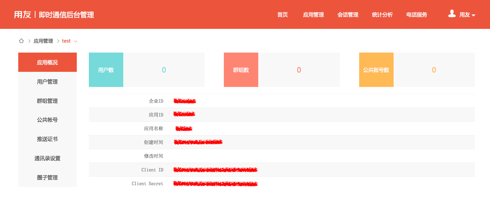

# 
用友eUC WEB_SDK集成指南
 #
感谢您使用**用友eUC**，本文档将会详细为您讲述WEB_SDK的使用方法以及集成方案。 
用户体系是APP当中的核心数据，也是APP中的绝对机密。用友致力于企业级软件多年，深知数据保密的重要性，所以用友IM中不保存任何APP的用户信息，也不想知道这些信息，比如CRM的APP，此APP中的用户姓名，账号，密码，电话，email等信息是保存到CRM自己的服务器中的，在使用用友IM服务时，无需把用户体系上传到用友IM服务器中。
用友服务希望以最友好的方式将IM嵌入到第三方APP中，反对暴力接入，第三方APP也无需为此改变自己的架构。
目前用友IM提供开放注册和授权注册两种用户接入的方式，每个APP可按照实际需要单独设置，也可进行调整。 

1.开放注册:
如果APP设置成开放注册模式，在使用用友IM服务时，无需事先导入用户体系，在客户端集成IM之后，用户在首次登陆时会被自动创建。

2、授权注册:
如果APP设置成授权注册模式，在使用用友IM服务时，需要事先导入用户体系或者使用REST API事先同步用户体系，在用户登录认证时，只有已集成到用户才视为合法用户。

当然，从隐私到角度来说，在使用此模式时，不必将自己的用户原账号导入到用友IM中，可在导入前做加密，只要保证此加密后的用户账号在APP内的唯一性即可。 

## 1 集成准备

### 1.1 注册开发者账号
在用友eUC官网[ <https://im.yyuap.com/>](https://im.yyuap.com "用友eUC") 上方点击“注册”，请按界面流程提示进行开发者账号注册。

### 1.2 创建应用
使用开发者账号登录到管理后台，点击页面上方“应用管理”，进入到应用管理。
点击左侧“新增应用”，输入应用信息即可创建，如图所示：

在应用概况中你可以查看应用的信息，我们会在客户端使用到“应用ID”和“企业ID”，在服务端进行获取token服务时使用到“ClientID”和“ClientSecret”，如果忘记了可以在这里查看。

### 1.3 在APP的Server端获取用友eUC token
用友eUC使用token进行用户验证

在APP的Server端需要新增一个获取token的服务，供客户端调用，在服务中需要调用用友eUC“获取用户token”的接口获得token并返回给客户端。

用友eUC使用应用的ClientID和ClientSecret获取应用访问的token,接口描述：
    
<table>
<tr>
	<td>Path</td>
    <td> rest/{etpId}/{appId}/token 其中etpId为企业ID，即申请帐号时的输入的企业ID; appId为应用ID, 可在管理后台的应用列表页查看</td>
</tr>

<tr>
	<td>HTTP Method</td>
    <td>POST</td>
</tr>

<tr>
	<td>URL Params</td>
    <td>无</td>
</tr>

<tr>
	<td>Request Headers</td>
    <td>{"Content-Type":"application/json"}</td>
</tr>

<tr>
	<td>Request Body</td>
    <td>"username":"获取token用户的用户名称", "clientId": "{app的ClientID}","clientSecret": "{app的ClientSecret}", "nickname":"昵称（可选）"}， 其中nickname为可选参数，仅在应用为开放模式下使用，如果提供了nickname且用户已经存在的情况下会更新昵称，提供了nickname且用户不存在则使用该昵称创建用户，没有提供nickname且用户存在，使用username作为nickname。</td>
</tr>

<tr>
	<td>Response Body</td>
    <td>
       <table>
         <tr><td>key</td><td>value</td></tr>
		 <tr><td>token</td><td>token值，在之后的请求中，需要将该值放置到Http Head中</td></tr>
		 <tr><td>expiration</td><td>有效时间,为从1970年1月1日到截止时间的毫秒数, 默认是24小时,在有效期内是不需要重复获取的，有效期重复获取的Token相同</td></tr>
      </table>
    </td>
</tr>

<tr>
	<td>可能的错误代码</td>
    <td> <table>
         <tr><td>错误码</td><td>错误原因</td></tr>
		 <tr><td>401</td><td>认证服务器认证失败</td></tr>
		 <tr><td>404</td><td> appId无效，应用不存在, 检查地址是否正确</td></tr>
		 <tr><td>406</td><td> clientid与appId不匹配, 检查地址和参数</td></tr>
 		 <tr><td>500</td><td> 认证过程发生错误。 </td></tr>
      </table>
   </td>
</tr>
</table>

### 1.4 下载用友eUC WEB_SDK
用友eUC WEB_SDK下载地址：**[https://im.yyuap.com/download.html](https://im.yyuap.com/download.html "用友eUC下载")** 

## 2 初始化

### 2.1 依赖的类库

WEB版的sdk主要依赖一个轻量级Javascript的程序库jQuery,这里对jQuery 的版本没有特别的要求，不过最好是比较新的版本。

### 2.2 SDK的集成

在html页面引入jQuery类库和 用友eUC的web_sdk。

例如：
    
    
    

### 2.3 初始化sdk
    YYIMChat.initSDK('{appId}', '{etpId}'); 

### 2.4 初始化回调方法
    YYIMChat.init({
				onOpened :  onOpened, // 登录成功
				onClosed : onClosed, // 连接关闭
				onAuthError : onAuthError, // 认证失败
				onStatusChanged : onStatusChanged, //连接状态改变
				onConnectError : onConnectError, // 连接错误
				onPresence : onPresence, // 好友状态改变
				onSubscribe : onSubscribe, // 订阅处理
				onRosterUpdateded : onRosterUpdateded, //联系人信息更新
				onRosterDeleted : onRosterDeleted, //被联系人删除
				onReceipts : onReceipts, // 接收到消息回执
				onTextMessage : onTextMessage, // 接收到文本(表情)消息
				onPictureMessage : onPictureMessage, // 接收到图片
				onFileMessage : onFileMessage // 接收到文件
				onShareMessage : onShareMessage, //接收到分享消息
				onSystemMessage: onSystemMessage, //接收到单图文消息
				onPublicMessage: onPublicMessage, //接收到多图文消息
				onLocationMessage: onLocationMessage, //接收到位置共享消息
				onAudoMessage : onAudoMessage, //接收到语音消息
				onGroupUpdate :  onGroupUpdate, //群组信息及成员信息更新
				onTransferGroupOwner :  onTransferGroupOwner, //当有群主转让群组
				onKickedOutGroup : onKickedOutGroup, //被群组踢出
				onPubaccountUpdate : onPubaccountUpdate //公共号新增、更新
			});
    

## 3 消息

### 3.1 发送消息

**发送文本（表情）消息**

    /**
	 * 发送文本消息[文本,表情]
	 * @param arg {
	 * to: id,  //对话人id
	 * type: "groupchat/chat/pubaccount",  //chat:单聊，groupcgat:群聊,pubaccount:
	 * 众号
	 * msg:text, //消息文本
	 * style：{
	 *    font: "16", //字体
	 *    size: "30", //大小
	 *    color: "#000", //颜色
	 *    biu: 7 //加粗、斜体、下划线
	 * }, 
	 * extend: string,  //扩展字段 
	 * success:function //成功回调函数
	 * }
	 */
	YYIMChat.sendTextMessage(arg); 

**发送图片消息**
    
	/**
	 * 发送图片消息
	 * @param arg{
	 * fileInputId：, //文件域id 
	 * to:jid,        //对话人id
	 * type: "groupchat/chat/pubaccount",  //chat:单聊，groupcgat:群聊,pubaccount:公众号
	 * success:function //成功回调函数
	 * }
	 */
	YYIMChat.sendPic(arg);

**发送文件消息**
    
	/**
	 * 发送文件消息
	 * @param arg{
	 * fileInputId：, //文件域id 
	 * to:jid,        //对话人id
	 * type: "groupchat/chat/pubaccount",  //chat:单聊，groupcgat:群聊,pubaccount:公众号
	 * success:function //成功回调函数
	 * }
	 */
	YYIMChat.sendFile(arg);

**发送分享消息**
	/**
	 * 发送分享消息[分享消息]
	 * @param arg {
	 * to: id, //对话人id
	 * type: "groupchat/chat/pubaccount",  //chat:单聊，groupcgat:群聊,pubaccount:公众号
	 * extend: string,  //扩展字段 
	 * sharebody:{
	 * 		shareImageUrl:string, //分享中图片的url
	 * 		shareUrl:string, //分享的url
	 * 		shareDesc:string, //分享的内容描述
	 * 		shareTitle:string //分享的标题
	 * 	},
	 * success:function //成功回调函数
	 * }
	 */    
	YYIMChat.sendShareMessage(arg);

**发送接收回执**
    
	/**
	 * 发送回执报文
	 * @param arg {
	 *  	to:,	//回执的对象
	 * 		id: 	//报文id
	 * }
	 */
	YYIMChat.sendReceiptsPacket(arg);

**发送已读回执**

	/**
	 * 发送回执报文
	 * @param arg {
	 *  	to:,	//回执的对象
	 * 		id: 	//报文id
	 * }
	 */
	YYIMChat.sendReadedReceiptsPacket(arg);

### 3.2 接收在线消息

初始化sdk时，通过注册回调函数方式处理在线消息的处理，例如：

	YYIMChat.init({
				//...，
				onTextMessage : onTextMessage, // 接收到文本(表情)消息
				onPictureMessage : onPictureMessage, // 接收到图片
				onFileMessage : onFileMessage // 接收到文件
				onShareMessage : onShareMessage, //接收到分享消息
				onSystemMessage: onSystemMessage, //接收到单图文消息
				onPublicMessage: onPublicMessage, //接收到多图文消息
				onLocationMessage: onLocationMessage, //接收到位置共享消息
				onAudoMessage : onAudoMessage, //接收到语音消息
				//...
			});

### 3.3 接收离线消息

    /**
	 * 获取离线消息
	 */
	YYIMChat.getOfflineMessage(); //当登陆成功以后，断线重连以后调用

### 3.4 查询历史记录消息
    
	/**
	 * 获取历史记录 
	 * @param arg {
	 * id: //对话人id
	 * chatType: "groupchat/chat/pubaccount",  //chat:单聊，groupcgat:群聊,pubaccount:公众号
	 * contentType:int, //代表希望拿到的消息类型，不填则为全部消息类型 
	 * start: number,   //消息列表的分页参数，起始值，默认0,
	 * num: number   //消息列表的分页参数，分页参数，默认100
	 * }
	 */
	YYIMChat.getHistoryMessage(arg)

## 4 好友

### 4.1 好友

**请求好友列表**

    /**
	 * 请求好友列表
	 * @param arg {
	 * success: function, //成功回调函数
	 * error: function,  //失败回调函数
	 * complete:function //无论成功失败都回调的函数
	 * }
	 */
	YYIMChat.getRosterItems(arg);

**添加好友**

	/**
	 * 添加好友
	 * @param id //被添加人id
	 */
    YYIMChat.addRosterItem(id);

**删除好友**

	/**
	 * 删除好友, 
	 * @param arg {
	 * id: string, //被删除人id
	 * success: function, 
	 * error: function,
	 * complete: function
	 * }
	 */
	YYIMChat.deleteRosterItem(arg);

**查询好友**

	/**
	 * 查找好友[roster][包括好友和非好友]，查询字段：userName, name
	 * @param arg { 
	 * keyword, 
	 * success: function, 
	 * error: function,
	 * complete: function
	 * }
	 */
	YYIMChat.queryRosterItem(arg);

**更新好友备注、分组**
    
	/**
	 * 更新好友
	 * @param arg {
	 * 		roster : {
	 * 			id : 好友id,
	 * 			name : 好友昵称,
	 * 			groups : ["group1","group2"] // 好友所在分组
	 * 		},
	 * 		success : function,
	 * 		error : function
	 * }
	 */
	YYIMChat.updateRosterItem(arg);

### 4.2 联系人（好友&非好友）

**查询联系人的在线状态**

    /**
	 * 获取用户在线状态 rongqb 20151119
	 * arg {
	 * username: ['zhangsan','lisi'],
	 * success:function,
	 * error:function,
	 * complete:function,
	 * }
	 * resource:2.1
	 */
	YYIMChat.getRostersPresence(arg);

返回值说明：
    
	 [{
	     "userid": "litingd",
	     "prensence": [{
	         available: 1, //1表示在线，0表示不在线
	         show: "chat", //没有该字段（等同于null)表示在线，chat/away/xa/dnd表示如下文。
	         device: "android" //可能的值有android/ios/pc/web
	     }， {
	         available: 1, //1表示在线，0表示不在线,
	         show: "away", //没有该字段（等同于null)表示在线，chat/away/xa/dnd表示如下文。
	         device: "web" //可能的值有android/ios/pc/web
	     }]
	 }, {
	     "userid": "liuhaoi",
	     "prensence": [{
	         available: 1, //1表示在线，0表示不在线
	         show: "chat", //没有该字段（等同于null)表示在线，chat/away/xa/dnd表示如下文。
	         device: "android" //可能的值有android/ios/pc/web
	     }， {
	         available: 1, //1表示在线，0表示不在线
	         show: "away", //没有该字段（等同于null)表示在线，chat/away/xa/dnd表示如下文。
	         device: "web" //可能的值有android/ios/pc/web
	     }]
	 }]

show字段对照表：

    away -- 该实体或资源临时离开.
    chat -- 该实体或资源活跃并想聊天.
    dnd -- 该实体或资源忙(dnd = "Do Not Disturb"，免打扰).
    xa -- 该实体或资源要离开相当长时间(xa = "eXtended Away"，长时间离开).
    如果show未被提供或为NULL, 该实体被假定在线并且可用.

**查询联系人VCard**
    
	/**
	 * 请求自己或好友的VCard
	 * @param arg
	 * 	{
	 * 		jid : 为空则请求自己的VCard,
	 * 		success : function,
	 * 		error : function,
	 * 		complete : function
	 *  }
	 */
	YYIMChat.getVCard(arg);

### 4.3 当前用户集成

**请求自己&所有好友的VCard**
    
	/**
	 * 请求自己&所有好友的VCard
	 * @param arg
	 * {
	 * 		success : function,
	 * 		error : function,
	 * 		complete : function
	 * }
	 */
	YYIMChat.getVCards(arg);

**修改当前用户的VCard**

	/**
	 * 修改当前用户的VCard
	 * @param arg {
	 * 		vcard : {
	 * 			nickname,
	 * 			photo,
	 * 			email,
	 * 			mobile,
	 * 			telephone
	 * 		},
	 * 		success : function,
	 * 		error : fcuntion
	 * }
	 */
	YYIMChat.setVCard(arg);

**修改当前用户的在线状态**
	/**
	 * 设置上线状态
	 * @param arg{show, status, priority}
	 */
	YYIMChat.setPresence();
	

## 5 群组

### 5.1 获取群组列表

	/**
	 * 获取群组列表
	 * @param arg {
	 * success: function, //成功回调函数
	 * error: function,  //失败回调函数
	 * complete:function //无论成功失败都回调的函数
	 * }
	 */
	YYIMChat.getChatGroups(arg);

### 5.2 创建群组

	/**
	 * 创建群组
	 * @param arg {
	 * name:, //群名称
	 * members:[], //初始化群成员
	 * success:function,
	 * complete:function
	 * }
	 */
	YYIMChat.createChatGroup(arg);

### 5.3 修改群名称

	/**
	 * 群成员更改配置信息
	 *  @param arg {
	 *  to:, //群组id
	 *  name:string, //群组新名称
	 *  success: function,
	 *  error:function,
	 *  complete: function
	 *  }
	 */
	YYIMChat.modifyChatGroupInfo(arg);

### 5.4 添加群成员
	
	/**
	 * 房间成员邀请人入群 
	 *  @param arg {
	 *  to:, //群组id
	 *  name:string, //群组新名称
	 *  success: function,
	 *  error:function,
	 *  complete: function
	 *  }
	 */
	YYIMChat.inviteGroupMember(arg);

### 5.5 群组踢人

	/**
	 * 群组踢人 
	 *  @param arg {
	 *  to:, //群组id
	 *  member:string, //被踢人id，一次只能踢一个人
	 *  success: function,
	 *  error:function,
	 *  complete: function
	 *  }
	 */
	YYIMChat.kickGroupMember(arg);

### 5.6 退出群组

	/**
	 * 退出群组
	 *  @param arg {
	 *  to:, //群组id
	 *  success: function,
	 *  error:function,
	 *  complete: function
	 *  }
	 */
	YYIMChat.exitChatGroup(arg);

### 5.7 获取群共享文件

	/**
	 * 获取指定群组的共享文件
	 * @param arg {
	 * id: 群组id, 
	 * start: int, 
	 * size: int, 
	 * success: function, 
	 * error: function, 
	 * complete: function
	 * }
	 */
	YYIMChat.getSharedFiles(arg);

### 5.8 收藏群组

	/**
	 *  收藏群组(收藏)
	 *  @param arg {
	 *  to:群组id, 
	 *  success: function, 
	 *  error: function,
	 *  complete: function
	 *  }
	 */
	YYIMChat.collectGroup(arg);

### 5.9 取消收藏群组

	/**
	 *  取消收藏群组
	 *  @param arg {
	 *  to:群组id, 
	 *  success: function, 
	 *  error: function,
	 *  complete: function
	 *  }
	 */
	YYIMChat.removeCollectGroup(arg);

### 5.10.群主转让群

	/**
	 *  群主转让(群主行为)
	 *  @param arg {
	 *  to:群组id, 
	 *	newOwner:string
	 *	}
	 *  resource:2.3 
	 */
	YYIMChat.transferChatGroup(arg);

### 5.11.群主解散群

	/**
	 *  群主转让(群主行为)
	 *  @param arg {
	 *  to:群组id 
	 *	}
	 *  resource:2.3 
	 */
	YYIMChat.dismissChatGroup(arg);

## 6 公共账号

### 6.1 获取我关注订阅号&广播号列表

	/**
	 * 获取广播号/订阅号列表[pubaccount]
	 * @param arg {
	 * success: function, //成功回调函数
	 * error: function,  //失败回调函数
	 * complete:function //无论成功失败都回调的函数
	 * }
	 */
	YYIMChat.getPubAccount(arg);

### 6.2 查找订阅号&广播号

	/**
	 * 查找广播号/订阅号
	 * @param arg {
	 * keyword, 
	 * success: function, 
	 * error: function,
	 * complete: function
	 * }
	 */
	YYIMChat.queryPubaccount(arg);
	
### 6.3 关注订阅号

	/**
	 * 关注订阅号
	 * @param arg {
	 * 		id : 公共号id,
	 * 		success : function,
	 * 		error : function
	 * }
	 */
	YYIMChat.addPubaccount(arg);

### 6.4.消息关注订阅号

	/**
	 * 消息关注订阅号
	 * @param arg {
	 * 		id : 公共号id,
	 * 		success : function,
	 * 		error : function
	 * }
	 */
	YYIMChat.removePubaccount(arg);
	

## 7 登录&退出

### 7.1 登录
    
	YYIMChat.login(
	    "linghuchong", // 用户名
	    "xixingdafa" // 密码或token
	);

### 7.2 退出
	
	YYIMChat.logout();
	

## 8.扩展功能

### 8.1.多端通话

	/**
	 * 多方通话 
	 * @param arg {
	 * 	caller: ,//主叫号码
	 *  phones：,//被叫号码
	 *  accountMmanaged:true, //账号托管，需要到im多租户后台授权
	 *  account：,//通话账号 accountMmanaged:true时 不传
	 *  key：,//通话秘钥  accountMmanaged:true时 不传
	 *  success:function,
	 *  error:function
	 * }
	 */
	YYIMChat.multiPartyCall(arg);
