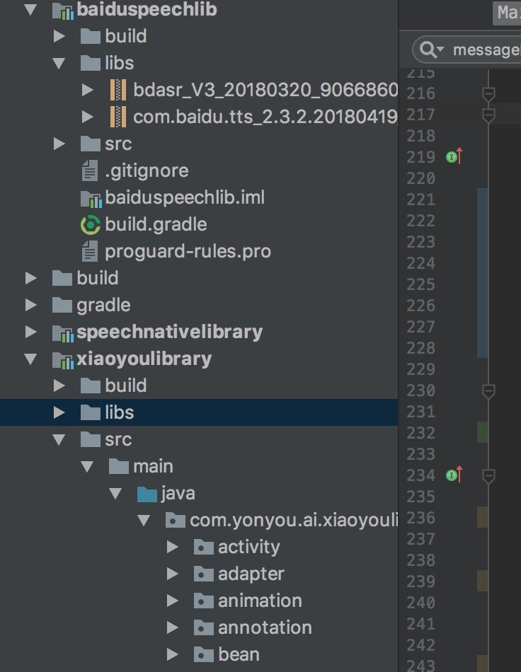

# 一、集成准备
## 1.1 注册开发者账号
	这部分是通用的注册流程，引用之前的注册流程
## 1.2 创建应用
	创建应用的流程与创建IM Android应用相同。
## 1.3下载小友SDK
	小友移动端Android SDK下载地址:[下载中心](https://iuap.yonyoucloud.com/doc/instantmessaging.html#/md-build/exclusive_cloud_instantmessaging/articles/product/11-/download.md?key=相关下载) 
	SDK结构目录如下图所示:

## 1.4申请百度语音服务账号
	由于小友SDK的语音识别等能力使用百度语音服务，因此，需要用户自行创建账号以获取授权使用相关服务。地址:http://ai.baidu.com
	用户创建百度账号及应用后，获取appid、apikey、secretkey，后续集成过程中会使用。
# 二、SDK集成
## 2.1集成小友SDK到APP
	demo工程默认使用测试机器人进行体验，若要申请用户自己的机器人（可根据用户自己的业务配置知识库等），需联系合作
	demo工程包含小友SDK、百度语音SDK,res文件夹可编译生成aar文件导入用户原生工程使用
## 2.2依赖的类库
	xiaoyoulibrary.aar
	bdasr_V3_20180320_9066860.jar
	com.baidu.tts_2.3.2.20180419_5a5fec8.jar
	libBaiduSpeechSDK.so
	libbd_easr_s1_merge_normal_20151216.dat.so
	libbdEASRAndroid.so
	libbdSpilWakeup.so
	libvad.dnn.so
## 2.3其他依赖及配置
	// appId appKey secretKey 网站上您申请的应用获取。
    //注意使用离线合成功能的话，需要应用中填写您app的包名。
    //包名在build.gradle中获取。
    build.gradle配置
    
		    dependencies {
			    compile fileTree(include: ['*.jar'], dir: 'libs')
			    compile 'com.android.support:appcompat-v7:25.0.0'
			    compile 'com.android.support:recyclerview-v7:25+'
			    compile 'com.github.stuxuhai:jpinyin:1.1.8'
			    compile 'com.google.code.gson:gson:2.6.2'
			    compile 'com.github.bumptech.glide:glide:3.6.1'
			    compile 'org.xutils:xutils:3.3.40'
			}
	
			<meta-data
	         android:name="com.baidu.speech.APP_ID"
	         android:value="11208749" />
        
	   		<meta-data
	         android:name="com.baidu.speech.API_KEY"
	         android:value="IsBkMplKkH4ovQSuazD230w2" />
        
	    	<meta-data
	         android:name="com.baidu.speech.SECRET_KEY"
	         android:value="YuIQXt9X5nUBpuZ8kNRXXTljD2X7uXhg" />
    
## 2.4调起小友界面及实现监听
	//初始化小友界面并实现XYMessageListener监听
     Intent intent=newIntent(context,XYAIChatActivityNew.class);
     JSONObject yrcParams = new JSONObject();
         try{
        yrcParams.put("tenantid", "iqopszg1");//租户id
         yrcParams.put("appcode", "diworkfaq");//应code
         yrcParams.put("userid", "lianggy");//用户名
         yrcParams.put("nickname", "");//用户名
         yrcParams.put("avatar","");//头像url
         yrcParams.put("aiurl", "");//服务器url
         yrcParams.put("aitoken", "");//aitoken
     }catch (JSONException e){
     e.printStackTrace();
    }
    intent.putExtra("xiaoyou_params", yrcParams.toString());
    context.startActivity(intent);

	XYAIChatActivityNew.setXyMessageListener(new XYMessageListener() {
              
                    @Override
                    public void callback(Context context, String action, Object jsonObject, MessageHandleListener listener) {
                        ToastUtils.showShort(MainActivity.this,jsonObject.toString());
                        JSONObject json = new JSONObject();
                        try {
                            json.put("code",1);
                        } catch (JSONException e) {
                            e.printStackTrace();
                        }
                        if(action.equals(XYConfig.ACTION_SCHEDULE_CANCEL)){
                            listener.callback(json);
                        }else if(action.equals(XYConfig.ACTION_SCHEDULE_CONFIRM)){
                            listener.callback(json);
                        }
                        else if(action.equals(XYConfig.ACTION_SCHEDULE_SELECT_LIST_ITEM)){
                            if(jsonObject instanceof CalendarSelectBean){
                                CalendarUserBean userBean = ((CalendarSelectBean)jsonObject).getInfos().get(0);
                                listener.callback(userBean);
                            }
                        }
                    }
                    @Override
                    public void onActivityResult(int requestCode, int resultCode, Intent data) {
                        messageHandleListener.callback(new JSONObject());
                    }
                });
## 2.5其他设置
系统权限

	（1）麦克风权限
	（2）定位权限

