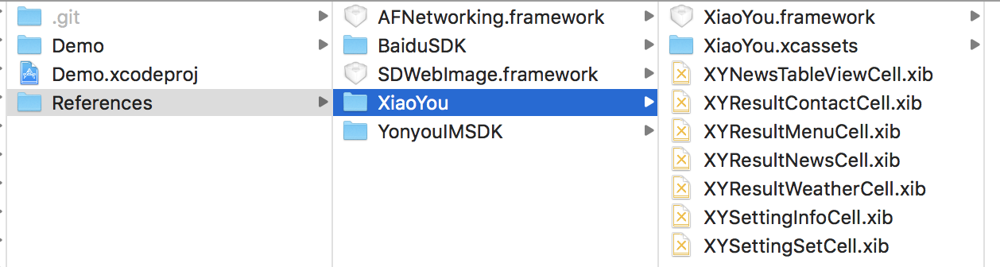

# 一、集成准备
## 1.1 注册开发者账号
	这部分是通用的注册流程，引用之前的注册流程
## 1.2 创建应用
	创建应用的流程与创建IM iOS应用相同。
## 1.3下载小友SDK
	小友移动端iOS SDK下载地址:[下载中心](https://iuap.yonyoucloud.com/doc/instantmessaging.html#/md-build/exclusive_cloud_instantmessaging/articles/product/11-/download.md?key=相关下载) 
	SDK结构目录如下图所示:

## 1.4申请百度语音服务账号
	由于小友SDK的语音识别等能力使用百度语音服务，因此，需要用户自行创建账号以获取授权使用相关服务。地址:http://ai.baidu.com
	用户创建百度账号及应用后，获取appid、apikey、secretkey，后续集成过程中会使用。
# 二、SDK集成
## 2.1集成小友SDK到APP
	本文档默认用户已经集成IMSDK，IMSDK的集成方案请参考相关文档。
	demo工程默认使用测试机器人进行体验，若要申请用户自己的机器人（可根据用户自己的业务配置知识库等），需联系合作
	demo工程包含小友SDK、百度语音SDK、IMSDK，References文件夹可直接拖入用户的原生工程内。
	对于AFNetworking和SDWebImage两个第三方库，若用户工程内已使用，则不用拖入。
## 2.2依赖的类库
	XiaoYou.framework
	libBaiduSpeechSDK.a
	libYonyouIMSdk.a
	SDWebImage.framework
	YYBaiduVoiceSDK.framework
	AFNetworking.framework
	libiconv.tbd
	libc++.tbd
	libresolv.tbd
## 2.3初始化SDK
	#import <XiaoYou/XiaoYou.h>
	#import <YYBaiduVoiceSDK/YYBaiduVoiceSDK.h>
	#import <AFNetworking/AFNetworking.h>
	
	#define APP_ID     @"用户申请的百度appid"
	#define API_KEY    @"用户申请的百度appkey"
	#define SECRET_KEY @"用户申请的百度secretkey"
	
	//开启检测网络状态
    [[AFNetworkReachabilityManager sharedManager] startMonitoring];
    //初始化百度语音SDK
    [[YYBaiduVoiceConfig sharedInstance] setApiKey:API_KEY withSecretKey:SECRET_KEY appid:APP_ID];
## 2.4调起小友界面及实现代理协议
初始化小友界面并实现XiaoYouViewControllerDelegate协议
	
	XiaoYouViewController *vc = [[XiaoYouViewController alloc] init];
	vc.delegate = self;
	[self.navigationController pushViewController:vc animated:YES];

实现XiaoYouViewControllerDelegate代理方法

	//该代理方法用于监听小友抛出的各种事件，具体事件类型可查看相关头文件
	- (void)xy_viewController:(XiaoYouViewController 	*)viewController handleActionWithInfo:(NSDictionary<NSString *,id> *)info callback:(void (^)(XiaoYouActionStatus status, NSDictionary* info))callback {
    
    	NSString *action = info[XiaoYouActionName];
    	id object = info[XiaoYouDataName];
    
    	if ([action isEqualToString:XiaoYouActionScheduleTapCard] ||
        [action isEqualToString:XiaoYouActionScheduleButtonConfirm]) {
        // 日程
        XYScheduleMessage *schedule = object;
        
        UIAlertController *alert = [UIAlertController alertControllerWithTitle:@"创建日程?" message:schedule.description preferredStyle:UIAlertControllerStyleAlert];
        
        UIAlertAction *cancelAction = [UIAlertAction actionWithTitle:@"取消" style:UIAlertActionStyleCancel handler:^(UIAlertAction * _Nonnull action) {
            
            if (callback) {
                callback(XiaoYouActionStatus_Cancel, nil);
            }
        }];
        UIAlertAction *confirmAction = [UIAlertAction actionWithTitle:@"确定" style:UIAlertActionStyleDefault handler:^(UIAlertAction * _Nonnull action) {
            
            if (callback) {
                NSMutableDictionary *info = [NSMutableDictionary dictionary];
                id personData1 = @{@"name": @"杨昊", @"department": @"部门0"};
                id personData2 = @{@"name": @"陈庆明", @"department": @"部门2"};
                XYPersonMessage *person1 = [[XYPersonMessage alloc] initWithJSONObject:personData1];
                XYPersonMessage *person2 = [[XYPersonMessage alloc] initWithJSONObject:personData2];
                schedule.participates = @[person1, person2];
                info[XiaoYouDataName] = @{ XiaoYouDataSchedule: schedule };
                callback(XiaoYouActionStatus_OK, info);
            }
        }];
        [alert addAction:cancelAction];
        [alert addAction:confirmAction];
        [viewController.navigationController presentViewController:alert animated:YES completion:nil];
        return;
    }
    else if ([action isEqualToString:XiaoYouActionPersonPickerSelect]) {
        
        NSString *name = [(NSDictionary *)object valueForKey:XiaoYouDataName];
        // 选择人员"选择"
        if (callback) {
            NSDictionary *personData = @{ @"name": @"杨昊", @"department": @"部门0" };
            XYPersonMessage *person = [[XYPersonMessage alloc] initWithJSONObject:personData];
            NSMutableDictionary *result = [object mutableCopy];
            result[XiaoYouDataSelectedPerson] = person;
            callback(XiaoYouActionStatus_OK, result);
        }
        return;
    }
    else if ([action isEqualToString:XiaoYouActionContactsTapCard]) {
        // 找人卡片
        XYPersonMessage *person = (XYPersonMessage *)object;
        NSLog(@"phone:%@", person.phone);
        return;
    }
    // 日程:XYScheduleMessage
    // 应用:XYApplicationMessage
    // 人员:XYPersonMessage
    UIAlertController *alert = [UIAlertController alertControllerWithTitle:action message:[object description] preferredStyle:UIAlertControllerStyleAlert];
    UIAlertAction *cancelAction = [UIAlertAction actionWithTitle:@"确定" style:UIAlertActionStyleCancel handler:nil];
    [alert addAction:cancelAction];
    [viewController.navigationController presentViewController:alert animated:YES completion:nil];
	}
## 2.5其他设置
系统权限

	（1）麦克风权限
	（2）定位权限

